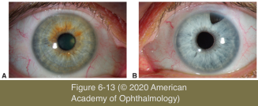
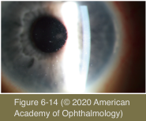

# 9.6.4. Noninfectious Ocular Inflammatory Diseases (IV): Chronic Anterior Uveitis (I)

## Images

## Hierarchy

- Fuchs heterochromic uveitis
  - epidemiology
    - 2-3% of patients referred to uveitis clinics
  - clinical persentation
    - unilateral
    - symptoms
      - asymptomatic
      - mild blurring and discomfort
    - diffuse iris stromal atrophy (variable pigment epithelial layer atrophy)
      - heterochromia
        - usually a lighter-colored iris indicates the involved eye
        - may be subtle in a brown-eyed patient
        - in blue-eyed persons the affected eye may become darker
    - small, white, stellate KPs scattered diffusely over the entire endothelium
    - cells in the anterior chamber & anterior vitreous
      - lack of synechiae
      - some patients may experience visual disability as a result of extensive vitreous opacification
        - may need pars plana vitrectomy
    - cataract
    - glaucoma
    - macular edema
      - abnormal vessels bridging the angle
        - may bleed during cataract surgery, resulting in postoperative hyphema
      - seldom
    - fundus scars and retinal periphlebitis
      - rare
  - etiology
    - association with ocular toxoplasmosis, HSV, rubella, and CMV infection
  - Histologic examination
    - plasma cells in the ciliary body
  - management
    - cataract surgery
      - generally do well
      - IOLs can be implanted successfully
    - glaucoma control can be difficult
    - few cases require therapy for inflammation
      - prognosis is good in most cases even when the inflammation persists for decades
      - topical corticosteroids can lessen the inflammation but typically do not resolve it
      - cycloplegia
        - seldom necessary
      - aggressive treatment to eradicate the cellular reaction is not indicated
- Introduction
  - relapses <3 months after discontinuation of therapy
  - usually starts insidiously
  - variable amounts of redness, discomfort, and photophobia, inflammation
    - some patients have no symptoms
  - unilateral or bilateral
  - CME is common
