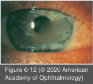
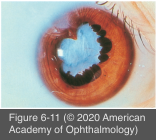

# 9.6.5. Chronic Anterior Uveitis (II): Juvenile Idiopathic Arthritis

## Images

## Hierarchy

- patients suspected of JIA should undergo
  - ANA testing
  - evaluation by a pediatric rheumatologist
    - joint disease may be minimal or absent at the time the uveitis is diagnosed!
- epidemiology
- definition
  - arthritis < age 16 years
    - most common systemic disorder associated with anterior uveitis in the pediatric age group
  - lasting ≥ 6 weeks
- differential diagnosis
  - TINU
  - Fuchs heterochromic uveitis
  - sarcoidosis
  - Behçet disease
  - seronegative spondyloarthropathies
  - herpetic uveitis
  - Lyme disease
- pauciarticular onset
- prognosis
  - long-term prognosis depends on the extent of structural complications at first diagnosis
    - profound silent ocular damage can occur
  - complications
    - band keratopathy
    - cataract
    - glaucoma
    - macular edema
    - chronic hypotony
      - phthisis
- 3 types
  - oligoarticular onset
    - 40%–50% of JIA
      - 80%–90% of JIA-associated uveitis
    - ≤ 4 joints during the first 6 months of disease
      - patients may have no joint symptoms
    - type 1
      - girls < 5 years
      - (+) antinuclear antibody (ANA)
      - chronic anterior uveitis occurs in ≤ 25%
    - type 2
      - older boys
      - (+) HLA-B27
        - 75%
        - many develop evidence of seronegative spondyloarthropathy
  - systemic onset (Still disease)
    - < 5 years
      - acute and recurrent uveitis (rather than chronic uveitis)
      - 10%–15% of JIA
    - fever, rash, lymphadenopathy, and hepatosplenomegaly
    - joint involvement may be minimal or absent initially
    - ocular involvement is rare
      - fewer than 6% of patients
  - polyarticular onset
    - .> 4 joints in the first 6 months of the disease
    - 40% of JIA
    - ≈10% of JIA-associated anterior uveitis
      - rheumatoid factor (-) patients
        - rheumatoid factor (+) patients may not develop uveitis
- treatment
  - goal of treatment is to eliminate active inflammation (anterior chamber cells)
    - See Table 6-1
      - regular slit-lamp examinations specially necessary if
        - oligoarticular disease
        - ANA (+)
  - topical corticosteroids
    - initial treatment
      - even low-grade inflammation, if present for a prolonged period, can result in ocular morbidity
  - systemic corticosteroids/IMT
    - more severe cases
  - corticosteroid-induced complications are common
    - growth retardation
      - long-term use of topical corticosteroids at doses ≥3 times daily can increase the risk of cataract formation
        - systemic IMT should be considered for such cases
    - cataracts
    - glaucoma
  - short-acting mydriatic drugs
    - in patients with chronic flare to prevent posterior synechiae formation
  - systemic NSAIDs
    - permit a lower dose of corticosteroids
  - low-dose methotrexate (weekly)
    - can effectively control the uveitis
    - well tolerated
    - can spare patients the complications of long- term corticosteroid use
  - TNF inhibitors and other biologic agents
  - cataract surgery in patients with JIA
    - high complication rate due to difficulty in controlling the more aggressive inflammatory response
    - use of IOLs remains controversial
      - aphakic children may develop amblyopia
    - lensectomy/vitrectomy via the pars plana
    - band keratopathy should be treated before cataract surgery
      - chelation EDTA
  - guidelines for cataract surgery with IOL implants in patients with JIA
    - intraocular inflammation must be well controlled with corticosteroids/systemic IMT for ≥3 months before surgery
      - IMT must be used preoperatively and postoperatively, not just perioperatively
      - must not require frequent instillation of topical corticosteroids
    - only acrylic IOL should be implanted
    - any inflammation after cataract surgery must be aggressively treated
    - patients must be strongly advised about the need for careful, regular, lifelong follow-up
    - low threshold for IOL explantation in patients who have persistent postoperative inflammation and recurrent cyclitic membranes.
  - glaucoma
    - should be treated with medical therapy initially
    - surgical intervention is often necessary in severe cases
    - standard filtering procedures are usually unsuccessful
      - antifibrotic drugs
      - aqueous drainage
- uveitis
  - average age of onset is 6 years
  - within 5–7 years of onset of joint disease
    - may occur as long as 28 years after development of arthritis
    - little or no correlation between ocular and joint inflammation
  - risk factors for the development of chronic uveitis
    - oligoarticular onset
    - female
    - (+) ANA
    - most patients test negative for rheumatoid factor
  - symptoms
    - mild to moderate pain
      - eye is frequently white
    - photophobia
    - blurring
    - some patients are asymptomatic
      - found incidentally during routine school physical examination
  - signs of inflammation include
    - fine KPs
    - band keratopathy
    - flare and cells
    - posterior synechiae
    - cataract
