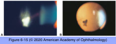

# 9.6.7. Intermediate Uveitis (II): Pars Planitis

## Images

## Hierarchy

- intermediate uveitis in the absence of an associated infection or systemic disease
  - the most common form of intermediate uveitis
    - 85–90%
- epidemiology
  - bimodal age distribution
    - younger (5–15 years)
    - older (20–40 years)
  - no overall sex predilection
- pathogenesis
  - autoimmune reactions against the vitreous, peripheral retina, and ciliary body
- clinical presentation
  - bilateral
    - 80%
    - +- asymmetric
  - children
    - redness, photophobia, and discomfort
      - significant anterior chamber inflammation
  - teenagers and young adults
    - more insidious onset
    - floaters
  - anterior segment
    - variable AC inflammatory cells
    - band keratopathy
    - posterior synechiae
    - signs of chronicity
  - posterior segment
    - vitreous cells
      - snowballs
    - pars plana exudates
    - inferior peripheral retinal phlebitis
      - retinal venous sheathing
    - neovascularization & vitreous hemorrhage
    - CME
    - vitreous opacification
    - epiretinal membrane
    - tractional or rhegmatogenous retinal detachment
    - secondary peripheral retinal vasoproliferative tumors
      - rare
        - Lyme and syphilitic uveitis may simulate any anatomical subtype of uveitis
- treatment
  - treat the underlying cause
  - corticosteroids
    - first line of therapy
    - periocular corticosteroid
      - particularly appealing in unilateral cases
      - as frequently as every 3–4 weeks
      - some cases prove recalcitrant
      - complications of periocular corticosteroids
        - corticosteroid-induced IOP elevation
        - aponeurotic ptosis
        - fat prolapse
        - enophthalmos
        - globe perforation
        - cataract formation
    - intravitreal corticosteroid
      - for refractory cases
      - risks of sustained IOP elevation/glaucoma
      - very small risks of retinal detachment, vitreous hemorrhage, and endophthalmitis
        - inject away from areas of snowbanking and areas with peripheral retinal pathology
    - systemic corticosteroid therapy
      - for severe or bilateral cases
      - initial dosage of 1–1.5 mg/kg/day
        - gradual tapering every 1–2 weeks to dosages of less than 10 mg/day
  - immunomodulatory treatment
    - indications
      - if corticosteroid therapy fails
      - if long-term use of high doses of corticosteroids are needed
    - antimetabolites (eg, methotrexate, azathioprine, mycophenolate mofetil)
    - T-cell inhibitors (eg, cyclosporine, tacrolimus)
    - biologic agents (eg, TNF inhibitors, interferon)
      - anti-TNF therapy can exacerbate MS
        - should be avoided in patients with MS- associated intermediate uveitis
    - alkylating drugs (eg, cyclophosphamide, chlorambucil)
    - Immunosuppressive Therapy for Eye Diseases (SITE) cohort study
      - cyclosporine, azathioprine, and mycophenolate mofetil were effective in achieving sustained control of inflammation in 70%–80% of intermediate uveitis
  - cryotherapy
    - peripheral ablation of the pars plana snowbank
    - rarely used at present
      - may induce further inflammation
  - indirect laser photocoagulation to the peripheral retina
    - for retinal ischemia and neovascularization
      - to prevent vitreous hemorrhage
  - intravitreal anti-VEGF treatment
    - for retinal or choroidal neovascularization
      - does not seem to increase the risk of rhegmatogenous retinal detachment
  - pars plana vitrectomy
    - +- laser photocoagulation
    - perioperative increase in systemic immunosuppression and/or corticosteroids should be considered
    - indications
      - for cases recalcitrant to IMT
      - for treating complications of pars planitis
        - severe vision loss caused by vitreous hemorrhage or traction
        - retinal detachment
        - epiretinal membrane
        - significant vitreous opacities despite adequate IMT
        - in cases involving epiretinal membrane or vitreomacular traction, separation of the posterior hyaloid membrane may reduce CME
- differential diagnosis
  - tuberculosis
  - syphilis
  - Lyme uveitis
    - Lyme antibody titers
  - sarcoidosis
    - intermediate uveitis in 7%
  - MS
    - anterior and intermediate uveitis in up to 20%
  - toxocariasis
    - serologic testing
  - primary central nervous system (CNS) lymphoma
    - vitritis without other ocular findings
    - sixth decade or older
  - Fuchs heterochromic uveitis
- ancillary tests and histologic findings
  - laboratory workup to exclude other causes of intermediate uveitis can be considered
  - fluorescein angiography (FA)
    - diffuse peripheral venous leakage
    - disc leakage
    - CME
  - ultrasound biomicroscopy
    - to demonstrate peripheral exudates or membranes over the pars plana in presence of small pupil or dense cataract
  - histologic examination
    - vitreous condensation
    - cellular infiltration in the vitreous base
    - peripheral lymphocytic cuffing of venules
      - inflammatory cells consist mostly of macrophages, lymphocytes, and a few plasma cells
    - loose fibrovascular membrane over the pars plana
- complications
  - cataract
    - ≤60%
    - cataract surgery with IOL implantation may be complicated by
      - smoldering low-grade inflammation
      - recurring opacification of the posterior capsule despite capsulotomy
      - recurrent retrolental membranes
      - chronic CME
      - even in cases with no active cellular inflammation
    - combining pars plana vitrectomy with cataract extraction and IOL implantation may reduce the risk of these complications
  - glaucoma
    - both angle-closure and open-angle
    - 10%
  - CME
    - 50%
      - 10% become chronic and refractory
    - major cause of vision loss
  - neovascularization of the retina, disc, snowbank
    - 10%
    - along the inferior snowbank
    - more common in children
    - may lead to vitreous hemorrhage
  - tractional or rhegmatogenous retinal detachment
    - 15%
    - require scleral buckling +- vitrectomy
    - risk factors for rhegmatogenous retinal detachment
      - severe inflammation
      - use of cryotherapy at the time of a vitrectomy
      - neovascularization of the pars plana snowbank
- prognosis
  - 3 types
    - self-limiting, benign course
      - 10%
    - smoldering course with remissions and exacerbations
      - 30%
    - may remain active for many years
      - prolonged course without exacerbations
        - 60%
  - if CME is treated until resolution, the long-term visual prognosis can be good
  - visual acuity of ≥20/40 after 10 years in 75%
