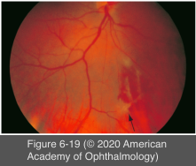

# 9.6.8. Posterior Uveitis (I): Collagen Vascular Diseases (I): Polyarteritis Nodosa

## Images

## Hierarchy

- epidemiology
  - subacute or chronic, focal, necrotizing inflammation of medium-sized and small muscular arteries
  - 40-60 years
    - affects men 3x more frequently
  - annual incidence of 0.7/100,000 individuals
  - no racial or geographic predisposing factors
- pathogenesis
  - immune-complex disease
    - 10% of patients are positive for hepatitis B surface antigen
      - circulating immune complexes composed of hepatitis B antigen and antibodies in vessel walls
- ocular presentation
  - 20%
  - retinal arteriolar occlusive disease
  - choroidal infarcts with exudative retinal detachment
    - consider PAN in the differential diagnosis of retinal vasculitis in patients with multiple systemic findings
    - Elschnig spots
      - focal areas of hyperpigmentation surrounded by hypopigmentation
  - hypertensive retinopathy
    - macular star formation
    - cotton-wool spots
    - intraretinal hemorrhage
    - in patients with renal disease
  - neuro-ophthalmic manifestations
    - cranial nerve palsies
    - amaurosis fugax
    - homonymous hemianopia
    - Horner syndrome
    - optic atrophy
  - scleral inflammatory disease
  - peripheral ulcerative keratitis (PUK)
    - +scleritis
- systemic presentation
  - Constitutional symptoms
    - 75%
    - fatigue
    - fever
    - weight loss
    - arthralgia
  - vasculitis-induced mononeuritis multiplex
    - most common symptom
    - nerve damage in ≥2 named nerves in separate parts of the body
  - renal involvement
  - secondary hypertension
    - one-third
  - gastrointestinal disease
    - small-bowel ischemia and infarction
  - cutaneous involvement
    - subcutaneous nodules
    - purpura
    - Raynaud phenomenon
  - coronary arteritis
  - pericarditis
  - hematologic abnormalities
- lab work-up
  - not associated with antineutrophil cytoplasmic antibodies (ANCA)
- management
  - 5-year mortality of untreated PAN is 90%
    - systemic corticosteroid
      - reduce this rate to 50%
    - combination therapy with immunomodulatory medications (e.g. cyclophosphamide)
      - improves 5-year survival to 80%
