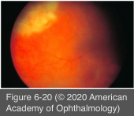

# 9.6.8. Posterior Uveitis (III): Collagen Vascular Diseases (III): Granulomatosis with polyangiitis (GPA)

## Images

## Hierarchy

- 15% at presentation
- ocular presentation
  - 50% during the course of the disease
  - orbital involvement
    - extension of the granulomatous inflammatory process from the paranasal sinuses
    - orbital pseudotumor
      - distinct from the sinus inflammation
    - orbital cellulitis
    - dacryocystitis
      - from secondarily infected nasal mucosa
  - scleritis
    - 40%
    - particularly diffuse anterior or necrotizing scleritis
    - posterior scleritis has been reported
    - +-peripheral ulcerative keratitis
  - uveitis
    - ≈10%
    - unilateral/bilateral
    - anterior, intermediate, or posterior uveitis
    - varying degrees of vitritis
      - uncommon
        - ≤10%
  - retinal involvement
    - retinal vasculitis
      - cotton-wool spots
      - +- intraretinal hemorrhages
      - branch or central retinal artery or vein occlusion
        - retinal neovascularization
          - vitreous hemorrhage
          - neovascular glaucoma
    - retinitis
      - ≤20%
  - compressive ischemic optic neuropathy
    - from orbital disease
  - vision loss
    - ≤40%
    - long-standing or inadequately treated disease
- systemic presentation
  - formerly Wegener granulomatosis
  - classic triad
    - necrotizing granulomatous vasculitis of the upper and lower respiratory tract
    - focal segmental glomerulonephritis
    - necrotizing vasculitis of small arteries and veins
  - paranasal sinus involvement
    - the most characteristic clinical feature of this disorder
    - sinusitis associated with bloody nasal discharge
  - renal involvement
    - focal segmental glomerulonephritis
      - ≤85%
      - +- evident at presentation
    - significant mortality if left untreated
  - dermatologic involvement
    - ≈1/2
    - purpura
      - lower extremities
      - most frequent skin finding
    - ulcers
    - subcutaneous nodules
  - constitutional symptoms
  - pulmonary symptomatology
  - arthritis
  - nervous system involvement
    - ≈1/3
      - peripheral neuropathies
        - mononeuritis multiplex
          - most common
    - cranial neuropathies
    - seizures
    - stroke syndromes
    - cerebral vasculitis
  - microscopic polyangiitis (MPA)
    - clinical features similar to GPA without granulomatous changes on biopsy
      - more likely to have ANCA directed at myeloperoxidase
    - ophthalmic involvement is much less common
- lab evaluation
  - chest x-ray
    - nodular, diffuse, or cavitary lesions
  - proteinuria or hematuria
  - elevated erythrocyte sedimentation rate and C-reactive protein
  - ANCA
    - antibodies against cytoplasmic azurophilic granules of neutrophils and monocytes
    - specific markers for a group of related systemic vasculitides
      - GPA
      - MPA
      - eosinophilic granulomatosis with polyangiitis (Churg-Strauss syndrome)
      - renal limited vasculitis
      - pauci-immunoglomerulonephritis
    - 2 main classes of ANCA
      - immunofluorescence staining patterns
        - cytoplasmic (c-ANCA)
          - sensitive and specific for GPA
          - present in ≤95%
          - antibodies against proteinase 3 (PR3-ANCA)
        - perinuclear (p-ANCA)
          - associated with
            - microscopic polyangiitis
            - renal limited vasculitis
            - pauci-immunoglomerulonephritis
          - antibodies against myeloperoxidase (MPO- ANCA)
      - specific antibody testing for PR3-ANCA and MPO-ANCA
- treatment
  - combination therapy with oral corticosteroids & IMT medications
    - 93% achieve remission
  - without therapy, 1-year mortality rate is 80%
