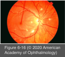
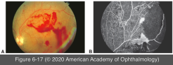
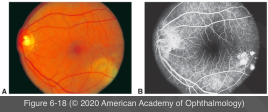

# 9.6.9. Posterior Uveitis (II): Collagen Vascular Diseases (II): Systemic Lupus Erythematosus

## Images

## Hierarchy

- 50%
- epidemiology
  - women of childbearing age
  - higher incidence among African Americans and Hispanics in US
- pathogenesis
  - autoimmune disorder characterized by
    - B-lymphocyte hyperactivity
      - polyclonal B-lymphocyte activation
    - hypergammaglobulinemia
    - autoantibody formation
      - antinuclear antibodies (ANA)
      - anti-ssDNA and anti-dsDNA
      - antibodies to cytoplasmic components (anti- Sm, anti-Ro, and anti-La)
      - antiphospholipid antibodies
        - antiphospholipid antibody syndrome (APS)
          - in association with SLE and other rheumatic diseases
          - venous or arterial thrombosis
            - deep venous thrombosis is the most common type of thrombosis
    - T-lymphocyte autoreactivity with immune complex deposition
  - association with HLA-DR2 and DR3
- ocular manifestations
  - eyelid lesions (discoid lupus erythematosus)
  - secondary Sjögren syndrome
    - 20%
  - scleral inflammatory disease
  - neuro-ophthalmic lesions
    - cranial nerve palsies
    - optic neuropathy
    - retrochiasmal and cerebral visual disorders
  - uveitis
    - rare
    - anterior or intermediate uveitis, are not commonly associated with SLE
  - lupus retinopathy
    - cotton-wool spots with or without intraretinal hemorrhages
      - independently of hypertension
    - severe retinal vascular occlusive disease (arterial and venous thrombosis)
      - retinal nonperfusion and ischemia
        - secondary retinal neovascularization
          - vitreous hemorrhage
    - an important marker of systemic disease activity
      - 3% with mild disease
      - 29% with more active disease
    - associated with
      - CNS lupus
      - antiphospholipid antibodies
        - hypercoagulable state
          - retinal vascular thrombosis
  - lupus choroidopathy
    - serous elevations of the retina, retinal pigment epithelium (RPE), or both
    - choroidal infarction
    - choroidal neovascularization (CNV)
  - arteriolar narrowing
  - disc edema
- systemic manifestations
  - acute cutaneous diseases
    - 70%–80%
    - malar rash
    - discoid lupus
    - photosensitivity
    - mucosal lesions
  - arthritis
    - 80%–85%
  - renal disease
    - 50%–75%
  - Raynaud phenomenon
    - 30%–50%
  - neurologic involvement
    - 35%
  - cardiac, pulmonary, hepatic, and hematologic abnormalities
  - SLICC criteria for diagnosis of SLE
    - See Table 9-1
- lab testing
  - ANA testing in patients with no systemic or ocular findings to suggest SLE has a very high false-positive rate
  - ANA testing should be limited to patients
    - with signs or symptoms suggestive of SLE
    - who have juvenile idiopathic arthritis
- treatment
  - control of the underlying disease
    - NSAIDs
    - corticosteroids
      - need monitoring for cataracts and glaucoma
    - IMT
    - plasmapheresis
    - systemic antihypertensive medications
    - patients with severe vaso-occlusive disease or antiphospholipid antibodies
      - antiplatelet therapy
      - systemic anticoagulation
    - hydroxychloroquine
      - to ameliorate skin, joint, and constitutional symptoms and prevent relapses
      - may help prevent nephritis and ANA-mediated thrombosis
      - need monitoring for retinal toxicity
  - proliferative retinopathy
    - panretinal photocoagulation
  - vitreous hemorrhage
    - vitrectomy surgery
