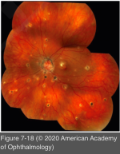
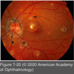
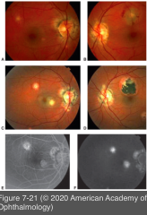
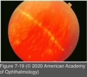

# 9.7.10. Infectious Ocular Inflammatory Diseases (X): Fungal Uveitis: Ocular histoplasmosis syndrome (OHS)

## Images

## Hierarchy

- epidemiology
  - endemic areas of the United States
    - Ohio and Mississippi River valleys
      - 60% of individuals react positively to histoplasmin skin testing
  - nonendemic areas in the United States
    - Maryland
  - sporadically throughout Europe (the United Kingdom and Netherlands)
  - M=F
    - vast majority of patients are of northern European descent
- pathogenesis
  - Histoplasma capsulatum
    - dimorphic fungus with yeast and filamentous forms
      - yeast form is the cause of both systemic and ocular disease
    - H capsulatum DNA has been detected in chronic choroidal lesions of a patient with OHS
    - individuals with disciform scars are more likely than control subjects to react positively to histoplasmin skin testing
  - inhalation of the fungal spores into the lungs
    - hematogenous dissemination of the organism
      - primary infection, typically during childhood
        - focal infection of the choroid at the time of initial systemic infection
  - immune mechanisms in patients with an underlying genetic predisposition
    - HLA-DRw2
      - 2x as common among patients with histo spots alone
    - HLA-B7 and HLA-DRw2
      - 2–4x more common among patients with disciform scars
    - HLA-DR2
      - present among those with CNV due to OHS
      - absent in a group of patients with MCP
- differential diagnosis
  - idiopathic CNV
  - MCP
  - punctate inner choroidopathy
  - syphilis
  - tuberculosis
  - sarcoidosis
  - coccidioidomycosis
  - toxocariasis
  - myopic degeneration
  - AMD
- diagnostic tests
  - FA of active choroiditis
    - early hypofluorescence (window block), late hyperfluorescence (staining)
- treatment of vision-threatening juxtafoveal or subfoveal CNV
  - thermal laser photocoagulation
    - rarely used in the treatment of subfoveal CNV associated with OHS
      - in contrast to CNV that shows early hyperfluorescence
  - photodynamic therapy (PDT)
    - advocated for the treatment of subfoveal OHS- associated CNV
  - intravitreal injection of anti–vascular endothelial growth factor (anti-VEGF) drugs
  - combination approaches using PDT and intravitreal corticosteroids or anti-VEGF drugs
  - submacular surgery
    - ≈ 50% recurrence rate
    - in selected cases of extensive peripapillary CNV, surgical removal may provide a more definitive vision benefit
- clinical presentation
  - clinical triad
    - multiple white, atrophic choroidal (histo spots)
      - macula or periphery
      - discrete and punched out
      - asymptomatic
      - seen in 1.5% of patients from endemic areas
        - appearing during adolescence
      - new choroidal scars develop in >20%
      - only 3.8% of these cases progress to CNV
      - early, acute granulomatous lesions of OHS are rarely observed
        - may be treated with oral or regional (periocular) corticosteroids
    - peripapillary pigment changes
    - maculopathy caused by CNV
      - metamorphopsia and a profound reduction in central vision
      - mean age of 41 years
      - histo spots in the macular area
        - 15% chance of developing CNV within 5 years
      - no spots in the macular area
        - 5% chance of developing CNV within 5 years
      - yellow-green subretinal membrane
        - surrounded by a pigment ring
        - arising at the border of a histo scar in the disc–macula area
      - subretinal fibrosis and disciform scarring
      - +- massive subretinal exudation and hemorrhagic retinal detachments
      - +- spontaneous resolution with a return to normal vision
      - visual prognosis of untreated OHS-associated CNV is poor
        - 75% of eyes reaching a final visual acuity of 20/100 or worse over a 3-year period
  - linear equatorial streaks
    - 5%
  - absence of vitreous cells
- similar to
  - PIC
  - SSPE
  - CMV
  - POHS
