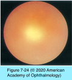
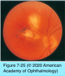
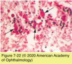
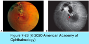
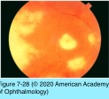
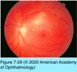
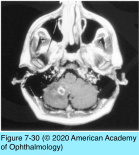
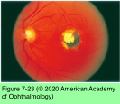

# 9.7.11. Infectious Ocular Inflammatory Diseases (XI): Protozoal Uveitis (I): Toxoplasmosis (I)

## Images

## Hierarchy

- Pathogenesis & epidemiology
  - Toxoplasma gondii
    - single-cell obligate intracellular apicomplexan parasite
      - felines are definitive hosts
      - humans and a variety of other animals are intermediate hosts
    - 3 genotypes
      - type I
        - more virulent
          - more severe disease and higher rates of ocular involvement
      - type II
        - most human infections in North America and Europe
        - less virulent than type I and atypical recombinant genotypes
      - type III
      - atypical recombinant genotypes
        - more virulent
          - more severe disease and higher rates of ocular involvement
    - 3 major forms
      - oocyst (soil form)
        - contains sporozoites
        - the result of sexual reproduction in the intestinal mucosa of felines
          - shed in infected cats’ feces
            - maturation in the soil
              - ingested by intermediate hosts or reingested by cats
        - 10–12 μm
      - tachyzoite (infectious form)
        - proliferative form
          - found in the circulatory system and may invade nearly all host tissue
          - replication of tachyzoites eventually ceases, with some microorganisms persisting as dormant bradyzoites within intercellular tissue cysts
        - 4–8 μm
      - tissue cyst (latent form)
        - contains bradyzoites
  - worldwide distribution
    - most common cause of infectious posterior uveitis in adults and children
      - ≤38%
        - 10–200 μm
    - prevalence of T gondii infection
      - 22.5% in US
        - 2% ocular toxoplasmosis among infected persons
        - 70-80% of women of childbearing age in US lack antibodies to T gondii
          - 0.2-1% incidence of toxoplasmosis acquired during pregnancy
      - 80% in southern Brazil
        - congenital infection in 1/770 live births
          - 18% ocular toxoplasmosis among infected persons
    - reported seropositivity rates among healthy adults
      - 3-10.8% in US
        - 15-40% among patients with HIV infection in US
      - 50-80% in France
  - modes of transmission
    - ingestion of undercooked, infected meat containing tissue cysts
    - ingestion of contaminated water, fruit, or vegetables with oocysts
    - inadvertent contact with cat feces, cat litter, or soil containing oocysts
    - transplacental transmission with primary infection during pregnancy
    - blood transfusion or organ transplantation
  - toxoplasmosis after infancy (postnatal)
    - reactivation of congenital infection
    - acquired infection
      - occurs in all age groups
        - primary prevention strategies, must target not only pregnant women but also children and adults at risk
      - ≤two-thirds of cases of toxoplasmic ocular disease
      - ocular disease can arise without concurrent systemic signs or symptoms
- Clinical presentation
  - symptoms
    - unilateral blurred or hazy vision
    - floaters
  - mild to moderate granulomatous anterior uveitis
  - elevated IOP
    - 20%
  - focal, white retinochoroiditis
    - overlying moderate vitreous inflammation
      - “headlight in the fog”
    - +- adjacent to a pigmented retinochoroidal scar
      - focal retinochoroiditis in the absence of retinochoroidal scarring should raise the suspicion of acquired disease or of another etiology
    - more commonly in the posterior pole
    - occasionally found immediately adjacent to or directly involving the optic nerve
  - retinal vessels in the vicinity of an active lesion may show perivasculitis
    - diffuse venous sheathing
    - segmental arterial plaques (kyrieleis arteriolitis)
    - vascular occlusions
  - additional ocular complications
    - cataract
    - persistent vitreous opacities
    - CME
    - retinal detachment
    - epiretinal membranes
    - optic atrophy
    - CNV
  - large, multiple, and/or bilateral lesions
    - immunocompromised patients
    - older patients
    - patients receiving steroids without concomitant antiparasitic therapy
  - atypical presentations
    - neuroretinitis
    - punctate outer retinal toxoplasmosis (PORT)
      - small, multifocal lesions at the level of the outer retina
      - exudation to subretinal space
      - scant overlying vitreal inflammation
    - unilateral pigmentary retinopathy simulating retinitis pigmentosa
    - other forms of intraocular inflammation in the absence of retinochoroiditis
  - clinical course
    - recurrent disease
      - new lesions develop
        - at the margins of old scars
        - elsewhere in the fundus
          - cysts may be present in normal-appearing retina
    - immunocompetent patient
      - self-limiting course
      - borders of the lesions become sharper/less edematous over a 6–8-week period without treatment
      - RPE hypertrophy occurs over a period of months
    - immunocompromised patient
      - disease is more severe and progressive
      - HIV/AIDS
        - frequent association of ocular disease with cerebral involvement (56%)
        - frequent recurrence of ocular disease when antitoxoplasmic medication is discontinued
- Congenital infection
  - 40% of primary maternal infections result in congenital infection
    - highest during the third trimester
  - risk of severe disease developing in fetus is inversely proportional to gestational age
    - early in pregnancy may result in spontaneous abortion, stillbirth, or severe congenital disease
    - acquired later in gestation may produce an asymptomatic, normal-appearing infant with latent infection
  - chronic or recurrent maternal infection during pregnancy is not thought to confer a significant risk of congenital toxoplasmosis
  - precautions for pregnant women without serologic evidence of T gondii infection
    - drink only well-filtered or boiled water.
      - avoid ingestion of raw/undercooked meat (freezing at –20°c/–4°f overnight also destroys tissue cysts)
    - carefully wash vegetables and fruits before consumption.
    - use gloves and wash hands and kitchen utensils well after handling meat or soil.
    - avoid contact with felines and their feces (including in soil or litter boxes).
  - periodic serologic screening of susceptible women during pregnancy in endemic areas
  - clinical presentation (Sabin's tetrad)
    - retinochoroiditis
      - most common abnormality in patients with congenital toxoplasmosis
        - 80%
        - may be subclinical and chronic
          - 25% become blind in 1 or both eyes
      - 85% bilateral
      - predilection for the posterior pole and macula
    - hydrocephalus or microcephaly
    - intracranial calcifications
      - diffuse
    - cognitive impairment
  - antiparasitic therapy for newborns with congenital toxoplasmosis during the first year of life
