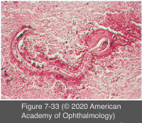
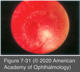
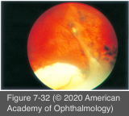

# 9.7.13. Infectious Ocular Inflammatory Diseases (XIII): Helminthic Uveitis (I): Ocular Toxocariasis

## Images

## Hierarchy

- epidemiology
  - M=F
    - children and young adults
      - median age = 11.5 years (range, 1–66)
    - non-Hispanic whites are affected most commonly
  - 1% of uveitic population
  - 14% of the US population is seropositive
  - US rate is 1 in 1000 persons
  - ocular involvement has been reported to occur in <1% of all seropositive children in Spain
- visceral larvae migrans (VLM)
  - increased rate of pica
    - children <3 years
  - direct relationship between peripheral eosinophilia and parasitic burden in systemic disease (but not in OT)
  - ocular toxocariasis (OT) and VLM rarely present contemporaneously
- pathogenesis
  - Toxocara canis or T cati
    - roundworm parasites
  - complete their life cycles in small intestines of dogs and cats
    - eggs are passed in feces
  - fecal–oral human transmission
    - ingestion of soil or contaminated food
      - eating disorder pica
      - contact with puppies or kittens
  - organisms grow in the small intestine
    - enter the portal circulation
      - hematogenous and lymphatic dissemination
        - tissue invasion by the second-stage larvae
          - visceral larvae migrans
  - maturation of adult worm does not occur in humans
    - ova are not shed in the alimentary tract!
- playgrounds/sandboxes
- diagnostic tests
  - diagnosis is essentially clinical
  - serology
    - serum ELISA titer of 1:8 is 91% sensitive and 90% specific for prior exposure
      - absence of serum antibodies rules out the diagnosis of toxoplasmosis!
    - ≤1/3 of patients have negative ELISA results
      - absence of serum antibodies does not rule out the diagnosis!
      - intraocular fluid ELISA may reveal specific Toxocara antibodies (positive GW coefficient)
    - any positive titer should be considered significant in the appropriate clinical context
  - toxocara larvae have been recovered from the vitreous during pars plana vitrectomy
  - PCR of vitreous not successful
  - B-scan ultrasonography and CT
    - useful in the presence of media opacity
      - vitreous membranes
      - tractional retinal detachment
      - absence of calcium
- differential diagnosis
  - sporadic unilateral retinoblastoma
    - younger age at presentation
    - paucity of inflammatory stigmata
    - demonstration of lesion growth in children
  - infectious endophthalmitis
  - toxoplasmosis
  - pars planitis
  - retinopathy of prematurity
  - persistent fetal vasculature
  - Coats disease
  - familial exudative vitreoretinopathy
- clinical presentation
  - symptoms
    - unilateral decreased vision
    - pain
    - photophobia
    - floaters
    - strabismus
    - leukocoria
  - bilateral disease is exceedingly rare
  - anterior segment is typically white and quiet
    - +- nongranulomatous anterior inflammation
    - +- posterior synechiae
  - posterior segment findings
    - 3 ocular syndromes
      - severe vitreous inflammation and chronic endophthalmitis
        - 25%
      - localized macular granuloma
        - 25%
        - 50%
      - peripheral granuloma
      - See Table 7-2
    - uncommon variants
      - unilateral pars planitis
      - diffuse peripheral inflammatory exudates
      - granulomas involving the optic nerve
  - determinants of visual prognosis
    - degree of intraocular inflammation
      - eyes with endophthalmitis have the worst vision at presentation
    - location of the inflammatory foci with respect to the fovea
      - in the absence of foveal involvement, vision is usually best with posterior pole granulomas
    - presence or absence of CME
    - development of tractional membranes involving the optic nerve, macula, and ciliary body
- treatment
  - periocular and systemic corticosteroids
  - antihelminthic therapy
    - utility of antihelminthic therapy has not been established
    - in concert with corticosteroids
      - albendazole or thiabendazole
  - laser photocoagulation
    - of the larvae
    - CNV arising in association with inactive Toxocara granulomas
  - vitreoretinal surgical techniques
    - tractional and rhegmatogenous complications
