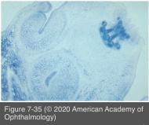
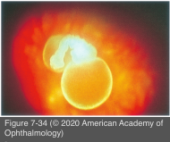

# 9.7.14. Infectious Ocular Inflammatory Diseases (XIV): Helminthic Uveitis (II): Cysticercosis

## Images

## Hierarchy

- pathogenesis
  - Cysticercus cellulosae
    - larval stage of Taenia solium (pork tapeworm)
  - ingestion of eggs in contaminated water/food
    - eggs mature into larvae
      - penetrate the intestinal mucosa
        - spread hematogenously to the eye via the posterior ciliary arteries into the subretinal space
          - posterior pole
          - may perforate the retina and gain access to the vitreous
  - eye is more commonly affected than any other organ
  - neural/cerebral cysticercosis
    - epileptiform seizures
    - significant morbidity and a mortality of 40%
    - CT
      - intracerebral calcification or hydrocephalus
- diagnostic tests
  - characteristic appearance of a motile cysticercus is pathognomonic
  - serum ELISA for anticysticercus antibodies
    - 50% and 80% of patients with ocular and neural cysticercosis
  - peripheral eosinophilia
  - anterior chamber paracentesis
    - large number of eosinophils
  - stool examination may find T solium eggs
    - in a definitive host (adult tapeworm in the gastrointestinal tract)
  - B-scan ultrasonography
    - characteristic picture of a sonolucent zone with a well-defined anterior and posterior margin
    - central echo-dense, curvilinear, highly reflective structure within the cyst is suggestive of a scolex
  - OCT
- epidemiology
  - most common ocular tapeworm infection
  - underdeveloped areas with poor hygiene
    - endemic to Mexico, Africa, Southeast Asia, eastern Europe, Central and South America, and India
      - Similar to congenital toxoplasmosis
  - young age
    - 10-30 years
- Similar to Toxocariasis
  - M=F
- differential diagnosis
  - retinoblastoma
  - Coats disease
  - retinopathy of prematurity
  - persistent fetal vasculature
  - toxocariasis
  - retinal detachment
  - diffuse unilateral subacute neuroretinitis
- clinical presentation
  - mostly unilateral
  - posterior segment is involved most often
    - may involve any structure of the eye and its adnexae
    - subretinal space > vitreous
  - symptoms
    - asymptomatic
    - floaters
    - moving sensations
    - ocular pain
    - photophobia
    - redness
    - poor visual acuity
  - uveitis
    - anterior chamber reaction
      - vitreous inflammation is more pronounced during the early stages
    - vitreous reaction
    - larvae death produces a severe inflammatory reaction
      - zonal granulomatous inflammation
  - larvae in the vitreous/subretinal space
    - 46%
    - globular or spherical, translucent, white cyst with a head, or scolex
    - undulates in response to the examining light
    - 1.5 to 6 disc diameters
  - retinal detachment
    - RPE atrophy may be observed surrounding the presumptive entry site into subretinal space
  - clinical course
    - can cause blindness, retinal atrophy, and phthisis
      - within 3–5 years
- treatment
  - antihelminthic drugs
    - praziquantel and albendazole
    - generally not effective for intraocular disease
      - larvae death causes worsening of ocular disease
        - albendazole or thiabendazole For Toxocariasis
  - laser photocoagulation
    - in combination with systemic corticosteroids
    - for small subretinal cysticerci
  - early removal of the larvae by vitreoretinal surgical techniques
    - poor results when the dead parasite is allowed to remain within the eye
  - references
