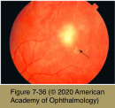
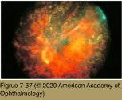
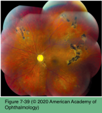
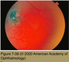

# 9.7.15. Infectious Ocular Inflammatory Diseases (XV): Helminthic Uveitis (III): DUSN Onchocerciasis

## Images

## Hierarchy

- Diffuse unilateral subacute neuroretinitis (DUSN)
  - epidemiology
    - healthy, young patients
      - mean age, 14 years; range, 11–65 years
  - pathogenesis
    - solitary nematodes of 2 different sizes
      - smaller worm
        - Ancylostoma caninum (the dog hookworm)
          - (or T canis)
        - 400–1000 μm
      - larger worm
        - 1500–2000 μm
          - Baylisascaris procyonis (the raccoon roundworm)
        - northern midwestern United States and Canada
  - clinical presentation
    - insidious onset
      - recurrent episodes
    - unilateral
      - rarely bilateral
        - Similar to Toxocariasis and cystisercosis
    - loss of vision
    - early stages
      - moderate to severe vitritis
      - optic disc swelling
      - multiple, focal, gray-white lesions in the postequatorial fundus
        - 1200 μm to 1500 μm
        - lesions are evanescent
        - +- overlying serous retinal detachment
      - +- visible worms in the subretinal space
    - late stages
      - retinal arteriolar narrowing
      - optic atrophy
      - diffuse pigment epithelial degeneration
      - abnormal electroretinographic results
    - +- neurologic disease (neural larvae migrans)
  - differential diagnosis
    - early stages
      - sarcoidosis-associated uveitis
        - Similar to cystisercosis
      - MCP
      - APMPPE
      - MEWDS
      - serpiginous choroidopathy
      - Behçet disease
      - OT
      - OHS
      - nonspecific optic neuritis
    - late stages
      - posttraumatic chorioretinopathy
      - occlusive vascular disease
      - toxic retinopathy
      - retinitis pigmentosa
  - diagnostic tests
    - typical clinical picture
      - observation of a worm in the subretinal space!
    - ERG abnormalities
      - systemic and laboratory evaluations are typically negative
  - treatment
    - direct laser photocoagulation of the worm
      - highly effective in halting progression of the disease
    - medical therapy with corticosteroids
      - transient control of the inflammation
        - has not been associated with significant exacerbation of inflammation
    - antihelminthic therapy
      - oral thiabendazole (22 mg/kg twice daily for 2– 4 days with a maximum dose of 3 g)
      - oral albendazole (200 mg twice daily for 30 days)
        - better-tolerated
      - indications
        - DUSN with no visible worm
          - to maximize the chance of identifying and treating the offending organism
            - immobilization of the subretinal nematode has been observed after antihelminthic therapy
        - if inflammation does not abate promptly after laser photocoagulation
          - second nematode (reinfection)?
- Onchocerciasis
  - epidemiology
    - a leading cause of blindness in the world
      - worldwide >18 million people are infected
      - 300,000 are blind
    - endemic in
      - sub-Saharan Africa
      - isolated foci in Central and South America
      - in hyperendemic areas everyone >15 years is infected
        - 1/2 will become blind before they die
    - rare in the US
  - pathogenesis
    - Onchocerca volvulus
      - filarial parasite
      - humans are the only host
    - female black flies of the Simulium genus
      - breed in fast-flowing streams
        - "river blindness"
      - transmit larvae
        - develop into mature adult worms that form subcutaneous nodules
          - adult females release millions of microfilariae
            - migrate throughout the body particularly to the skin and the eye
    - reach the eye by various routes
      - direct invasion of the cornea from the conjunctiva
      - penetration of the sclera, both directly and through the vascular bundles
      - hematogenous spread (possibly)
  - clinical presentation
    - live microfilariae are usually well tolerated
    - dead microfilariae initiate a focal inflammatory response
    - anterior segment signs are common
      - live microfilariae in the cornea
        - microfilariae swimming freely in the anterior chamber
      - dead microfilariae cause a small corneal stromal punctate inflammatory opacity
        - clears with time
      - mild uveitis and limbitis
      - +- severe anterior uveitis
        - synechiae
        - secondary glaucoma
        - cataract
    - posterior segment findings
      - RPE disruption
      - pigment dispersion and focal areas of atrophy
      - severe chorioretinal atrophy
        - predominantly in the posterior pole
      - optic atrophy
        - common in advanced disease
  - diagnosis
    - clinical appearance
    - history of pathogen exposure in an endemic area
    - finding microfilariae in small skin biopsies or in the eye
  - treatment
    - ivermectin
      - single oral dose of 150 μg/kg
        - treatment of choice for onchocerciasis
        - repeated annually, probably for 10 years
      - kills microfilariae but does not have a permanent effect on adult worms
        - slows progression of visual field loss and optic atrophy
          - reduces the microfilarial load in the anterior chamber and the development of new anterior chamber lesions
        - does not reduce the macrofilarial load
        - does not appear to prevent the development of new chorioretinal lesions or resolve existing lesions
    - topical corticosteroids
      - to control any anterior uveitis
    - surgical removal of skin nodules
      - many nodules are deeply buried and cannot be found
    - doxycycline
      - targets Wolbachia
        - adult worm is infected with the parasitic bacterium Wolbachia
          - crucial to the sexual development of the worm
      - doxycycline + ivermectin
        - treatment of choice
        - can cause long-term sterilization of adult worms and early worm death
      - x 6-week
