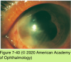

# 9.7.16. Infectious Ocular Inflammatory Diseases (XVI): Bacterial Uveitis (I): Ocular Syphilis (I)

## Images

## Hierarchy

- Acquired syphilis
  - stages
    - primary syphilis
      - incubation period ≈ 3 weeks
      - chancre
        - painless, solitary lesion at site of inoculation
        - spontaneous resolution within 12 weeks
      - +- CNS seeding
        - no neurologic findings
    - secondary syphilis
      - 6–8 weeks later
      - lymphadenopathy
      - generalized maculopapular rash
        - prominent on the palms and soles
      - uveitis
        - 10%
    - latent period
      - from 1 year (early latency) to decades (late latency)
    - tertiary syphilis
      - 1/3 of untreated patients
      - types
        - benign tertiary syphilis
          - gumma
            - skin and mucous membranes
            - choroid and iris
        - cardiovascular syphilis
        - neurosyphilis
          - ocular syphilis is a variant of neurosyphilis
      - uveitis
        - ≤5% of patients whose disease has progressed to tertiary syphilis
        - can occur at any stage of infection, including primary disease
- Epidemiology
  - Treponema pallidum
    - spirochete
  - transmission
    - sexual contact
      - most common
    - transplacental
      - after the tenth week of pregnancy
  - <2% of all uveitis cases
  - incidence in US
    - all-time low in 2000
    - incidence rate at any disease stage is rising
      - especially among
        - homosexual men
        - African Americans
          - have 5x greater risk than non-Hispanic whites
    - sharp declines in both primary and secondary syphilis among women over the past decade
      - rate of congenital syphilis
        - 2000
          - 14.3/100,000 live births
        - 2010
          - 8.7/100,000 live births
  - one of the great masqueraders of medicine
  - can be cured with appropriate antimicrobial therapy, even in patients with HIV/AIDS
  - references
- Congenital syphilis
  - risk of transmission to fetus
    - primary or secondary syphilis > latent syphilis
  - systemic findings
    - early congenital syphilis (≤2 years)
      - hepatosplenomegaly
        - the longer the mother had syphilis, the less likely is the transmission
      - changes of the long bones on radiographic examination
      - abdominal distention
      - desquamative skin rash
      - low birth weight
      - pneumonia
      - severe anemia
    - late congenital syphilis (>3 years)
      - Hutchinson teeth
      - mulberry molars
      - abnormal facies
      - cranial nerve VIII deafness
      - saber shins
      - perforations of the hard palate
      - neurosyphilis
        - cutaneous lesions such as rhagades
      - cardiovascular complications
        - unusual
  - ocular findings
    - present at birth or decades later
    - congenital cataract
    - stromal interstitial keratitis
      - the most common inflammatory sign of untreated late congenital syphilis
        - 50%
        - most commonly in girls
      - an allergic response to T pallidum in the cornea
      - symptoms
        - photophobia
          - intense pain
      - blood vessels invade the cornea
      - late stages
        - deep “ghost” (nonperfused) stromal vessels
        - corneal opacities
          - left untreated corneal inflammation may regress but leave the cornea diffusely opaque
      - anterior uveitis
      - +- glaucoma
      - Hutchinson triad
        - interstitial keratitis
        - cranial nerve VIII deafness
    - uveitis
      - anterior uveitis
        - accompanies interstitial keratitis
          - Hutchinson teeth
        - difficult to observe
      - posterior uveitis
        - multifocal chorioretinitis
          - bilateral salt-and-pepper fundus
            - affects the peripheral retina, posterior pole, or a single quadrant
            - not progressive
            - may have normal vision
          - bilateral secondary degeneration of the RPE
            - may mimic retinitis pigmentosa
              - narrowing of the retinal and choroidal vessels
              - optic disc pallor with sharp margins
              - variable deposits of pigment
            - less common
        - retinal vasculitis
          - less common
    - optic neuritis
- clinical presentation
  - affects all structures
  - unilateral or bilateral
  - symptoms
    - pain
    - redness
    - photophobia
    - blurred vision
    - floaters
  - anterior segment findings
    - iris roseola
    - vascularized papules (iris papulosa)
    - larger red nodules (iris nodosa)
    - gummata
    - posterior synechiae
      - interstitial keratitis
    - lens dislocation
    - iris atrophy
  - posterior segment findings
    - chorioretinitis
      - focal or multifocal
        - most common manifestation
      - small
        - usually with vitritis
        - may become confluent
      - grayish yellow
      - located in the postequatorial fundus
        - Figure 7-41
      - +- retinal vasculitis
      - +- disc edema
      - +- serous retinal detachment
      - +- exudates
      - posterior placoid chorioretinitis
        - pathognomonic of secondary syphilis
          - Figure 7-42
        - solitary or multifocal
        - macular or papillary
        - yellowish gray
        - at the level of the rpe
        - vitritis
        - FA
          - early hypofluorescence
          - late staining
          - retinal perivenous staining
        - ICG
          - hypofluorescent spots corresponding to lesions
    - papillitis/neuroretinitis
      - +- macular star formation
    - less common posterior segment presentations
      - retinitis
        - types
          - focal retinitis
            - Figure 7-43
          - peripheral necrotizing retinitis
            - may resemble ARN or PORN
          - punctate inner retinal infiltrates
            - Figure 7-44
        - may become confluent
        - usually with retinal vasculitis
        - slowly progressive
        - responds dramatically to intravenous penicillin
          - good visual outcome
      - isolated retinal vasculitis
        - retinal arterioles, capillaries, and larger arteries or veins (or both)
        - best appreciated on FA
        - may masquerade as a branch retinal vein occlusion
      - exudative retinal detachment
  - immunocompromised or HIV/AIDS patients
    - may have atypical/more fulminant ocular disease
    - optic neuritis/neuroretinitis are more common in the initial presentation of these patients
  - neuro-ophthalmic manifestations of syphilis
    - Argyll Robertson pupil
      - disease recurrences are noted even after appropriate antibacterial therapy
    - ocular motor nerve palsies
    - optic neuropathy
      - retrobulbar optic neuritis
    - most often in tertiary syphilis or neurosyphilis
