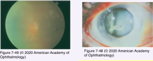
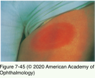
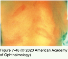
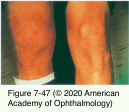

# 9.7.18. Infectious Ocular Inflammatory Diseases (XVIII): Bacterial Uveitis (III): Lyme Disease (LD)

## Images

## Hierarchy

- Epidemiology
  - most common tick-borne illness in the United States
  - spirochete Borrelia burgdorferi
  - animal reservoirs
    - deer
    - horses
    - cows
    - rodents
    - birds
    - cats
    - dogs
  - transmitted to humans through the bite of infected ticks
    - Ixodes scapularis
      - northeast, mid-Atlantic, and midwestern United State
    - I pacificus
      - western United States
  - 2011: 10.8 cases per 100,000 persons per year
  - M (53%)>F (47%)
  - bimodal distribution
    - children aged 5–14 years
    - adults aged 50–59 years
  - whites>other races
  - seasonal variation
    - May - August
  - worldwide distribution
    - caused by different species of Borrelia outside United States
- Ocular disease
  - stage 1
    - follicular conjunctivitis
      - 11%
        - most common ocular manifestation
    - episcleritis
  - stage 2
    - intraocular inflammatory disease
      - anterior uveitis
        - granulomatous anterior chamber reaction
      - intermediate uveitis
        - vitritis
          - one of the most common intraocular presentations
          - may be severe
      - posterior uveitis
        - choroiditis
        - peripheral multifocal choroiditis
          - multiple, small, round, punched-out lesions
            - similar to sarcoidosis
          - associated with vitritis
          - RPE clumping
            - resembling the inflammatory changes that occur with syphilis or rubella
        - retinal vasculitis
          - vasculitic branch retinal vein occlusion
        - papillitis
          - neuroretinitis
        - exudative retinal detachment
      - panuveitis
    - neuro-ophthalmic manifestations
      - unilaterally or bilaterally
      - sequentially or simultaneously
      - involvement of multiple cranial nerves (II, III, IV, V, VI, and, most commonly, VII)
      - optic nerve findings
        - optic neuritis
        - papillitis
        - papilledema associated with meningitis
      - Horner syndrome
  - stage 3
    - keratitis
      - months-years after the onset of infection
        - most common ocular manifestation of stage 3
      - immune phenomenon
        - responds to topical corticosteroids alone
      - clinical presentation
        - bilateral, patchy, focal, and stromal
        - subepithelial infiltrates with indistinct borders
        - peripheral keratitis with stromal edema
        - corneal neovascularization
    - episcleritis
- several weeks-4 months
- Systemic manifestations
  - stage 1 (local disease)
    - erythema chronicum migrans
      - 70%
      - site of the tick bite
        - within 2–28 days
      - macular rash
        - lesion enlarges and becomes papular
          - paracentral area may clear, forming a “bull’s eye” lesion
    - constitutional symptoms
      - fever
      - malaise
      - fatigue
      - myalgias
      - arthralgias
  - Stage 2 (disseminated disease)
    - hematogenous spread to the skin, CNS, joints, heart, and eyes
    - secondary erythema chronicum migrans rash
      - at sites remote from the tick bite
    - joint involvement
      - monoarthritis or oligoarthritis
      - large joints
        - typically the knee
      - ≤80% (if untreated)
      - differential diagnosis
        - may be the only manifestation of Lyme disease in children
        - juvenile idiopathic arthritis (JIA)
    - neurologic involvement
      - 40%
        - meningitis
      - encephalitis
      - painful radiculitis
      - unilateral or bilateral Bell palsy
        - in endemic areas, ≤25% of cranial nerve VII palsies may be attributed to LD
  - stage 3 (persistent disease)
    - ≥5 months
    - episodic arthritis
      - most frequent systemic manifestation
      - may become chronic
        - HLA-DR4 and -DR2 haplotypes in North America
          - patients with HLA-DR4 have poorer response to antibiotics
    - acrodermatitis chronica atrophicans
      - bluish red lesion on the extremities
      - may progress to fibrous bands and nodules
    - chronic neurologic syndromes
      - neuropsychiatric disease
      - memory loss
      - chronic fatigue
      - radiculopathy
      - peripheral neuropathy
- Treatment
  - intraocular inflammation is regarded a manifestation of CNS involvement
    - warrants careful neurologic evaluation, including a lumbar puncture
  - intravenous antibiotic therapy with neurologic dosing regimens
    - severe posterior segment manifestations
    - confirmed CNS involvement
    - less-severe disease that responds incompletely or relapses when oral antibiotics are discontinued
    - carditis
    - admit to the hospital
      - atrioventricular block
  - topical corticosteroids and mydriatics
    - anterior segment inflammation
    - after the initiation of appropriate antibiotic therapy
  - routine use of systemic corticosteroids is controversial
    - associated with an increase in antibiotic treatment failures
  - Jarisch-Herxheimer reaction may complicate antibiotic therapy
  - may become reinfected after successful antibiotic therapy
  - may experience a more severe or chronic course by virtue of concomitant
    - babesiosis
      - intraerythrocytic parasitic infection caused by protozoa of the genus Babesia
      - transmitted by Ixodes species ticks
    - human granulocytic anaplasmosis
      - caused by obligate intracellular bacterium Anaplasma phagocytophilum
      - transmitted by Ixodes species ticks
  - prevention strategies
    - avoiding tick-infested habitats
    - using tick repellents
      - onchocerciasis may be associated with Wolbachia
    - wearing protective outer garments
    - removing ticks promptly
    - reducing tick populations
  - See Table 7-4
- Diagnosis
  - in the appropriate clinical context, erythema chronicum migrans is diagnostic
  - serology
    - interpreting serologic data is problematic
      - lack of standardization
      - cross-reactivity with other spirochetes
        - frequent false-positive and false-negative test results
    - CDC recommends a 2-step protocol
      - ELISA for IgM and IgG
      - Western immunoblot testing
  - PCR-based assays
    - amplify both genomic and plasmid DNA from a variety of tissues
      - ocular fluids
      - highest yields obtained from the skin
