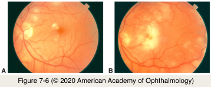

# 9.7.1. Infectious Ocular Inflammatory Diseases (I): HSV and VZV (I)

## Images

## Hierarchy

- Nonnecrotizing herpetic retinitis
  - children
    - acute retinochoroiditis with diffuse hemorrhages
      - following acute VZV infection
  - adults
    - chronic choroiditis or retinal vasculitis
  - viral etiology in 13% of cases diagnosed as “idiopathic posterior uveitis”
  - may present with
    - bilateral
    - cystoid macular edema (CME)
    - birdshot uveitis–like retinochoroidopathy
    - occlusive bilateral retinitis
  - treatment
    - resistant to systemic corticosteroids and/or IMT
    - favorable response to systemic antiviral medication
- Progressive outer retinal necrosis (PORN)
  - variant of acute necrotizing herpetic retinopathy
  - profoundly immunosuppressed patients
  - etiology
    - VZV
      - most common
        - advanced AIDS (CD4+ T lymphocytes ≤50 cells/μL)
    - HSV
  - clinical presentation
    - patchy areas of outer retinal whitening that coalesce rapidly
    - differences with ARN
      - early involvement of posterior pole
      - absent vitreous inflammatory cells
      - minimal involvement of retinal vasculature
        - at least initially
    - patients with PORN + AIDS
      - history of cutaneous zoster (67%)
      - bilateral involvement (71%)
      - high rate (70%) of retinal detachment as in ARN
        - Similar to ARN
  - visual prognosis is poor
    - visual acuity of no light perception in 75%
  - treatment
    - often resistant to intravenous acyclovir alone
    - combination systemic and intraocular therapy using foscarnet and ganciclovir
      - successful management has been reported
    - long-term suppressive antiviral therapy is required in patients with HIV/AIDS who are not able to achieve immune reconstitution
