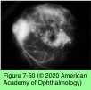
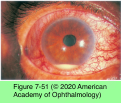
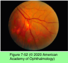
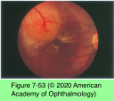
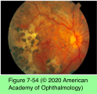
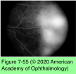

# 9.7.20. Infectious Ocular Inflammatory Diseases (XX): Bacterial Uveitis (V): Tuberculosis (TB)

## Images

## Hierarchy

- Epidemiology
  - Mycobacterium tuberculosis
    - acid-fast
    - obligate aerobe
      - affinity for highly oxygenated tissues
        - apices of the lungs
        - choroid
    - transmitted by aerosolized droplets
  - uncommon in the United States
    - 2001: 3.4/100,000 persons
  - worldwide TB remains the most important systemic infectious disease
    - 2008: 9.4 million new cases and 1.8 million deaths
    - 1/3 of the world’s population is infected
    - 95% of cases occur in resource-limited countries
    - incidence of TB increased coincident with the AIDS epidemic
  - frequency of ocular disease parallels the prevalence of TB in general
  - uveitis attributable to TB
    - in US
      - 0.6%
        - ocular disease relatively uncommon both in endemic areas and among institutionalized populations with unequivocal systemic disease
    - in India
      - 0.6% - 10%
    - in Japan & Saudi Arabia
      - 7.9% and 10.5%, respectively
  - high-risk groups
    - health care professionals
    - recent immigrants from endemic areas
    - indigent, immunocompromised patients
    - chronic disease
    - HIV/AIDS
    - IMT
    - older adults
- Systemic infection
  - primary
    - a result of recent exposure
  - secondary
    - 90%
    - reactivation of the disease with immune compromise
  - miliary disease
    - widespread hematogenous dissemination
  - pulmonary TB
    - 80%
      - most often in immunocompromised persons
  - extrapulmonary disease
    - 20%
      - 1/2 have a normal-appearing chest radiograph
    - ≤20% have a negative PPD skin test
    - patients coinfected with HIV present more often with extrapulmonary disease
    - provides definite diagnosis
  - vast majority of infected individuals remain asymptomatic
    - only 10% develop symptomatic disease
    - classic presentation of symptomatic disease
      - fever
      - night sweats
      - weight loss
      - both pulmonary and extrapulmonary infection
- Ocular disease
  - mechanism
    - active infection
    - immunologic reaction to the organism
  - types
    - primary ocular TB
      - the eye is the primary portal of entry
        - conjunctival, corneal, and scleral disease
          - scleritis
          - phlyctenulosis
          - interstitial keratitis
          - corneal infiltrates
    - secondary ocular TB
      - routes
        - hematogenous dissemination
        - contiguous spread from adjacent structures
      - uveitis is the most common manifestation
  - tuberculous uveitis
    - chronic granulomatous disease
    - waxing and waning course
      - mutton-fat KPs
    - anterior uveitis
      - posterior synechiae
        - iris nodules
      - secondary glaucoma
      - CME
      - hypopyon
    - posterior segment findings
      - disseminated choroiditis
        - most common presentation
        - multiple deep, discrete, yellowish lesions (tubercles)
        - 0.5 mm - 3.0 mm
        - 5 - several hundred
        - in the posterior pole
        - +- disc edema
        - +- nerve fiber layer hemorrhages
        - choroidal tubercles may be one of the earliest signs of disseminated disease
        - more common among immunocompromised hosts
        - FA
          - active choroidal lesions display early hyperfluorescence with late leakage
          - cicatricial lesions show early blocked fluorescence with late staining
        - ICG angiography
          - early- and late-stage hypofluorescence
          - more numerous than those seen on FA or clinical examination
        - in patients with HIV/AIDS, tuberculous choroiditis may progress despite effective antituberculous therapy
      - single, focal, large, elevated choroidal mass (tuberculoma)
        - 4 mm - 14 mm
        - neurosensory retinal detachment
        - macular star formation
      - serpiginous-like choroiditis
      - Eales disease
        - 20–40 years
          - healthy young men
        - recurrent, unilateral retinal and vitreous hemorrhage
        - subsequent involvement of the fellow eye
        - peripheral retinal perivasculitis
          - venous occlusion
            - periphlebitis
          - peripheral nonperfusion
          - neovascularization
          - tractional retinal detachment
        - PCR shows M tuberculosis DNA from the aqueous, vitreous, and epiretinal membranes of patients with Eales disease
      - vitritis
      - subretinal abscess
      - CNV
      - optic neuritis
      - acute panophthalmitis
- Diagnosis
  - extraocular
    - detection of mycobacteria in body fluids or tissues
    - PPD test
      - (+) PPD test is indicative of prior exposure
        - not necessarily active infection!
          - provides presumptive diagnosis
      - intradermal injection of 5-tuberculin-unit
      - false-negative
        - 25%
        - severe acute illness
        - immune compromise
          - corticosteroid use
          - advanced age
          - poor nutrition
          - sarcoidosis
      - false-positive
        - BCG vaccination
        - atypical mycobacteria
        - intraluminal BCG injections for bladder cancer
      - indications
        - should be used selectively only when the index of suspicion is high
        - important to do PPD test before starting tumor necrosis factor inhibitors
      - failure to demonstrate systemic disease does not exclude possibility of intraocular infection
  - ocular
    - intraocular fluid analysis or tissue biopsy
      - for suspected ocular TB when testing for systemic infection is negative
      - nucleic acid amplification
        - transcription-mediated amplification of 16S ribosomal RNA
        - PCR amplification of M tuberculosis DNA sequences
    - chorioretinal biopsy
      - PCR testing
      - routine histologic exam
- Treatment
  - indications for systemic antibiotic therapy in patients with uveitis
    - abnormal-appearing chest radiograph
    - TB skin test has recently converted to positive
    - nonadherent patients receiving single-drug therapy
      - positive bacterial culture or PCR results
  - patients at risk for multidrug-resistant tuberculosis (MDRTB)
    - migrant or indigent populations
    - recent immigrants from countries where INH and rifampin are available over the counter
  - multidrug therapy
    - induction phase
      - INH, rifampin, and pyrazinamide
        - immunocompromised patients, including those with HIV infection
        - x 2 month
    - continuation phase
      - x 4–7 months
    - in the event of drug resistance
      - 95% of immunocompetent patients may be successfully treated with a full course of therapy
      - another drug (ethambutol or streptomycin) is added to the initial triple-drug regimen
        - followed by
          - INH and rifampin x 4-month
  - directly observed therapy (DOT)
  - uveitis consistent with TB + normal chest radiograph + positive TB test result
    - a diagnosis of extrapulmonary TB may be entertained and treatment initiated
      - particularly
        - medically unresponsive uveitis or other findings supportive of the diagnosis
        - skin test result recently converted to positive
        - large area of induration
        - recent exposure to or inadequate treatment of the disease
  - topical and systemic corticosteroids
    - in conjunction with antimicrobial therapy
    - any patient suspected of harboring TB should undergo appropriate testing before beginning corticosteroid therapy
  - prophylactic treatment with INH (6 months - 1 year)
    - or
      - positive TB test result
        - and
          - for whom systemic corticosteroid treatment is being considered
          - who have received corticosteroids for >2 weeks at doses greater than 15 mg/day
      - abnormal chest film appearance
    - patients with latent TB in whom anti–TNF therapy is being considered
