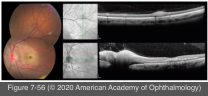

# 9.7.21. Infectious Ocular Inflammatory Diseases (XXI): Bacterial Uveitis (VI): Cat Scratch Disease

## Images

## Hierarchy

- epidemiology
  - zoonotic disease
    - cats are the primary mammalian reservoir
      - cat flea important for transmission of the organism among cats
    - transmitted to humans by
      - scratches
      - lick
      - bites
      - domestic cats, particularly kittens
  - Bartonella henselae
    - small
      - gram-negative rod
        - Nocardia: G+ rod
          - Leptospira: gram-negative spirochete
      - predominantly in fall and winter
  - seasonal pattern
  - incidence rate in US
    - children <10 years
    - 9.3/100,000 persons/year
  - most prevalent in the southern states, California, and Hawaii
- systemic manifestations
  - precede the ocular manifestations
  - erythematous papule, vesicle, or pustule
    - at the primary site of cutaneous injury
    - 3–10 days after primary inoculation
    - 1–2 weeks before the onset of lymphadenopathy and constitutional symptoms
  - mild to moderate flulike illness
  - regional adenopathy
  - more severe, disseminated disease
    - encephalopathy
    - aseptic meningitis
    - osteomyelitis
    - hepatosplenic disease
    - pneumonia
    - pleural and pericardial effusions
    - less common
- diagnostic tests
  - indirect fluorescent antibody assay
    - for detection of serum anti–B henselae antibodies
    - 88% sensitive
      - titers of >1:64 considered positive
    - 94% specific
  - enzyme immunoassays
    - IgG
      - sensitivity of 86%–95% and a specificity of 96%
  - Western blot analysis
    - a single positive indirect fluorescent antibody or enzyme immunoassay titer for IgG or IgM is sufficient to confirm the diagnosis
  - bacterial cultures
    - require several weeks for colonies to become apparent
  - skin testing
    - sensitivity of up to 100%
  - PCR-based techniques
    - specificity of up to 98%
    - target the bacterial 16S ribosomal RNA gene or B henselae DNA
- treatment
  - self-limiting in most cases
    - excellent systemic and visual prognosis
    - doxycycline
  - antibiotics
    - erythromycin
    - rifampin
    - trimethoprim-sulfamethoxazole
      - for more severe systemic or ocular manifestations
        - their efficacy has not been demonstrated conclusively
    - ciprofloxacin
    - gentamycin
  - not <18 years
    - not <8 years
  - immunocompetent patients >8 years
    - doxycycline, 100 mg orally twice daily
      - X 2-4 weeks
  - more severe infections
    - or
      - intravenous doxycycline
    - doxycycline + rifampin, 300 mg orally twice daily
  - immunocompromised individuals
    - treatment x 4 months
  - children
    - azithromycin
    - the safety of ciprofloxacin <18 years has not been established
  - oral corticosteroids
    - efficacy on the course of systemic and ocular disease is unknown
      - marginal corneal infiltrates
  - in the subset of patients with recurrent idiopathic neuroretinitis, long-term IMT may be of benefit
- ocular involvement
  - 5%–10% of patients with CSD
  - Parinaud oculoglandular syndrome
    - unilateral granulomatous conjunctivitis
    - 5% of patients with CSD
      - regional lymphadenopathy
    - differential diagnosis
      - tularemia
      - tuberculosis
      - syphilis
      - sporotrichosis
      - acute Chlamydia trachomatis infection
  - posterior segment manifestations
    - neuroretinitis
      - "Leber idiopathic stellate neuroretinitis"
        - caused by B henselae infection in ≈ 2/3 of cases
          - See Table 7-5
      - 1%–2% of patients with CSD
      - follows constitutional symptoms by 2–3 weeks
      - abrupt vision loss
        - most often unilateral
          - bilateral cases have been reported
            - frequently asymmetric
        - 20/25 - ≤20/200
      - optic disc swelling
      - peripapillary serous retinal detachment
        - 2–4 weeks before macular star
      - macular star formation
        - partial or incomplete
        - resolves in 8–12 weeks
      - anterior chamber inflammation
      - vitritis
    - retinal/choroidal lesions
      - discrete, focal/multifocal
      - 50–300 μm
      - arterial and venous occlusive disease
      - localized neurosensory macular detachment
    - other posterior segment complications
      - epiretinal membranes
      - inflammatory mass of the optic nerve head
      - peripapillary angiomatosis
      - intermediate uveitis
      - retinal white dot syndrome
      - isolated optic disc swelling
      - panuveitis
      - orbital abscess
