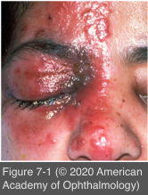
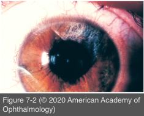

# 9.7.2. Infectious Ocular Inflammatory Diseases (II): HSV and VZV (II): Anterior Uveitis

## Images

## Hierarchy

- general
  - +- keratitis (keratouveitis)
    - +- diffuse or localized decreased corneal sensation
      - neurotrophic keratitis
  - the inflammation may become chronic
    - VZV infection should be considered in the differential diagnosis of chronic unilateral anterior uveitis, even if the
      - cutaneous component occurred in the past
      - cutaneous component was minimal
      - cutaneous component was absent (varicella- zoster sine herpete)
  - chickenpox (varicella)
    - acute, mild, nongranulomatous, self-limiting, and bilateral anterior uveitis
    - ≤40% of patients with primary VZV infection may develop anterior uveitis
  - herpes zoster cutaneous vesicles at the tip of the nose (Hutchinson sign)
    - indicate nasociliary nerve involvement and a greater likelihood that the eye will be affected
  - vasculitis
    - with herpes-zoster ophthalmicus
    - may lead to
      - anterior segment ischemia
      - scleritis
      - vasculitis in the orbit gives rise to cranial nerve palsies
      - retinal artery occlusion
- treatment
  - topical corticosteroids and cycloplegic agents
    - may require prolonged corticosteroid therapy with very gradual tapering
    - some patients with VZV infection require very long-term, albeit extremely low, doses of topical corticosteroids (as infrequent as 1 drop per week)
  - topical antiviral drugs
    - usually ineffective for herpetic uveitis
  - systemic antiviral drugs
    - acyclovir (400–800 mg, 5 times/day)
      - may be indicated in patients with herpes simplex keratouveitis to prevent dendritic keratitis as a complication of topical corticosteroid therapy
    - famciclovir (250–500 mg, 3 times/day)
    - valacyclovir (500 mg to 1 g, 3 times/day)
    - higher doses used for VZV uveitis
      - often beneficial in intraocular inflammation associated with HSV or VZV uveitis
      - initiation of oral antiviral therapy at the onset of VZV uveitis is recommended
  - systemic corticosteroids are sometimes necessary
  - long-term, suppressive, low-dose antiviral therapy
    - may be indicated in patients with herpetic uveitis, but controlled studies are lacking
    - oral prophylactic dosages
      - HSV
        - acyclovir, 400 mg 2 times/day
        - valacyclovir, 500 mg/day
      - VZV
        - acyclovir, 800 mg 2 times/day
        - valacyclovir, 1 g/day
- clinical presentation
  - stellate keratic precipitates (KPs)
    - distinctly stellate pattern
    - diffuse distribution
    - fine and fibrillar
    - viral infections particularly herpes group viruses
    - also present in Fuchs heterochromic uveitis
    - not diagnostic of any particular condition!
  - ocular hypertension
    - <50–60 mm Hg
    - a frequent complication of herpetic uveitis
      - trabeculitis
    - most other inflammatory syndromes are associated with decreased IOP
      - a helpful diagnostic hallmark of herpetic uveitis
  - iris atrophy
    - characteristic of herpetic inflammation
      - HSV, VZV, CMV
      - patchy or sectoral
        - HSV
          - patchy
        - VZV
          - sectoral
      - detected with retroillumination
  - hyphema
  - hypopyon
  - posterior synechia
  - corneal edema
