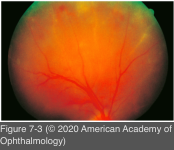
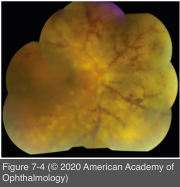
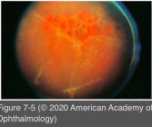

# 9.7.3. Infectious Ocular Inflammatory Diseases (III): HSV and VZV (III): Acute Retinal Necrosis

## Images

## Hierarchy

- necrotizing herpetic retinopathy
  - retinal lesions of presumed herpetic etiology that are not characteristic of well-recognized syndromes such as ARN, CMV retinitis, or progressive outer retinal necrosis
- Acute retinal necrosis (ARN)
  - epidemiology
    - otherwise healthy adults
    - M=F
      - immunocompromised patients (including HIV infection)
    - clustering in fifth-seventh decades
      - reported in children
  - prodromal infection
    - without a systemic prodrome years after primary infection
    - following cutaneous herpetic infection
      - dermatomal zoster
    - following systemic herpetic infection
      - chickenpox
      - herpetic encephalitis
        - HSV-1 or -2
- diagnostic criteria
  - See Table 7-1
- diagnostic tests
  - retinal choroidal biopsy
    - polymerase chain reaction (PCR) testing of aqueous and/or vitreous samples
  - Intraocular antibody production
    - Goldmann-Witmer (GW) coefficient
      - anterior chamber paracentesis
        - aqueous humor analysis
      - ratio >3 is diagnostic of local antibody production
      - adjunct to the diagnosis of toxoplasmosis and uveitis caused by HSV and VZV infection
      - combining the GW coefficient with PCR analysis may increase diagnostic yield
        - little value in the diagnosis of CMV retinitis
  - PCR testing
    - has largely supplanted viral culture, intraocular antibody titers, and serology
      - most sensitive, specific, and rapid diagnostic method for detecting infectious posterior uveitis in general and ARN specifically
    - aqueous humor
      - aqueous sampling is usually sufficient
    - vitreous
    - quantitative PCR
      - information with respect to viral load, disease activity, and response to therapy
    - etiology
      - VZV> HSV-1> HSV-2
        - HSV-1 or VZV
          - tend to be older (mean age, 40 years)
        - HSV-1
          - higher risk of encephalitis and meningitis
        - HSV-2
          - younger (<age 25 years)
      - in rare instances, CMV
  - endoretinal biopsy
    - rarely when PCR results are negative but the clinical suspicion is high
- clinical presentation
  - symptoms
    - loss of vision
    - photophobia
    - floaters
      - pain
    - acute unilateral
      - 36%
  - fellow eye involvement
    - usually within 6 weeks
      - may be delayed for extended periods
  - panuveitis
    - significant anterior segment inflammation
      - KPs
      - posterior synechiae
      - elevated IOP
    - heavy vitreous cellular infiltration
  - within 2 weeks
    - classic triad
      - occlusive retinal arteriolitis
      - vitritis
      - multifocal yellow-white peripheral retinitis
        - early
          - peripheral retinal lesions are discontinuous and have scalloped edges
          - appear to arise in the outer retina
        - within days
          - lesions coalesce to form a confluent 360° creamy retinitis
          - progresses in a posterior direction
          - full-thickness retinal necrosis
            - occasional retinal hemorrhage
          - posterior pole tends to be spared
  - combined tractional–rhegmatogenous retinal detachments
    - 75%
    - multiple posterior retinal breaks
    - proliferative vitreoretinopathy
      - within the first weeks to months
  - exudative retinal detachment
  - disc swelling and relative afferent pupillary defect
- treatment
  - induction antiviral therapy
    - Intravenous acyclovir, 10 mg/kg every 8 hours for 10–14 days,
      - effective against HSV and VZV
      - +- reversible elevations in serum creatinine and liver enzymes
    - oral valacyclovir at doses of up to 2 g 3x/day
      - alternative to intravenous acyclovir
        - in the presence of frank renal insufficiency, the dosage will need to be reduced
      - has not been demonstrated as superior to the intravenous approach
    - intravitreal antiviral
      - ganciclovir (0.2–2.0 mg/0.1 mL)
      - foscarnet (1.2–2.4 mg/0.1 mL)
      - for rapid induction (in combination with intravenous or oral antivirals)
      - for disease that fails to respond to systemic acyclovir
      - injections may need to be repeated twice weekly until the retinitis is controlled
  - systemic corticosteroids
    - oral prednisone, 1 mg/kg/day after 24–48 hours of antiviral therapy
      - treatment prevents development of new lesions and promotes lesion regression over 4 days
    - tapered over several weeks
  - aspirin and other anticoagulants
    - to prevent vascular occlusions
    - results have been inconclusive
  - maintenance antiviral therapy
    - x3 months
      - extended antiviral therapy may reduce the incidence of contralateral disease by 80% over 1 year
    - VZV infection
      - acyclovir at 800 mg orally 5 times daily, valacyclovir at 1 g orally 3 times daily, or famciclovir at 500 mg orally 3 times daily
    - HSV-1
      - dose is one-half of that for VZV
  - retinal detachment
    - prophylactic
      - prophylactic barrier laser photocoagulation
        - to areas of healthy retina at posterior border of necrotic lesions
          - as soon as view permits
        - may prevent retinal detachment
      - early vitrectomy combined with endolaser photocoagulation
        - to eliminate the contribution of vitreous traction on the necrotic retina
    - vitrectomy, air–fluid exchange, endolaser photocoagulation, long-acting gas or silicone oil tamponade
      - more successful than standard scleral buckling
- prognosis
  - untreated
    - final visual acuity of ≤20/200 in 2/3
  - with early recognition, aggressive antiviral therapy, and laser photocoagulation, this prognosis may be significantly improved
    - 46% achieved a visual acuity of ≥20/40
    - 92% achieved a visual acuity of ≥20/400
- differential diagnosis
  - CMV retinitis
  - atypical toxoplasmic retinochoroiditis
  - syphilis
  - lymphoma
  - leukemia
  - autoimmune retinal vasculitis (such as Behçet disease)
