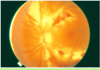
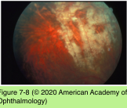
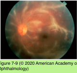
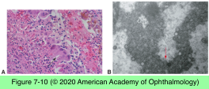

# 9.7.4. Infectious Ocular Inflammatory Diseases (IV): Cytomegalovirus (CMV)

## Images

## Hierarchy

- in contrast to CMV retinitis
- Introduction
  - Herpesviridae family
    - double-stranded DNA virus
  - most common cause of congenital viral infection
  - CMV retinitis
    - the most common ophthalmic manifestation of both congenital CMV infection and of CMV as an opportunistic infection
  - causes illness in immunocompromised patients
    - leukemia
    - lymphoma
    - HIV/AIDS
      - before introduction of combination antiretroviral therapy
        - 30% of patients with HIV/AIDS developed CMV retinitis
          - rhegmatogenous retinal detachments with multiple breaks developed in 33% per eye per year
      - combination antiretroviral regimens
        - 80% decline in new cases/year of CMV retinitis
        - new cases of CMV retinitis continue to occur among patients who
          - fail combination antiretroviral treatment
          - abandon treatment
          - experience immune reconstitution but do not develop CMV-specific immunity
      - CMV retinitis confers a twofold increased risk in mortality among patients with a CD4+ T-cell count <100 cells/μL
    - transplant recipients
      - resistant CMV infection in patients with CMV retinitis is further associated with increased mortality
    - systemic immunomodulation
- CMV anterior uveitis
  - immunocompetent adults
  - chronic or recurrent unilateral anterior uveitis
  - associated with
    - ocular hypertension
    - corneal edema
      - similar to VZV
    - demonstration of CMV DNA by PCR analysis
      - variable degrees of sectoral iris atrophy
  - diagnosis
    - intraocular antibodies directed against CMV by enzyme-linked immunosorbent assay (ELISA)
  - treatment
    - specific, prolonged, systemic anti-CMV treatment
      - negative study results for HSV and VZV
      - valganciclovir
    - relapses are common after discontinuation of therapy
- Pathogenesis
  - virus reaches the eye hematogenously
    - infects retinal vascular endothelial cells
      - crosses the blood–ocular barrier
        - cell-to-cell transmission within the retina
- Congenital CMV retinitis
  - associated with other systemic manifestations of disseminated disease
    - fever
    - thrombocytopenia
    - anemia
    - pneumonitis
    - hepatosplenomegaly
  - prevalence
    - 11%-22%
  - diagnosis of congenital disease
    - associated systemic disease findings
    - clinical fundus appearance
    - evidence of viral inclusion bodies or positive PCR in urine, saliva, and subretinal fluid
    - complement-fixation test
      - of value 5–24 months after the loss of the maternal antibodies
  - resolution of the retinitis leaves both pigmented and atrophic lesions
  - CMV retinitis can occur later in life
  - complications
    - retinal detachment
      - ≤1/3
        - children with congenital CMV infection should be monitored at regular intervals for potential ocular involvement later into childhood
    - optic atrophy
    - cataract
      - Intravenous acyclovir for HSV & VZV
- clinical presentation
  - 3 distinct variants
    - classic or fulminant retinitis
      - early retinitis
        - small, white retinal infiltrate masquerading as a cotton-wool spot
          - inevitable progression without treatment
      - large areas of retinal hemorrhage against a background of whitened, edematous, or necrotic retina
        - associated with blood vessels
          - posterior pole, from the disc to the vascular arcades, in the distribution of the nerve fiber layer
    - granular or indolent form
      - retinal periphery
      - little or no retinal edema, hemorrhage, or vascular sheathing
      - active retinitis progressing from the borders of the lesion
    - perivascular form
      - variant of “frosted-branch” angiitis, an idiopathic retinal perivasculitis initially described in immunocompetent children
- Management
  - antiretroviral therapy
  - anti-CMV therapy
    - high-dose intravenous induction
      - ganciclovir (5 mg/kg twice daily)
      - x2 weeks
        - foscarnet (90 mg/kg twice daily)
    - low-dose oral maintenance therapy
      - antiretroviral therapy–naive patients
      - antiretroviral therapy–experienced patients
        - may require only 6 months of anti-CMV therapy
          - effective against CMV and also HSV-1 & HSV-2
        - may require long-term maintenance therapy
      - patients on antiretroviral therapy with sustained immune recovery
        - (CD4+ T lymphocytes ≥100 cells/μL x 3–6 months)
        - systemic anti-CMV maintenance therapy may be safely discontinued
          - remain at risk for recurrence
            - monitor at 3-month intervals
      - effective against CMV
    - oral valganciclovir (900 mg twice daily)
      - x3 weeks
        - followed by maintenance therapy (900 mg/ day)
    - intravitreal injection of ganciclovir or foscarnet
      - highly effective in treating intraocular disease
        - particularly effective for patients with vision- threatening posteriorly located retinitis
      - useful alternative in patients who cannot tolerate intravenous systemic therapy (myelotoxicity)
      - leaves extraocular systemic CMV and the fellow eye untreated
        - intravitreal injection + oral valganciclovir may obviate this limitation
    - aggressive anti-CMV therapy initiated at the same time as antiretroviral treatment may decrease the incidence of immune recovery uveitis
- Diagnostic tests
  - diagnosis of CMV retinitis in patients with HIV/ AIDS or undergoing IMT is essentially clinical
  - immunocompromised patients with atypical lesions or whose disease is not responding to anti-CMV therapy
    - PCR (aqueous or vitreous)
      - high sensitivity and specificity
      - to differentiate CMV from other herpetic causes of necrotizing retinitis and from toxoplasmic retinochoroiditis
- Pathology
  - full-thickness, coagulative necrotizing retinitis
  - secondary diffuse choroiditis
  - infected retinal cells show pathognomonic cytomegalic changes
    - large eosinophilic intranuclear inclusions
    - small, multiple, basophilic cytoplasmic inclusions
    - viral inclusions may be present in RPE and vascular endothelium
  - electron microscopy
    - viral particles with the typical morphology of the herpes family
