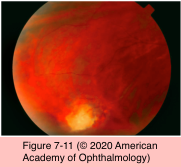

# 9.7.5. Infectious Ocular Inflammatory Diseases (V): EBV/LCMV

## Images

## Hierarchy

- similar to herpes viruses
- Epstein-Barr virus (EBV)
  - double-stranded DNA virus
    - complex capsid and envelope
    - tropism for B lymphocytes
      - only cells known to have surface receptors for the virus
    - very high seroprevalence of EBV (90%) in the adult population
  - diseases
    - infectious mononucleosis (IM)
    - Burkitt lymphoma (especially among African children)
    - nasopharyngeal carcinoma
    - Hodgkin disease
    - Sjögren syndrome
  - anterior segment manifestations
    - cataract
      - congenital EBV infection
    - mild, self-limiting follicular conjunctivitis
      - early in the course of acquired IM
    - less frequently reported anterior ocular manifestations
      - epithelial or stromal keratitis
      - episcleritis
      - bilateral, granulomatous anterior uveitis
      - cranial nerve palsies
        - dacryoadenitis
      - Parinaud oculoglandular syndrome
  - posterior segment manifestations
    - isolated optic disc edema and optic neuritis
    - macular edema
    - retinal hemorrhages
    - retinitis
    - punctate outer retinitis
    - choroiditis
    - multifocal choroiditis and panuveitis (MCP)
    - pars planitis and vitritis
    - progressive subretinal fibrosis
    - secondary choroidal neovascularization
    - ARN
    - association between these findings and EBV infection is not well established
      - does not require treatment
  - treatment
    - anterior uveitis
      - ocular disease is self-limiting
      - topical corticosteroids and cycloplegia
    - posterior segment inflammation
      - systemic corticosteroids
    - efficacy of systemic antiviral therapy for EBV infection has not been established
      - consider for necrotizing retinitis/ARN
- Lymphocytic choriomeningitis virus (LCMV)
  - single-stranded RNA virus
    - Arenaviridae family
      - fetal teratogen
    - rodents are the natural hosts
  - symptomatic maternal illness
    - 2/3
    - maternal viremia
      - transmission
        - airborne
        - contaminated food by infected rodent excreta
        - bite of an infected animal
    - transmission earlier in gestation results in more serious sequelae
      - periventricular
  - systemic findings
    - macrocephaly
    - hydrocephalus
    - intracranial calcifications
    - seizures
    - mild cognitive impairment
    - neurologic abnormalities
  - ocular manifestations
    - macular and chorioretinal peripheral scarring
    - optic atrophy
    - strabismus
      - similar to that of congenital toxoplasmosis
    - nystagmus
  - differentiation from congenital toxoplasmosis
    - serologic testing of the mother and the infant
      - Immunofluorescent antibody tests
      - Western blot
      - ELISA
      - IgM and IgG antibodies
        - diffuse
    - pattern of intracerebral calcifications
      - toxoplasmosis
      - congenital LCMV
        - periventricular distribution
