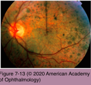
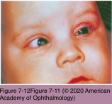

# 9.7.6. Infectious Ocular Inflammatory Diseases (VI): Rubella

## Images

## Hierarchy

- single-stranded RNA virus
  - Togaviridae family
  - lipid envelope (toga)
  - teratogenic virus
    - Similar to LCMV
- Similar to LCMV
- epidemiology
  - an important cause of blindness in resource- limited regions and nations
  - peak age incidence
    - prevaccine era
      - 5–9 years
    - postvaccine era
      - 15–19 years
    - more recently
      - 20–24 years (young adults)
  - 5–25% of women of childbearing age are susceptible to primary infection
- acquired infection (German measles)
  - prodrome
    - malaise and fever
  - erythematous, maculopapular rash
    - involves the entire body within 24 hours
      - appears first on the face, spreads toward the hands and feet
    - rash is not always prominent
      - disappears by the third day
  - lymphadenopathy
    - invariably present
  - ocular manifestations
    - conjunctivitis (70%)
      - most frequent ocular complication of postnatally acquired rubella
    - epithelial keratitis
    - acquired rubella retinitis
      - acute-onset decreased vision
        - visual acuity returns to normal
      - multifocal chorioretinitis
      - large areas of bullous neurosensory detachment
        - neurosensory detachments resolve spontaneously
      - preretinal vitreous cells
        - underlying pigment epithelial detachment involving the entire posterior pole
      - dark gray atrophic lesions of the RPE
      - normal appearance of the retinal vessels and optic nerve
      - absence of retinal hemorrhage
    - Fuchs heterochromic uveitis
      - chronic rubella virus infection
        - similar to congenital rubella
- congenital rubella syndrome (CRS)
  - clinical manifestations
    - cardiac malformations (patent ductus arteriosus, interventricular septal defects, and pulmonic stenosis)
    - hearing loss
      - most common systemic finding
    - ocular findings
      - pigmentary retinopathy
        - unilateral or bilateral
          - the most common ocular manifestation of CRS
            - 25%–50%
        - “salt-and-pepper” fundus
        - considerable variation
          - finely stippled, bone spicule–like, small, black, irregular masses
          - gross pigmentary irregularities with coarse, blotchy mottling
        - stationary or progressive
        - neither vision nor electroretinogram are affected
        - optic nerve and the retinal vessels are normal
      - glaucoma (10%)
      - corneal clouding
      - strabismus
      - congenital (nuclear) cataract (15%)
        - most frequent causes of poor visual acuity
      - microphthalmia
    - greater risk for diabetes mellitus and subsequent diabetic retinopathy later in life
  - histology
    - retained cell nuclei in the embryonic lens nucleus
    - anterior and posterior cortical degeneration
    - poor development of the pupil dilator muscle
    - necrosis of the iris pigment epithelium
    - chronic nongranulomatous inflammation of iris
    - alternating areas of RPE atrophy and hypertrophy
    - anterior chamber angle appears similar to that of congenital glaucoma
  - pathogenesis
    - maternal viremia during primary infection
      - transplacental fetal infection
        - establishes a chronic, persistent infection during organogenesis
          - inhibits cellular multiplication
          - persistence of viral replication after birth
            - appearance of hearing and neurologic and/or ocular deficits long after birth
    - frequency of fetal infection is highest during the first 10 weeks and the final month of pregnancy
    - rate of congenital defects varies inversely with gestational age
      - obvious maternal infection during the first trimester of pregnancy may end in spontaneous abortion, stillbirth, or severe fetal malformations
      - seropositive asymptomatic maternal rubella may also result in severe fetal disease
- Serologic criteria for rubella infection
  - 4x increase in rubella-specific IgG in paired sera 1–2 weeks apart
  - new appearance of rubella-specific IgM
  - specific IgM or IgA antibodies to rubella in the cord blood
- treatment
  - no specific antiviral therapy for congenital rubella
    - treatment is supportive
  - uncomplicated acquired rubella does not require specific therapy
  - systemic corticosteroids
    - rubella retinitis
    - postvaccination optic neuritis
