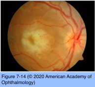

# 9.7.7. Infectious Ocular Inflammatory Diseases (VII): Measles SSPE

## Images

## Hierarchy

- Similar to rubella and LCMV
- Measles (Rubeola)
  - single-stranded RNA virus
    - genus Morbillivirus
      - Paramyxoviridae family
    - highly contagious
      - transmission
        - direct
        - aerosolization of nasopharyngeal secretions
        - transplacental
    - a leading cause of mortality worldwide among young children
  - ocular manifestations of congenital measles
    - cataract
    - optic nerve head drusen
    - bilateral diffuse pigmentary retinopathy
      - posterior pole and retinal periphery
      - normal or attenuated retinal vessels
      - retinal edema
        - In contrast to acquired measles
      - macular star
      - ERG and visual acuity are typically normal
  - ocular manifestations of acquired measles
    - keratitis
      - most common ocular manifestations
        - both keratitis and conjunctivitis resolve without sequelae in the vast majority of cases in the United States
          - similar to congenital rubella
        - postmeasles blindness, a consequence of keratitis, is a significant problem worldwide
    - papillary, nonpurulent conjunctivitis
    - measles retinopathy
      - severe vision loss
        - more common in acquired than in congenital disease
        - in contrast to congenital measles and congenital & acquired rubella
      - clear media
        - 6–12 days after the appearance of the characteristic exanthem
      - diffuse retinal edema
      - macular star formation
      - attenuated arterioles
        - in contrast to acquired rubella retinitis
      - scattered retinal hemorrhages
      - blurred disc margins
      - +- encephalitis
      - further sequelae may evolve
        - arteriolar attenuation with or without perivascular sheathing
        - optic disc pallor
        - secondary pigmentary retinopathy with either a bone spicule or salt-and-pepper appearance
      - ERG
        - extinguished during the acute phase of measles retinopathy
          - +- permanent visual field constriction
      - visual field testing may reveal
        - severe constriction
        - ring scotomata
        - small peripheral islands of vision
      - resolution of acquired measles retinopathy over weeks-months is generally associated with
        - return of useful vision
  - differential diagnosis
    - congenital measles retinopathy
      - TORCH syndrome
      - atypical retinitis pigmentosa
      - neuroretinitis
    - acquired measles retinopathy
      - central serous chorioretinopathy
      - Vogt-Koyanagi-Harada (VKH) syndrome
      - retinitis pigmentosa
      - syphilis neuroretinitis
      - viral retinopathies
  - diagnostic tests
    - diagnosis of measles and its ocular sequelae is made clinically
    - serologic testing
      - complement fixation, ELISA, and immunofluorescent and hemagglutination inhibition assays
    - virus may be recovered from the nasopharynx, conjunctiva, lymphoid tissues, respiratory mucous membranes, urine, and blood
      - for a few days before and several days after appearance of the rash
  - management
    - the disease is usually self-limiting
    - supportive treatment
    - prophylactic treatment with gamma globulin, 0.25 mL/kg, administered within 5 days of exposure
      - pregnant women
      - children younger than age 1 year
    - ocular manifestations of measles are treated symptomatically
      - keratitis or conjunctivitis
        - immunocompromised individuals
        - topical antivirals or antibiotics
      - acute measles retinopathy
        - systemic corticosteroids should be considered
  - references
- Subacute sclerosing panencephalitis (SSPE)
  - epidemiology
    - late complication of acquired measles
      - unvaccinated children 6–8 years after the primary infection
        - onset in late childhood or adolescence
      - children infected with measles <1 year have 16 x greater risk than those infected ≥ 5 years
  - insidious appearance of
    - visual impairment
    - behavioral disturbances
    - memory impairment
    - myoclonus
    - spastic paresis
    - dementia
    - 50%
      - death within 1–3 years
  - ocular findings
    - may precede the neurologic manifestations by several weeks to 2 years
    - maculopathy
      - 36%
      - focal retinitis
        - whitish retinal infiltrates
        - macular edema
        - serous macular detachment
        - small intraretinal hemorrhages
        - may progress within several days to involve the posterior pole and peripheral retina
      - macular hole
      - macular pigment epithelial disturbances
        - mottling and scarring of the RPE
      - preretinal membranes
    - disc swelling and papilledema
      - optic atrophy
    - drusen
    - ptosis
    - hemianopsia
    - cortical blindness
    - horizontal nystagmus
      - little, if any, vitritis
        - similar to CMV & histoplasmosis
  - diagnostic tests
    - diagnosis is on the basis of clinical manifestations
    - characteristic, periodic EEG discharges
    - raised IgG antibody titer against measles in the plasma and CSF
    - histologic findings suggestive of panencephalitis on brain biopsy
  - differential diagnosis
    - necrotizing viral retinitis caused by HSV, VZV, and CMV infection
    - multiple sclerosis (MS)
      - not a panencephalitis
        - MRI shows focal periventricular white matter lesions
        - CME and retinal vasculitis are prominent features of MS
  - treatment
    - oral isoprinosine
    - require lifelong therapy
      - intraventricular interferon alpha
- return of ERG activity
- leukopenia
  - during the prodromal phase
