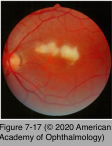
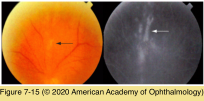
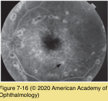

# 9.7.8. Infectious Ocular Inflammatory Diseases (VIII): WNV & RVF

## Images

## Hierarchy

- Similar to measles, rubella, and LCMV
- Rift Valley fever (RVF)
  - arthropod-borne Bunyaviridae of the Phlebovirus genus
  - epizootic
    - primarily affecting domestic animals (sheep, goats, camels, and cattle)
    - transmitted to humans
      - direct contact with the blood or organs of infected animals
      - inhalation of aerosols released during their slaughter
      - ingesting the unpasteurized milk of infected animals
  - clinical presentation
    - incubation period
      - 3-7 days
        - bites from infected mosquitoes
    - 3 clinical syndromes
      - uncomplicated, febrile, influenza-like illness
      - hemorrhagic fever
      - neurologic involvement with encephalitis
        - mortality rate of 1%
    - ocular manifestations
      - 20%
      - bilateral
      - profoundly reduced visual acuity at presentation
        - <20/200 in 80%
      - macular or paramacular retinitis
        - similar to SSPE
        - in all affected eyes at the time of initial presentation
      - additional manifestations
        - intraretinal hemorrhages (40%)
        - vitritis (26%)
        - optic nerve edema (15%)
        - retinal vasculitis (7%)
        - anterior uveitis (31%)
      - spontaneous resolution
        - within 10–12 weeks
        - optic atrophy
        - ischemic retina
        - macular (60%) or paramacular (9%) scarring
        - retinal vascular occlusion (23%)
        - optic atrophy (20%)
  - FA
    - delayed filling of the retinal and choroidal circulation
    - early hypofluorescence and late staining of the inflammatory retinal lesions
  - diagnosis
    - serology
      - IgM in a single serum sample
      - rising IgG titer in samples from acutely ill and convalescent patients
    - virus isolation from the blood in the acute phase
    - virus detection in either serum or tissue by reverse transcription PCR testing
  - differential diagnosis
    - other viral entities
      - measles, rubella, influenza, dengue fever, and WNV
    - bacterial illnesses
      - brucellosis
      - Lyme disease
      - toxoplasmosis
      - cat-scratch disease
      - rickettsial diseases
  - treatment
    - anterior uveitis
      - topical steroids
    - inactivated vaccine
      - role of systemic antiviral and anti-inflammatory therapy for retinal manifestations of RVF is unknown
      - still experimental
- West Nile virus (WNV)
  - single-stranded RNA virus
    - family Flaviviridae
    - enzootic cycle
      - birds are the natural host
        - transmission to humans and other vertebrates through the bite of an infected mosquito (Culex genus)
  - epidemiology
    - endemic to Europe, Australia, Asia, and Africa
    - peak onset in late summer
      - anytime between July and December
  - systemic manifestations
    - incubation period 3-14 days
      - majority are subclinical (80%)
    - febrile illness (20%)
      - accompanied by
        - myalgia
        - arthralgia
        - headache
        - conjunctivitis
        - lymphadenopathy
        - maculopapular or roseolar rash
        - neurologic disease
          - meningitis
          - encephalitis
          - risk factors
            - diabetes mellitus
              - risk factor for WNV-related death
              - observed with significantly increased frequency among patients with WNV- associated ocular involvement
          - only 1 of 150 infections
            - advanced age
            - severity of WNV infection has increased over time
  - ocular manifestations
    - ocular symptoms
      - pain, photophobia, conjunctival hyperemia, and blurred vision
    - multifocal chorioretinitis
      - present in the majority of patients
      - 200–1000 μm
      - midperiphery
        - +- involvement of the posterior pole
      - in linear arrays
        - 80%
        - following the course of retinal nerve fibers
      - whitish to yellow
        - evolve with varying degrees of pigmentation and atrophy
    - vitritis
    - nongranulomatous anterior uveitis
    - other findings
      - intraretinal hemorrhages
      - disc edema
        - optic atrophy
      - focal retinal vascular sheathing and occlusion
      - cranial nerve VI palsy
      - nystagmus
    - congenital WNV infection has been reported
  - FA
    - active lesions
      - central hypofluorescence with late staining
    - inactive lesions
      - early hyperfluorescence with late staining
      - many inactive lesions exhibit a targetlike appearance angiographically
  - ICG
    - hypofluorescent spots
    - more numerous than those apparent on FA or funduscopy
  - self-limiting course
    - return of visual acuity to baseline after several months
    - loss of vision may occur because of
      - CNV
      - foveal scar
      - ischemic maculopathy
      - vitreous hemorrhage
      - tractional retinal detachment
      - optic nerve pathology
      - retrogeniculate damage
  - diagnostic tests
    - demonstration of IgM antibody to the virus in serum
      - IgM antibody-capture ELISA
      - plaque-reduction neutralization testing (PRNT)
  - differential diagnosis
    - syphilis
    - MCP
    - histoplasmosis
    - sarcoidosis
    - tuberculosis
  - treatment
    - anterior uveitis
      - no proven treatment for WNV infection
        - supportive therapy
      - topical corticosteroids
    - efficacy of systemic and periocular corticosteroids for chorioretinal manifestations is unknown
