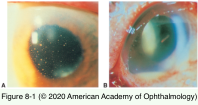
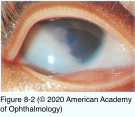

# 9.8.1. Endophthalmitis (I)

## Images

## Hierarchy

- General
  - definition
    - "Endophthalmitis"
      - intraocular inflammation involving both the posterior and anterior chambers attributable to bacterial or fungal infection
    - “Sterile endophthalmitis”
      - infection is suspected but culture results are negative
  - ± retinal or choroidal involvement
  - +- concomitant infective scleritis or keratitis
- gram-positive pleomorphic rod
- acute onset
- Endogenous Bacterial Endophthalmitis
  - uncommon
    - <10% of all forms of endophthalmitis
  - pathogenesis
    - extraocular focus in 90% of cases
      - pneumonia
      - urinary tract infection
      - bacterial meningitis
      - liver abscess
      - osteomyelitis
      - sinusitis
      - hematogenous dissemination of bacterial organisms
    - predisposing conditions
      - compromised immune system
      - diabetes mellitus
      - systemic malignancy
      - sickle cell anemia
      - systemic lupus erythematosus
      - HIV infection
      - extensive gastrointestinal surgery
      - endoscopy
      - dental procedures
      - systemic immunomodulatory therapy and chemotherapy
      - also consider endogenous endophthalmitis in newborns and infants, especially <6 months
    - bacteria
      - gram-positive organisms
        - Streptococcus species (endocarditis)
        - Staphylococcus aureus (cutaneous infections)
      - gram-negative organisms
        - Neisseria meningitidis
          - Bacillus species (from intravenous drug use)
        - Haemophilus influenzae
        - enteric organisms
          - Escherichia coli
          - Klebsiella
            - in Asia, Klebsiella in liver abscesses is the most common cause
  - clinical presentation
    - systemic infection
      - fever >101.5°F
      - elevated peripheral leukocyte count
      - positive bacterial cultures from extraocular sites (blood, urine, sputum)
      - patients are often ill and being treated for a primary underlying disease
      - extraocular infection may be very difficult to diagnose
    - ocular presentation
      - sometimes both eyes are affected simultaneously
      - symptoms
        - pain
        - photophobia
        - blurred vision
      - periorbital and eyelid edema
      - fibrin in the anterior chamber
      - ± hypopyon
      - vitreous inflammation
      - small microabscesses in the retina/subretinal space
      - white-centered retinal hemorrhages (Roth spots)
  - diagnostic workup
    - vitreous and aqueous samples
      - culture
      - Gram and Giemsa stains
      - PCR evaluation
        - pan-bacterial or pan-fungal primers
  - blood and other body fluid cultures
    - should be used along with ocular culture
  - treatment
    - intravitreal antibiotics
      - administered at the time of vitrectomy
      - if fungal infection is a possibility, treatment of both fungal and bacterial etiologies is indicated at the time of vitrectomy
    - ± intravenous antibiotic
      - sometimes required for several weeks, depending on the organism
    - recurrent or persistent intraocular infection may require numerous surgeries and repeat injections of intravitreal antibiotics
  - complications
    - sepsis
    - death
    - cataract development
    - retinal detachment
    - suprachoroidal hemorrhage
    - vitreous hemorrhage
    - hypotony
    - phthisis bulbi
  - prognosis
    - offending organism
    - systemic status of the patient.
- Chronic Postoperative Endophthalmitis
  - introduction
    - multiple recurrences of chronic indolent inflammation in an eye that had previously undergone surgery
      - as early as 1–2 weeks after surgery
    - incidence
      - acute postoperative endophthalmitis
        - often weeks to months (or years) after surgery
        - 0.07% - 0.1%
      - chronic postoperative endophthalmitis
        - not established
  - etiology
    - bacterial
      - Propionibacterium acnes
        - anaerobic
          - may sequester between IOL and posterior capsule
        - commonly found on eyelid skin or conjunctiva
      - Staphylococcus epidermidis
    - fungal
      - Candida parapsilosis
        - Corynebacterium species
      - Aspergillus flavus
      - Torulopsis candida
      - Paecilomyces lilacinus
      - Verticillium species
  - clinical presentation
    - chronic postoperative bacterial endophthalmitis
      - slight blurring of vision
        - begins 3–4 months after surgery
      - persistent granulomatous inflammation
      - whitish plaques between the posterior capsule and the IOL implant
      - may respond initially to topical or regional corticosteroids
      - severe untreated cases
        - ± vitreous inflammation
        - ± corneal decompensation
        - ± iris neovascularization
    - chronic postoperative fungal endophthalmitis
      - most occur after cataract surgery
        - Nd:YAG capsulotomy can liberate the organism into the vitreous cavity
          - more severe vitreous inflammation
      - delayed-onset, indolent, progressive inflammation
        - not responsive to corticosteroids
          - in contrast to chronic fungal endophthalmitis
      - clinical signs helpful in differentiating fungal from bacterial endophthalmitis
        - corneal infiltrate or edema
        - mass in the iris or ciliary body
        - necrotizing scleritis
        - vitreous “snowballs”
          - “string-of-pearls” appearance
        - intraocular inflammation worsening after topical, periocular, or intraocular steroid
          - also seen in sarcoidosis
  - diagnostic workup
    - aerobic, anaerobic, and fungal cultures
      - aqueous
      - capsular plaques
      - undiluted vitreous
    - Gram and Giemsa stains of undiluted specimens
      - capsular plaques
        - cultures must be retained by the laboratory for ≥2 weeks
      - vitreous snowballs
    - PCR evaluation
      - aqueous
      - vitreous
      - capsular plaques
      - pan-fungal and pan-bacterial primers
  - differential diagnosis
    - retained cortical material/retained intravitreal lens fragments
    - iris chafing from IOL malposition
    - uveitis-glaucoma-hyphema syndrome
    - intraocular lymphoma
  - treatment
    - chronic postoperative bacterial endophthalmitis
      - pars plana vitrectomy + injection of intravitreal and endocapsular vancomycin
        - may not be successful especially if equatorial lens capsule sequestrae of bacteria are present
      - treatment for resistant cases
        - IOL explantation
          - decision to explant the IOL must be based in part on
            - clinical course
            - severity of the intraocular inflammation
            - level of vision loss
        - complete capsulectomy
        - intravitreal vancomycin injection
      - multiple surgeries may be necessary
    - chronic postoperative fungal endophthalmitis
      - more difficult to treat
      - intravitreal antifungal drugs (amphotericin & voriconazole)
      - systemic antifungal drugs
        - in the most severe cases
      - multiple surgeries may be necessary
