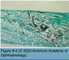
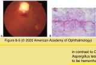
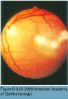

# 9.8.2. Endophthalmitis (II): Fungal Endophthalmitis (I)

## Images

## Hierarchy

- General
  - focal or multifocal areas of chorioretinitis
    - begins in the choroid
      - yellow-white lesions with indistinct borders
      - from small cotton-wool spots to several disc diameters
    - can subsequently break through into the vitreous
      - localized cellular and fungal aggregates overlying the original site(s)
  - etiology
    - Aspergillus
      - Candida (the most common cause)
    - Coccidioides
    - Histoplasma capsulatum
    - Cryptococcus neoformans
    - Sporothrix schenkii
    - Blastomyces dermatitidis
      - less common
  - granulomatous or nongranulomatous inflammation
    - keratic precipitates
    - hypopyon
    - vitritis with cellular aggregates
  - ± iris nodules
  - ± rubeosis
  - nonneoplastic masquerade syndrome
    - mistaken for noninfectious uveitis
      - Aspergillus
        - Candida (the most common cause)
      - Coccidioides
    - corticosteroids alone usually worsen the disease
  - requires aggressive systemic and local antifungal therapy as well as surgical intervention
- dense vitritis
- Aspergillus endophthalmitis
  - Aspergillus fumigatus/Aspergillus flavus
    - human exposure is very common
      - found in soil and decaying vegetation
      - infection is rare
        - depends on the virulence of the fungal pathogen and immunocompetence of the host
    - spores
      - become airborne
        - seed the lungs and paranasal sinuses of humans
          - hematogenous dissemination to the choroid
  - predisposing conditions
    - severe chronic pulmonary diseases
    - cancer
    - endocarditis
    - severe immunocompromise
    - intravenous drug abuse
    - orthotopic liver transplantation
    - may occur in immunocompetent patients
      - rare
  - clinical presentation
    - associated with disseminated aspergillosis
      - lung
      - eye
        - second most common site of infection
    - rapid onset of pain and loss of vision
    - confluent yellowish infiltrate is often present in the macula
      - commonly invades the retinal and choroidal vessels
        - retinal hemorrhages
        - retinal vascular occlusions
          - broad areas of ischemic infarction
            - full-thickness retinal necrosis
              - forms central atrophic scar when healed
      - choroid and subretinal space
        - ± hypopyon in the subretinal or subhyaloidal space
      - in contrast to Candida chorioretinitis, Aspergillus lesions are larger and more likely to be hemorrhagic
    - variable degrees of cells, flare, and hypopyon in the anterior chamber
  - diagnosis
    - pars plana vitreous biopsy
      - culture
      - Gram and Giemsa stains
        - septate, dichotomously branching hyphae
    - difficult to culture from the blood
    - coexisting systemic aspergillosis can be a strong clue, especially among high-risk patients
  - pathology
    - angiocentric
      - hemorrhage in all retinal layers
    - mixed acute (polymorphonuclear leukocytes) and chronic (lymphocytes and plasma cells) inflammation
      - granulomas contain rare giant cells
      - polymorphonuclear leukocytes in the vitreous
    - branching fungal hyphae spreading on the surface of the Bruch membrane without penetrating it
      - surrounded by macrophages and lymphocytes
        - form small vitreous abscesses
    - primary focus of infection
      - Candida endophthalmitis
        - vitreous
      - Aspergillus endophthalmitis
        - retinal and choroidal vessels
        - subretinal/subretinal pigment epithelial space
  - differential diagnosis
    - Candida endophthalmitis
    - cytomegalovirus retinitis
    - Toxoplasma retinochoroiditis
    - coccidioidomycotic choroiditis
    - bacterial endophthalmitis
  - treatment
    - pars plana vitrectomy
    - intravitreal amphotericin B or voriconazole
      - ± intravitreal corticosteroids
    - systemic treatment
      - infectious diseases specialist
      - oral voriconazole
      - intravenous amphotericin B
      - caspofungin
        - activity against Candida and Aspergillus
      - other systemic antifungal drugs, such as itraconazole, miconazole, fluconazole, and ketoconazole
    - visual prognosis is poor because of frequent macular involvement
      - VA<20/200
- Candida endophthalmitis
  - etiology
    - Candida species are the most common cause of endogenous fungal endophthalmitis
      - in both pediatric and adult populations
    - organisms
      - Candida albicans
        - the most common pathogen
      - non-albicans species (eg, C glabrata)
    - budding yeast
      - characteristic pseudohyphate appearance
    - reach the choroid hematogenously
      - break through the Bruch membrane
        - form subretinal abscesses
          - involve the retina and vitreous
  - epidemiology
    - prevalence of intraocular candidiasis in patients with candidemia
      - 9%-78%
      - ≤37% if not receiving antifungal therapy
      - 3% if receiving antifungal therapy
    - patients with ocular lesions are more likely to have infection involving a greater number of organ systems
    - predisposing conditions
      - recent major gastrointestinal surgery
      - bacterial sepsis
      - systemic antibiotic use
      - use of indwelling catheters
      - hyperalimentation
      - debilitating diseases
        - diabetes mellitus
      - immunomodulatory therapy
      - prolonged neutropenia
      - organ transplantation
      - hospitalized neonates
      - intravenous drug users
      - immunodeficiency per se does not appear to be a prominent predisposing factor
        - paucity of Candida chorioretinitis/ endophthalmitis among patients with HIV/ AIDS
  - clinical presentation
    - symptoms
      - blurred or decreased vision
      - pain
    - multiple, bilateral, white, well-circumscribed lesions
      - <1 mm
      - postequatorial fundus
        - string-of-pearls appearance
    - overlying vitreous cellular inflammation
    - vascular sheathing
    - intraretinal hemorrhages
  - diagnostic workup
    - all patients with candidemia should undergo baseline dilated funduscopic examination
      - monitoring for ≥2 weeks after an initial eye examination
      - earlier treatment of candidal endophthalmitis has been associated with better visual outcomes
    - blood culture
    - diagnostic and therapeutic vitrectomy
      - in presence of vitreous snowballs and endophthalmitis
      - vitreous culture
        - undiluted vitreous sample
      - Giemsa stain
      - PCR for Candida species
  - differential diagnosis
    - toxoplasmic retinochoroiditis
    - pars planitis
  - treatment
    - consultation with a specialist in infectious diseases is essential
    - chorioretinal lesions not yet involving the vitreous
      - oral antifungal drugs (triazoles)
        - voriconazole (200 mg, twice daily)
          - good oral bioavailability
          - broad spectrum of antifungal activity
          - good vitreous penetration
        - x 2–4 weeks
          - fluconazole
    - vitreous body is involved
      - intravenous + intravitreal antifungal drugs
      - intravitreal injection of antifungal drugs
        - usually in conjunction with pars plana vitrectomy
          - debulking the pathogen load
        - ± dexamethasone, 0.4 mg/0.1 mL
          - amphotericin B, 5–10 μg/0.1 mL
            - OR
              - voriconazole, 100 μg/0.1 mL
      - intravenous amphotericin B ± flucytosine
        - more severe infections
        - dose-limiting toxicities
          - renal, cardiac, and neurologic
        - liposomal lipid complex formulations
          - less toxicity
      - intravenous caspofungin
        - echinocandin class
          - activity against Candida and Aspergillus
          - inhibit synthesis of glucan in the cell wall
      - intravenous micafungin
        - echinocandin class
      - oral voriconazole, flucytosine, fluconazole, or rifampin
        - may be administered in addition to intravenous treatment
    - treatment of both peripherally located lesions/ lesions not involving the macular center may salvage useful vision
