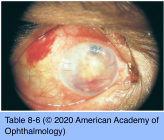

# 9.8.3. Endophthalmitis (III): Fungal Endophthalmitis (II)

## Images

## Hierarchy

- yeast; pseudohyphate appearance
- Aspergillus
  - Candida
- yeast
  - soil and decaying vegetation
    - septate hyphae; dichotomously branching
  - contaminated soil and pigeon feces
- India ink stain
- Coccidioides immitis
  - Cryptococcus
    - Fungi
- soil
  - dimorphic fungus
  - Papanicolaou stain
- Coccidioidomycosis
  - Coccidioides immitis
    - dimorphic soil fungus
      - southwestern United States
    - endemic to
      - southern California and the San Joaquin Valley
        - pulmonary infection
          - dissemination to the CNS, skin, skeleton, and eyes
            - <1% of patients with pulmonary coccidioidomycosis
      - parts of Central and South America
        - northern Mexico
        - Argentina
    - inhalation of dust-borne arthrospores
  - systemic disease
    - 40% of infected patients are symptomatic
      - mild upper respiratory tract infection
        - 3 weeks after exposure
      - pneumonitis
      - erythema nodosum or multiforme
        - 3 days-3 weeks after the onset of symptoms
  - ocular coccidioidomycosis
    - uncommon
      - even with disseminated disease
    - 1/2 of patients with ocular involvement have systemic disease
    - extraocular findings
      - blepharitis
      - keratoconjunctivitis
      - phlyctenular and granulomatous conjunctivitis
      - episcleritis and scleritis
      - extraocular nerve palsies
      - orbital infection
    - intraocular findings
      - <20 pathologically verified cases
      - unilateral or bilateral
      - anterior segment
        - granulomatous anterior uveitis
          - should be considered in the differential diagnosis of any patient with granulomatous iritis who has lived in or traveled through endemic areas
        - iris granulomas
      - posterior segment
        - multifocal chorioretinitis (choroidal granulomas)
          - multiple, discrete, yellow-white lesions
            - <1 DD in size
          - postequatorial fundus
          - may resolve --> punched-out chorioretinal scars
            - similar to cryptococcosis
        - serous retinal detachment
        - vitreous cellular infiltration
        - vascular sheathing
        - retinal hemorrhage
        - involvement of the optic nerve
  - diagnostic workup
    - serologic testing
      - serum, cerebrospinal fluid, vitreous, and aqueous
      - complement-fixation titers often elevated (>1:32)
    - skin testing for exposure to coccidioidin
    - anterior chamber tap
      - for isolated anterior segment involvement
      - culturing for the organism may delay diagnosis
  - pathology
    - pyogenic, granulomatous, and mixed reactions
    - zonal granulomatous inflammation
    - Coccidioides organisms are usually visible
  - differential diagnosis
    - Candida
    - Aspergillus
    - Histoplasma
    - tuberculous uveitis
  - treatment
    - infectious diseases specialist
    - oral azole antifungal drug
      - fluconazole
      - itraconazole
    - amphotericin B
      - reserved for lesions worsening rapidly or located in vital sites (e.g. spine)
    - pars plana vitrectomy
      - surgical debulking of anterior chamber granulomas
      - intraocular injections of amphotericin and voriconazole
    - poor visual prognosis
      - most eyes require enucleation because of pain and blindness
    - with systemic disease, higher doses and longer duration is needed
- Cryptococcosis
  - Cryptococcus neoformans
    - yeast
      - found in contaminated soil and pigeon feces
    - inhalation of the aerosolized fungus
      - reaches the eye
        - hematogenously
          - Histoplasma capsulatum In bat droppings
          - begins as a focus in the choroid
            - subsequent extension and secondary involvement of overlying tissues
        - ± direct extension from the optic nerve
    - predilection for the central nervous system
      - the most common cause of fungal meningitis
        - ocular infections occur months after the onset of meningitis
    - causes severe disseminated disease among immunocompromised/debilitated patients
      - most frequent fungal eye infection in patients with HIV/AIDS
  - ocular presentation
    - granulomatous anterior cellular inflammation
      - solitary or multiple discrete yellow-white chorioretinal lesions
        - varying markedly in size
        - postequatorial
    - variable degrees of vitritis
    - vascular sheathing
    - exudative retinal detachment
    - papilledema
  - diagnostic workup
    - India ink stain
    - Intravenous amphotericin B
      - culture of the fungus from cerebrospinal fluid
  - treatment
    - oral flucytosine
    - with optic nerve or macular involvement visual prognosis is poor
- Papanicolaou stain
