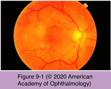
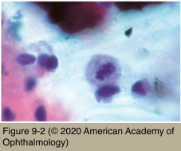

# 9.9.2. Masquerade Syndromes (II): Neoplastic Masquerade Syndromes (II): Primary CNS Lymphoma

## Images

## Hierarchy

- types
  - non-Hodgkin B-lymphocyte lymphomas
    - 98%
  - non-Hodgkin T-lymphocyte lymphomas
    - 2%
- epidemiology
  - age of onset
    - peak: 75-84 years
      - median: 6th-7th decade
    - rarely in adolescents and children
  - incidence of PCNSL appears to be increasing
    - 1/100,000 immunocompetent patients
  - ≤25% of patients with PCNSL have ocular involvement (vitreoretinal lymphoma)
  - more than 2/3 of patients with vitreoretinal lymphoma develop CNS disease
    - usually within 29 months of diagnosis
- lymphoma cells are sparse
- diagnostic testing
  - ultrasonography
    - vitreous debris
    - elevated chorioretinal lesions
    - serous retinal detachment
  - fluorescein angiography
    - hyperfluorescent window defects due to RPE atrophy
    - hypofluorescent areas due to blockage from a sub-RPE tumor mass/RPE clumping
    - leopard-spot pattern of alternating hyperfluorescence and hypofluorescence
  - ocular biopsy
    - vitreous biopsy
      - ≥1 mL of undiluted vitreous sample
      - lymphoma cells are friable and undergo degeneration if transportation is delayed
      - examination by an experienced pathologist
      - ≤1/3 false-negative result
        - ± second vitreous biopsy
        - abnormal lymphocytes may be isolated manually or by laser capture and PCR–based assays performed to improve the diagnostic yield
    - sub-RPE/retinal aspiration biopsy
      - if previous vitreous biopsy results were negative
    - internal or external chorioretinal biopsy
      - if diagnosis by vitreous aspiration or subretinal/sub-RPE aspiration cannot be established
    - cytologic examination
      - pleomorphic cells with scanty cytoplasm, hyperchromatic nuclei with multiple irregular nucleoli, and an elevated nuclear-to-cytoplasm ratio
    - monoclonal B lymphocytes
      - immunophenotyping by immunohistochemistry or flow cytometry
        - abnormal immunoglobulin κ or λ light chain predominance
        - specific B-lymphocyte markers (CD19, CD20, and CD22)
    - gene/oncogene translocations or gene rearrangements
  - CNS involvement
    - brain CT
      - multiple diffuse periventricular lesions
        - (+) enhancement
    - brain MRI
      - isointense lesions on T1-weighted images
      - isointense to hyperintense lesions on T2- weighted images
    - CSF analysis
      - lymphoma cells in 1/3
  - cytokine analysis of vitreous sample
    - IL-10 levels are elevated with VR lymphoma
    - high vitreous levels of IL-6 are found with inflammatory uveitis
    - elevated IL-10/IL-6 ratio
- clinical presentation
  - symptoms
    - decreased vision
    - floaters
  - creamy yellow sub-RPE/subretinal infiltrates
    - 1-2 mm in thickness
  - variable degree of vitritis and anterior chamber cells
  - coexisting multifocal chorioretinal scars and retinal vasculitis
  - anti-inflammatory medication can improve the vitreous cellular infiltration
    - not long-lasting
  - CNS signs
    - hemiparesis
      - behavioral changes
        - most frequent
    - cerebellar signs
    - epileptic seizures
    - cranial nerve palsies
    - CSF seeding of lymphoma cells
      - 42%
- differential diagnosis
  - acute retinal necrosis
  - toxoplasmosis
  - “frosted branch” angiitis
  - retinal arteriolar obstruction
- treatment
  - only 1 eye affected + no CNS involvement
    - intravitreal methotrexate or rituximab
  - both eyes affected
    - intraocular treatment alone is controversial
  - CNS involvement
    - high-dose methotrexate
      - intravenously ± intrathecal administration
      - ± brain radiation therapy
        - radiation is neurotoxic
          - especially in elderly patients
      - ± other chemotherapeutic drugs
  - ≈1/2 of patients with ocular involvement eventually develop CNS involvement
    - some specialists use prophylactic treatment of the CNS even in cases of seemingly isolated ocular disease
- prognosis
  - prognostic factors of PCNSL
    - advanced age
    - worse neurologic functional classification level
    - multiple rather than single lesions
    - deep nuclei/periventricular lesions (rather than superficial lesions)
  - long-term prognosis for PCNSL remains poor
    - median survival
      - with supportive care alone is 2–3 months
      - with surgery alone is 1–5 months
      - with treatment longest median survival approaches 40 months
