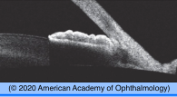

# Acute Angle Closure Glaucoma (AACG)

## Images

## Hierarchy

- Image Description
  - 55-year-old Asian female presents with unilateral eye pain, blurred vision, and rainbow-colored halos around light
  - conjunctival injection, diffuse corneal edema, and non-reactive mid-dilated pupil
- Assessment
  - AACG
- Differential Diagnosis
  - acute angle closure glaucoma
    - primary
      - pupillary block
      - plateau iris
      - complications
        - glaucomatous optic nerve damage
        - ischemic optic nerve damage
        - retinal vascular occlusion
        - PAS formation
        - IOP-induced iris ischemia
          - sector atrophy of the iris
          - pigment release from the iris
          - iris sphincter muscle ischemia
            - permanently fixed and dilated pupil
        - Glaukomflecken
    - secondary
      - neovascular
      - PAS
        - uveitis
      - membrane
        - ICE
        - epithelial downgrowth
      - lens induced
        - phacomorphic glaucoma
        - zonular weakness
          - trauma
          - PXF
          - Marfan
        - small eye
          - nanophthalmos
            - short axial length (15–20 mm)
            - high degree of hyperopia (7– 15 D)
        - microspherophakia
          - small lens with anterior prolapse
      - aphakic/pseudophakic pupillary block
      - aqueous misdirection
      - posterior segment mass
        - tumor
          - seizure trearment
        - choroidal effusion
          - topiramate/sulfonamide- induced
          - scleral buckle
          - excess laser
        - hemorrhagic choroidal detachment
  - acute open angle glaucoma
    - inflammatory
    - traumatic
      - hyphema
    - pigmentary
    - PXF
    - glaucomatocyclitic crisis
    - retrobulbar hemorrhage/ inflammation
    - C-C fistula
- Treatment
  - Medical
    - topical
      - beta-blockers
        - timolol
          - caution with asthma/COPD, heart failure
      - alpha-2 agonists
        - brimonidine
        - avoid
          - nonselective adrenergic agonists (epinephrine)
            - cause pupillary dilation and iris ischemia
          - medications with significant α1-adrenergic activity (apraclonidine)
      - PG analogs
        - latanoprost
      - CAI
        - dorzolamide
      - 3 rounds q15 min
        - recheck in 1 hour
          - if IOP not controlled
            - admit
            - do not use for aphakic/ pseudophakic AACG
              - do not use for secondary ACG
      - pilocarpine 1-2%
        - has fallen out of favor
        - for phakic primary AACG
        - q 15 min x 2
        - check renal function/ electrolytes
          - stronger miotics should be avoided
          - increase the vascular congestion of the iris or rotate the lens–iris interface more anteriorly
    - don't use for topiramate/ sulfonamide-induced ACG
    - systemic (IV or oral) CAI
    - osmotic agent
      - IV mannitol
        - check renal function/ electrolytes
          - contraindicated in CHF, renal disease, intracranial bleeding
    - topical steroid
  - Surgical
    - laser PI
      - when IOP controlled and cornea clear
      - laser PI other eye if occludable angle
    - laser iridoplasty
      - if not responsive to LPI
    - surgical PI
  - aqueous misdirection
    - IOP lowering agents
    - mydriatics
    - open posterior capsule (pseudophakic)
    - YAG anterior hyaloidotomy
    - PPV
  - NVI
    - lower eye pressure
    - anti-VEGF
    - PRP
  - choroidal effusion
    - lower eye pressure
    - mydriatics
    - steroids
  - phacomorphic
    - lower eye pressure
    - cataract surgery
- Patient Education
  - Dos
    - suggest eye examination of relatives
  - Prognosis
    - good prognosis if diagnosed and treated early
  - Follow-up
    - after LPI, discharge on IOP- lowering drops and oral medications
      - initially follow daily
- Data acquistion
  - History
    - precipitating events
      - dim light
      - mydriatic eyedrops
      - flu medicine
    - previous episodes
    - glasses/hyperopia
    - eye surgery/trauma
      - scleral buckle
      - retinal laser
    - topiramate/sulfonamides
    - family history of AACG
  - Physical Exam
    - IOP
      - Wide mire --> false high reading; narrow mire --> false low reading
    - microcystic epithelial edema
    - shallow anterior chamber
    - iris bombe
    - mid-dilated pupil
      - poorly reactive
    - AC reaction, hyphema
    - iris atrophy
    - glaucomflecken
    - KPs
    - PAS/PS
    - NVI
    - intumescent /subluxated lens, microspherophakia
    - gonioscopy of both eyes
      - angle morphology
        - examine other eye for occludable angle
      - PAS
        - compression gonioscopy
      - NVA
    - funduscopy
      - CB or choroidal tumor
      - choroidal effusion
      - spontaneous arterial pulsation
      - CRAO, CRVO
      - optic disc swelling/atrophy/ cupping
  - Additional Testing
    - anterior segment OCT
    - B-scan/UBM if no fundus view
