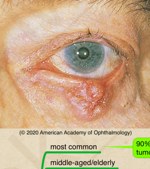

# Basal Cell Carcinoma (BCC)

## Images

## Hierarchy

- Case Description
  - elderly woman with slowly enlarging and raised nodule of her eyelid
  - Image Description
- Data acquisition
  - History
    - onset & course
    - pain
    - double vision
    - bleeding
    - sun exposure
    - prior radiation
    - skin lesions elsewhere
  - Physical Exam
    - lid exam
      - central ulceration
      - telangiectasia
      - lash loss
    - orbital signs
      - 2%–4% incidence of orbital invasion
    - lymph node exam
- Additional Testing
  - orbital imaging
    - if orbital signs
    - if in medial canthus
- Assessment
  - BCC
- Treatment
  - Medical
    - topical imiquimod (Aldara)
    - oral vismodegib or sonidegib
      - for advanced orbital infiltrative BCC not amenable to surgical resection or radiation
  - Surgical
    - treatment of choice for eyelid basal cell carcinomas
    - incisional biopsy
      - to confirm diagnosis when
        - tumor involves eyelid margin
        - tumor involves medial canthus
        - tumor is especially large
    - excisional biopsy
      - full-thickness margin wedge resection
      - evaluation of tumor margins
        - with frozen sections
        - Moh's technique
      - lid reconstruction
        - only if margins clear
      - lacrimal drainage system excision
        - for basal cell carcinomas that involve the medial canthal area
          - reconstruction of the lacrimal outflow system is not undertaken until the patient is tumor free
    - exenteration
      - for orbital invasion
    - cryotherapy
      - for patients who are poor surgical candidates
    - radiation
      - palliative and should generally be avoided for periorbital lesions
  - Referrals
    - refer to dermatologist
      - full body exam
- Differential Diagnosis
  - BCC
    - most common middle-aged/elderly
      - 90%–95% of malignant eyelid tumors
        - lid margin lesion with elevated, rolled edges, central ulceration, and lash loss
    - lower lid, medial canthus
    - types
      - nodular
        - telangiectasia
        - central ulceration
      - morpheaform
        - indistinct borders
    - systemic conditions
      - xeroderma pigmentosum
        - rare
        - autosomal recessive
        - extreme sun sensitivity
        - defective repair mechanism for UV light–induced DNA damage in skin cells
          - similar to Muir/Torre syndrome
      - basal cell nevus syndrome (Gorlin syndrome)
        - autosomal dominant
        - multiple nevoid basal cell carcinomas
          - appear early in life
        - skeletal anomalies
          - mandible
          - maxilla
          - vertebrae
      - Muir-Torre syndrome
        - autosomal dominant
        - multiple acquired
          - sebaceous adenomas
          - sebaceous hyperplasia
          - basal cell carcinomas with sebaceous differentiation
        - increased incidence of visceral malignancy
          - especially colorectal
  - SCC
  - sebaceous cell carcinoma
  - molluscum contagiosum
  - amelanotic nevus
  - hordeolum/chalazion
- Patient Education
  - General
    - discuss risk of future lid lesions
  - Dos
    - suggest sun protection
      - skin
      - eye
  - Prognosis & Complications
    - good prognosis with complete resection
  - Follow-up
    - 1 wk, 1 mo after surgery
      - q 3-4 mo
