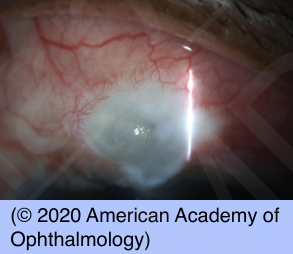

# Blebitis

## Images

## Hierarchy

- Case Description
  - 60-year-old man S/P trabeculectomy several years ago has been experiencing eye pain for the past 2 days
  - Image Description
- Additional Testing
  - bleb culture
- Assessment
  - blebitis
- Differential Diagnosis
  - blebitis
    - days to years after trabeculectomy
      - staph aureus
        - mucopurulent infiltrate within a superior conjunctival bleb with localized conjunctival hyperemia
      - staph epidermidis
    - classification
      - grade 1
        - bleb reaction
      - grade 2
        - AC reaction
      - grade 3
        - vitreous reaction
  - ischemic bleb
    - immediate postoperative period
    - after antimetabolite use
  - nodular scleritis/episcleritis
  - conjunctivitis
    - no pain/photophobia
    - discharge
  - anterior uveitis
  - endophthalmitis
    - more severe findings without blebitis
- Treatment
  - ± admit
  - grade 1
    - OR
      - fortified antibiotics (vancomycin [cefazolin]+ gentamicin [tobramycin])
    - topical fluoroquinolones
      - loading dose q5min x 4
        - q1hr
    - steroids after 24 hr
  - grade 2
    - as blebitis + oral fluoroquinolones
    - cycloplegia
  - grade 3
    - treat as endophthalmitis
      - vitreous tap + culture
      - intravitreal antibiotics
        - vancomycin
          - +.
            - ceftazidime
- Patient Education
  - General
  - Prognosis
    - depends on grade
  - Follow-up
    - observe closely over first 24 hours
      - follow daily until resolution
- Data acquistion
  - History
    - systemic diseases
      - RA
      - SLE
      - Wegener's
      - PAN
      - syphilis
      - lyme
    - ocular history
      - symptoms
        - onset & course
        - decreased vision
        - pain
        - photophobia
        - discharge
      - previous similar episodes
        - prior sclertitis
      - glaucoma surgery
        - date
        - antimetabolite use
  - Physical Exam
    - BCVA
    - reaction in bleb
    - hole in bleb
      - Seidel test
    - AC reaction
      - grade 2 blebitis
      - ± hypopyon
    - vitritis
      - grade 3 blebitis
