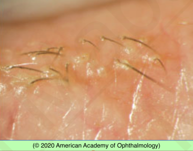
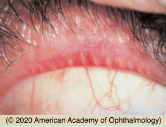
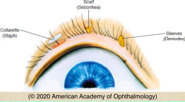
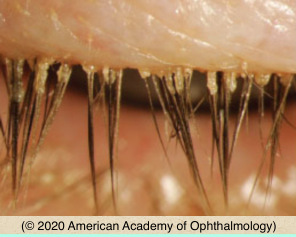

# Blepharitis

## Images

## Hierarchy

- Case Description
  - 30-year-old man with chronic redness and burning sensation of the eyelids
  - Image Description
    - hard, brittle fibrinous scales and crusts surrounding individual cilia (collarettes) on the anterior eyelid margin without lash loss
- Data acquisition
  - History
    - onset & course of symptoms
      - worse upon awakening
    - rosacea
    - exacerbating foods/drinks (rosacea)
      - hot beverages
        - coffee
        - tea
      - spicy foods
      - tobacco
      - vasodilators
      - alcohol
      - emotional stress
    - prior treatment
  - Physical Exam
    - external exam
      - facial telangiectasia
      - rhinophyma
      - lid margin thickening & telangiectasia
    - slit lamp
      - collarette/scurf/sleeve
      - lid margin ulceration
        - Staph blepharitis
      - corneal pannus
      - marginal corneal ulcer
      - lash loss
        - sebaceous cell carcinoma
      - preauricular LAP
      - dendrites
- Assessment
  - blepharitis (Staphyloccocal)
- Differential Diagnosis
  - blepharitis
    - symptoms
      - itching, burning, FB sensation
        - in contrast to dry eye syndrome
      - worse upon awakening
    - signs
      - crusting
      - red, thickened lid margins with prominent blood vessels
    - types
      - seborrheic
        - anterior lid margin
        - scurf
          - oily or greasy
          - does not surround eyelashes
      - Staph
        - anterior lid margin
        - collarettes
          - surround eyelashes
      - meibomian gland dysfunction
        - inspissated oil glands at posterior lid margin
        - commonly associated with rosacea
        - causes evaporative dry eye
  - demodicosis
    - cylindrical sleeves
  - herpes simplex blepharoconjunctivitis
  - toxic blepharoconjunctivitis
  - sebaceous cell carcinoma
  - pediculosis
- Treatment
  - Medical
    - lid hygiene
      - warm compress
        - bid-qid
        - 5-10 min
      - wash/scrub eyelid margin
        - bid
        - mild shampoo
    - erythromycin ointment (azithromycin gel)
      - qhs
      - for moderate-severe cases
    - doxycycline (azithromycin)
      - inhibits MMP
      - x 1-2 weeks
        - taper to1/4 full dose
          - continue x 3-6 months
    - omega-3 fatty acid oral supplementation
    - cyclosporine 0.05% drops
    - preservative-free artificial tears
      - for dry eye
    - tea-tree oil eyelid scrub
      - for demodex
    - metronidazole gel
      - for facial rosacea
    - treat chalazia
      - medical
      - incision & drainage
    - avoid ocular steroids in patients with ocular rosacea
      - can cause corneal thinning & perforation
- do not prescribe tetracycline for
  - children ≤8 years
  - nursing women
  - pregnant women
- Patient Education
  - Course
    - chronic
      - needs longterm treatment
  - dos
    - minimize sun exposure if using oral tetracycline
  - Don’ts
    - avoid exacerbating foods/ drinks
      - alcohol
      - spicy foods
        - if rosacea
  - Follow-up
    - 2-4 weeks
      - taper treatment as symptoms improve
