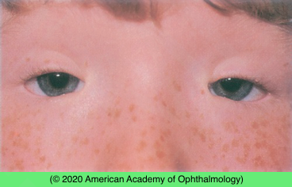

# Blepharophimosis– ptosis–epicanthus inversus syndrome

## Images

## Hierarchy

- Case Description
  - young child brought for bilateral abnormal eyelid appearance and upper eyelid droopiness
  - Image Description
- Assessment
  - Blepharophimosis–ptosis– epicanthus inversus syndrome
- Differential Diagnosis
  - Blepharophimosis– ptosis–epicanthus inversus syndrome
    - AD
      - chromosome 3
        - FOXL2 mutation
          - external photograph shows bilateral ptosis, epicanthus inversus, and telecanthus
      - can transmit to children
    - blepharophimosis severe ptosis
      - palpebral fissures are shortened horizontally and vertically
    - telecanthus
    - epicanthus inversus
      - fold of skin extending from the lower to upper eyelid
    - poorly developed nasal bridge
    - lateral lower lid ectropion
    - hypoplasia of the superior orbital rims
    - hypertelorism
    - ear deformities
    - systemic associations
      - premature ovarian failure
        - type 1
      - cardiac defects
  - isolated blepharophimosis
  - congenital ptosis
  - facial dysmorphisms
    - Crouzon syndrome
      - craniosynostosis
- Management
  - Medical
    - glasses for refractive error
    - amblyopia treatment
    - lubrication for corneal epitheliopathy
  - Surgical
    - multi-stage plan
      - epicanthal folds
        - double Z plasty, Y-Z plasty + transnasal wiring of medial canthal tendon
          - may exacerbate the ptosis
      - ptosis repair
        - brow suspension or frontalis suspension
        - can be performed simultaneously with repair of telecanthus
  - Referrals
    - refer to geneticist
      - visually obstructive ptosis should be corrected promptly
    - refer to cardiologist
    - refer female patients to endocrinologist
- Patient Education/ Counselling
  - Diagnosis/Pathogenesis
    - genetic disease
      - AD
        - can transmit to children
  - Natural course
    - epicanthus and telecanthus may improve with age
  - Follow-up
    - for refractive error and amblyopia
- Data acquisition
  - History
    - family history of similar condition
    - growth & developmental delay
    - cardiac disease
      - high rate of amblyopia
        - high rate of strabismus
  - Physical Exam
    - VA
    - EOM
    - head positioning
    - head & neck exam
      - cleft palate, high-arched palate
      - ear abnormalities
        - cup-shaped ears
    - lacrimal system
    - corneal epitheliopathy
      - optic disc coloboma
    - refraction
      - high rate of refractive error & anisometropia
