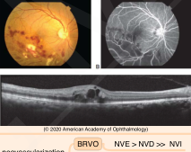
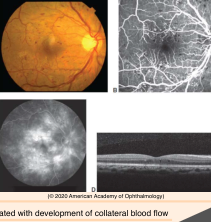
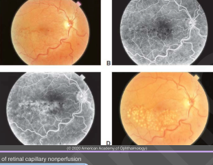
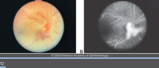

# Branch Retinal Vein Occlusion (BRV0)

## Images

## Hierarchy

- Introduction to retinal Vein Occlusion
  - Risk factors
    - advancing age
    - hypertension
    - glaucoma
      - history of glaucoma increases risk of CRVO by 5.3 x and of BRVO by 2.5 x
        - Eye Disease Case-Control Study
    - elevated retinal venous pressure
      - increases in supine position
    - reduced retinal artery perfusion pressure
      - blood pressure mediations at bedtime
  - Clinical findings
    - intraretinal hemorrhages
    - dilated tortuous retinal veins
    - cotton wool sposts
      - severe cases
    - neovascularization
      - BRVO
        - NVE > NVD >> NVI
      - CRVO
        - NVA/NVI > NVE/NVD
    - decreased vision in acute stage
      - macular edema
      - macular ischemia
      - foveal intraretinal hemorrhages
    - chronic retinal changes
      - microaneurysms
      - telangiectasia
      - macular edema
      - collateral blood vessels
        - BRVO
          - distinguish collateral vessels from NV
          - across meridian raphe
        - CRVO
          - optociliary shunt vessels
            - expansion of small retinal vessels connecting retinal circulation to choroidal circulation near the optic nerve head
  - Spontaneous improvement
    - usually associated with development of collateral blood flow
- Pharmacoligic management
  - mainstay of treatment
- Surgical management
  - Macular laser surgery
    - The Branch Vein Occlusion Study (BVOS)
      - argon laser photocoagulation for macular edema
        - inclusion criteria
          - chronic macular edema
            - treatment was delayed for ≥3 months after onset of macular edema
          - VA = 20/40 - 20/200
          - intact foveal vasculature
        - technique
          - argon laser
            - light grid laser
              - 100-200 μm spots
              - areas of capillary leakage
            - direct laser
              - leaking microvascular abnormalities
              - avoid collateral vessels
        - 2 lines of visual acuity gain
          - treated eyes
            - 65%
          - untreated eyes
            - 37%
        - VA≥20/40 at 3 years
          - treated eyes
            - 60%
          - untreated eyes
            - 34%
        - mean visual acuity improvement
          - treated eyes
            - 1.3 ETDRS lines
          - untreated eyes
            - 0.2 ETDRS lines
        - mean visual acuity
          - treated eyes
            - 20/40- 20/50
          - untreated eyes
            - 20/70
  - Scatter photocoagulation
    - The Branch Vein Occlusion Study (BVOS
      - scatter (panretinal) laser photocoagulation to areas of retinal capillary nonperfusion
      - indication for treament
        - NVE
        - NVD
          - risk of vitreous hemorrhage in eyes with NVE or NVD
            - treated eyes
              - 30%
            - untreated eyes
              - 60%
        - NVI
  - Pars plana vitrectomy
    - indications
      - vitreous hemorrahge
      - retinal detachment
- pathogenesis
  - common adventitial sheath at AV crossing
    - arterial wall thickening
      - vein compression
        - turbulence of flow
          - endothelial cell damage
            - thrombotic occlusion
- risk factors
  - increasing age
  - systemic arterial hypertension
  - smoking
    - smoking is not a risk factor for CRVO
  - glaucoma
  - hypercoagulable conditions
  - diabetes not an independent risk factor for BRVO
    - diabetes is a risk factor for CRVO
- ischemia alone is not an indication for treatment provided follow-up could be maintained
  - risk of NV in eyes with recent BRVO >5 DD
    - treated eyes
      - 12%
    - untreated eyes
      - 22%
- clinical
  - location
    - at AV crossing
    - superotemporal quadrant
      - 63%
  - acute findings
    - dilated tortuous vein
    - superficial retinal hemorrhages
    - retinal edema
    - NFL infarcts
  - chronic findings
    - secondary arterial narrowing & sheathing
    - macular edema
    - macular ischemia
    - lipid (hard) exudation
    - neovascularization
    - vitreous hemorrhage
      - Branch Vein Occlusion Study
        - extensive retinal ischemia (≥ 5 disc diameter)
          - NVE or NVD
            - 36%
          - NVI
            - 2%
        - vitreous hemorrahge
          - 60-90% of eyes with NVE or NVD
    - tractional RD
    - rhegmatogenous RD
      - retinal break adjacent to/under retinal NV
  - causes of decreased vision
    - macular hemorrhage
    - macular edema
    - macular ischemia
    - pigmentary macular disturbance
    - subretinal fibrosis
    - epiretinal membrane formation
    - VA≥20/40 @1 year
      - 50-60%
