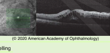
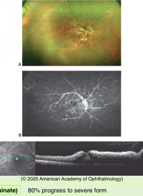
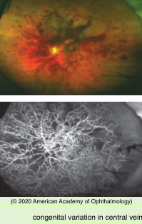
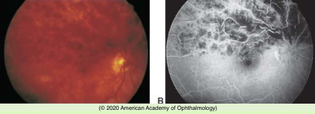

# Central Retinal Vein Occlusion

## Images

## Hierarchy

- Introduction
  - pathogenesis
    - thrombosis of CRV at or posterior to lamina cribrosa
    - central retinal artery thickening --> turbulence, endothelial damage, and thrombus formation in CRV
  - Risk factors & causes
    - >50 years old
      - 90%
        - patients with mild CRVO are generally younger
    - systemic associations (Eye Disease Case-Control Study)
      - systemic arterial hypertension
      - open angle glaucoma
      - not a risk factor for BRVO diabetes mellitus
      - hyperlipidemia
      - hypercoagulability
        - hyperhomocysteinemia
        - protein S deficiency
        - protein C deficiency
    - medications
      - oral contraceptives
      - diuretics
    - vasculitis
      - sarcoidosis
      - SLE
- Complications
  - iris neovascularization
    - in ≤ 60% of eyes with ischemic CRVO
    - 3-5 months after onset of symptoms
    - risk factors (CVOS)
      - poor visual acuity
      - large areas of retinal capillary nonperfusion
      - large areas of intraretinal blood
      - ERG did not add to risk factors!
    - treatment (CVOS)
      - scatter PRP
        - if ≥2 clock-hours of NVI on undilated gonioscopy (CVOS)
        - in clinical practice is performed at the first sign of NVI
    - intravitreal anti-VEGF agents
      - reduce NVI in short term
  - vitreous hemorrhage
    - can happen in absence of neovascularization
- Differential diagnosis
  - hypercoagulable conditions
    - hyperhomocysteinemia
    - protein S deficiency
    - protein C deficiency
  - hyperviscolsity retinopathy
    - bilateral
    - dysproteinemia
      - Waldenstrom macroglobulinemia
      - multiple myeloma
    - blood dyscrasias
      - polycythemia vera
    - diagnostic testing
      - CBC
      - serum protein electrophoresis
      - measurement of whole blood viscosity
  - ocular ischemic syndrome
    - hemorrhages limited to deeper retinal layers
    - no vascular tortuosity
  - vasculitis
    - sarcoidosis
    - systemic lupus erythematosus
- evaluation & management
  - examination
    - visual acuity
    - APD
    - IOP measurement
      - treat any elevation of IOP in affected or fellow eye
    - gonioscopy
      - CRVO can lead to transient shallowing of AC
      - check regularly for NVI
    - monitor every month x 6 months
  - ancillary testing
    - visual field
    - fluorescein angiography
    - ERG
  - lab tests
    - > 50 years
      - check for common risk factors
        - CRVO after age 50 years does not require elaborate systemic workup
    - < 50 years
      - check for hypercoagulable conditions/thrombophilia
        - hyperhomocysteinemia
        - protein S deficiency
        - protein C deficiency
      - especially if
        - bilateral CRVO
        - history of previous thrombosis
        - family history of thrombosis
  - treatment of associated medical conditions
    - hypertension
    - hypercholesterolemia
    - diabetes
    - hyperhomocyteinemia
    - smoking
  - patient should report worsening vision
    - non-ischemic CRVO can progress to ischemic CRVO
      - CVOS
        - 16% in 4 months
        - 34% in 36 months
- Types
  - nonischemic (mild)
    - “venous stasis retinopathy”
    - visual acuity ≥20/200
    - no or mild afferent pupillary defect
    - mild visual field changes
    - mild dilation & tortuosity of retinal veins
    - dot & flame hemorrhages in all quadrants
    - ± macular edema
    - ± mild optic disc swelling
    - fluorescein angiography
      - prolonged retinal circulation time
      - breakdown of capillary permeability
      - minimal nonperfusion
    - NVI
      - rare
    - chronic changes
      - telangiectasia
      - microaneurysms
      - macular pigmentary changes
    - papillophlebitis
      - young patients
      - nonischemic CRVO
      - prominent disc edema
  - intermediate (indeterminate)
    - 80% progress to severe form
  - ischemic (severe)
    - ≥10 disc areas of capillary nonperfusion
    - poor vision
      - ± premonitory symptoms of transient obscuration of vision before overt retinal manifestations
    - afferent pupillary defect
    - dense central scotoma
    - peripheral field constriction
    - marked venous dilation
    - extensive 4-quadrant retinal hemorrhages
    - retinal edema
    - cotton wool spots
    - fluorescein angiography
      - prolonged retinal circulation time
      - widespread capillary nonperfusion
        - ≥10 disc areas on a posterior pole view
          - .>5 DD for BRVO
    - ERG
      - decreased ERG bright-flash, dark-adapted b-wave to a- wave amplitude ratio
    - poor visual prognosis
      - CVOS
        - VA>20/400
          - 10%
      - prognosis better with anti-VEGF treatment
    - NVI
      - ≤60%
      - 3-5 months after symptoms
    - shallowing of anterior chamber
      - may lead to angle-closure glaucoma
  - Hemiretinal vein occlusion
    - congenital variation in central vein anatomy
- treatment
  - pharmacologic management
    - mainstay of treatment
  - laser management
    - grid pattern photocoagulation for macular edema (CVOS)
      - not recommended
      - reduced angiographic evidence of macular edema
      - did not improve visual acuity
    - PRP (CVOS)
      - prophylactic PRP did not result in decrease in NVI 20% still developed NVI
      - perform PRP at first sign of NVI
  - pars plana vitrectomy
    - vitreous hemorrhage
      - visual rehabilitation
      - endolaser for NVI
  - abandoned surgical procedures
    - radial optic neurotomy
      - radial relaxing incision of scleral ring
    - creation of laser anastomosis between retinal vein and choroidal circulation
    - retinal vein canulation with infusion of tissue plasminogen activator
  - systemic anticoagulation
    - not recommended
