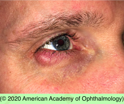
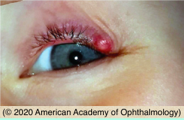

# Chalazion

## Images

## Hierarchy

- Case Description
  - middle-aged man has noted a tender eyelid lump for the past 2 days
  - Image Description
    - focal redness and swelling of right lower
- Assessment
  - chalazion
- focal inflammation of eyelid from an obstruction of meibomian glands
- Differential Diagnosis
  - chalazion
    - internal posterior hordeolum
      - chronic lipogranulomatous inflammation
  - hordeolum
    - acute infection (usually staphylococcal)
      - external hordeolum (stye)
        - glands of Zeis
      - internal hordeolum
        - meibomian glands
  - preseptal cellulitis
  - pyogenic granuloma
  - sebaceous cell carcinoma
- Treatment
  - Medical
    - warm compress
      - x 10 min qid
    - wash/scrub eyelid margin
      - bid
      - mild shampoo
    - topical antibiotics
      - if
        - lesion draining
        - associated blepharitis/ conjunctivitis
          - do not prescribe tetracycline for
    - oral doxycycline (azithromycin)
      - indications
        - blepharitis
        - meibomian gland dysfunction
          - nursing women
            - children ≤8 years
              - pregnant women
        - multiple chalazia/hordeola
      - inhibits MMP
      - x 1-2 weeks
        - taper to1/4 full dose
          - continue x 3-6 months
    - intralesional steroid
      - can cause
        - hypopigmentation
        - atrophy
        - retinal artery occlusion
  - Surgical
    - incision/curettage
      - if no response to 3-4 weeks of medical treatment
      - send to pathology in recurrent/atypical cases
- Patient Education
  - Prognosis & Complications
    - good prognosis
    - treatment of underlying blepharitis, meibomian gland dysfunction, rosacea will reduce future recurrences
  - Follow-up
    - reexamine if lesion persists >3-4 weeks
- Data acquisition
  - History
    - onset & course
    - similar prior lesions
      - chalazion
    - rosacea
    - blepharitis
    - trauma/surgery
  - Physical Exam
    - external exam
      - facial telangiectasia
      - rhinophyma
        - rosacea
    - blepharitis
    - palpate lid for nodularity
    - evert eyelid
      - r/o pyogenic granuloma
    - meibomian glands for inspissation
    - look for signs of sebaceous cell carcinoma
      - older patient
      - unilateral
      - eyelid thickening
      - lash loss
      - preauricular LAP
