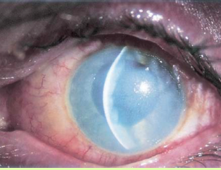

# Chemical Injury

## Images

## Hierarchy

- Case Description
  - young lab technician was splashed in the eye with an alkaline solution
  - Image Description
    - diffuse conjunctival injection with corneal edema and haze
- Differential Diagnosis
  - chemical burn
  - AACG
  - traumatic iritis
  - globe trauma
- Treatment
  - Medical
    - start rx at the scene
    - copious irrigation
      - lactated ringer
      - saline
      - tap water
      - until pH is 7.0
        - check PH 10 min after irrigation ends
    - sweep & irrigate fornices
    - cycloplegia
    - topical antibiotic
      - for severe burns
        - q1h
    - preservative-free artifical tears
      - q1h
    - oral pain medication
    - lower eye pressure
      - start if IOP elevated or cannot be measured
      - oral acetazolamide
      - topical timolol
    - topical steroids
      - x 7 days
        - taper after 7 days
    - oral doxycycline
      - even in presence of CED
      - MMP inhibitor
    - oral ascorbate & citrate
      - for alkali burns
      - promote collagen synthesis
    - avoid phenylephrine
    - avoid alpha-agonsist
      - if limbal ischemia
    - lysis of conjunctival adhesions
      - bid
  - Surgical
    - amniotic membrane graft
    - tarsorrhaphy
    - PK
      - 12-18 months after injury
- Data acquistion
  - History
    - time of injury
    - type of chemical
    - eye protection
    - time to irrigation
  - Physical Exam
    - VA
    - IOP
    - facial & lid burns
    - inspect fornices for debris
    - eyelid eversion
      - Desmarres eyelid retractor
    - chemosis
    - conjunctival or corneal ulcer
    - limbal blanching
    - fluorescein staining
    - corneal stromal edema & opacity
    - AC rxn
    - retinal necrosis
      - severe alkali burns
- Patient Education
  - Prognosis & Complications
    - conjunctival scarring/ symblepharon
    - entropion/trichiasis
    - dry eye
    - corneal melting
    - corneal scarring
  - Follow-up
    - daily, then every few days until CED heals
- Assessment
  - chemical injury
    - mild-moderate
    - severe
      - 2nd-3rd degree skin burn
      - high IOP
      - severe chemosis
      - conjunctival/limbal blanching
      - corneal edema/opacification
      - moderate/severe AC rxn
      - local necrotic retinopathy
