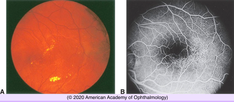
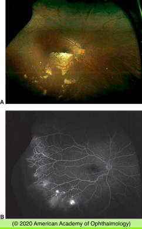
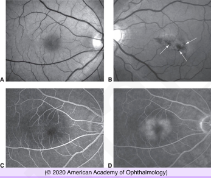

# Coats Disease & Parafoveal Retinal Telangiectasia

## Images

## Hierarchy

- Coats Disease
  - General
    - male predominance (85%)
    - only 1 eye is involved
    - not hereditary
      - an associated gene has been identified on chromosome 4
    - not associated with systemic disease
  - Pathogenesis
    - abnormal vessels are incompetent
      - leakage of serum and other blood components
  - Clinical
    - peripheral and macular capillary system may be involved
      - vascular dilatations (retinal telangiectasia)
      - ectatic arterioles
      - microaneurysms
      - venous dilations (phlebectasias)
      - fusiform capillary dilatations
    - exudative retinal detachment
    - lipid exudation
      - lipid may deposit in an otherwise angiographically normal macula
        - submacular lipogranuloma
        - subretinal fibrosis
          - may simulate retinoblastoma
    - fluorescein angiography
      - retinal capillary nonperfusion
    - posterior segment neovascularization is unusual
    - severity and rate of progression greater in children < 4 years
      - massive exudative retinal detachment
        - retina apposed to the lens
  - Differential Diagnosis
    - dominant (familial) exudative vitreoretinopathy
    - facioscapulohumeral muscular dystrophy
    - retinopathy of prematurity (ROP)
    - diabetic retinopathy
    - BRVO
    - juxtafoveal retinal telangiectasia
    - radiation retinopathy
  - Treatment
    - photocoagulation
    - cryotherapy
    - retinal reattachment surgery
    - several treatments may be necessary
- Parafoveal (Juxtafoveal) Retinal Telangiectasia
  - Clinical findings
    - telangiectasia of the capillary bed
    - focal retinal gliosis
    - juxtafoveolar region of 1 or both eyes
    - capillary incompetence and exudation
    - refractile changes (“retinal crystals”)
      - advanced cases
  - not a true telangiectasia
  - Histology
    - structural abnormalities similar to those of diabetic microangiopathy
      - deposits of excess basement membrane within the retinal capillaries
  - 3 types
    - Type 1
      - aneurysmal telangiectasia
      - males
      - unilateral
      - congenital or acquired
      - circinate type of exudate
      - resembles macular variant of Coats disease
        - Leber miliary aneurysm
    - Type 2
      - perifoveal telangiectasia
      - bilateral
      - no sex predilection
      - retinal changes
        - thickening
        - loss of transparency with a grayish appearance
        - small telangiectatic vessels
        - cystic appearance of the fovea
        - temporal fovea
        - chronic changes
          - intralesional retinal pigment epithelium (RPE) migration
          - choroidal neovascularization
      - vision loss ranges from mild to severe
      - abnormal glucose tolerance test
        - 1/3
      - right-angle retinal venules
        - dive at a right angle into deeper retinal layers
    - Type 3
      - bilateral parafoveal telangiectasia with retinal capillary obliteration
        - progressive vision loss from perifoveal capillary occlusion
  - Imaging
    - fluorescein angiography
      - leakage of telangiectatic vessels
    - OCT
      - thinned central macular retina
      - inner lamellar oblong foveal cavitations
        - long axis is parallel to the retinal surface
  - Differential diagnosis
    - branch retinal vein or venule obstruction
    - diabetes mellitus
    - radiation retinopathy
    - cystoid macular edema (especially chronic)
    - carotid artery disease
  - Treatment
    - Photocoagulation
      - for type 1
    - anti-VEGF drugs
      - limited success
        - Type 2 and type 3 eyes typically do not respond to photocoagulation
