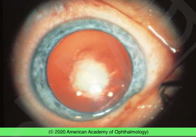
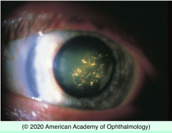
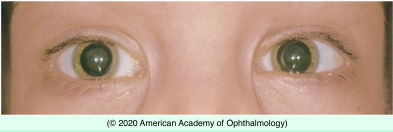

# Congenital Cataract

## Images

## Hierarchy

- Case Description
  - parents of a child have noted white pupils in his both eyes
  - Image Description
- Data acquisition
  - History
    - onset & course
    - maternal illness during pregnancy
      - TORCHS
    - maternal drug ingestion during pregnancy
    - premature birth
      - ROP
    - growth & development delay
      - systemic disease
    - ocular/systemic diseases in patient
    - steroid use
    - radiation
    - family hx of eye disease
      - congenital cataract
      - retinoblastoma
  - Physical Exam
    - VA
      - Teller cards
        - grating cards
      - tumbling E's
      - pictures
    - IOP
    - RAPD
      - cataract should not cause RAPD
    - corneal diameter
      - microcornea
        - PFV
    - slit lamp exam
      - cataract
        - location
        - size
          - <3 mm vs >3 mm
        - density
          - retina visible with direct ophthalmoscope through undilated pupil?
      - persistent fetal vasculature
      - examine family members
    - dilated fundus exam
      - persistent fetal vasculature
        - stalk between optic disc and lens
      - medulloepithelioma
      - retinoblastoma
      - ROP
      - IP, Norrie disease
    - cycloplegic refraction
- Additional Testing
  - lab tests are indicated in patients with bilateral cataract
    - lab tests not indicated if
      - positive family history of isolated congenital/childhood cataract
        - no known systemic diseases
      - examination of parents shows lens opacities
  - B-scan ultrasound
    - if no fundus view
  - urine testing
    - reducing substances
      - galactosemia
    - amino acids
      - Lowe syndrome
      - Alport syndrome
  - RBC galactokinase
    - galactosemia
  - serum glucose
    - diabetes
  - serum calcium (low) & phosphorus (high)
    - hypoparathyroidism
  - serology for TORCH
- Differential Diagnosis
  - congential/childhood cataract
    - bilateral
      - familial (hereditary)
        - AD
          - external photograph shows dense white cataract involving the nucleus of the lens
          - most common
        - X-linked
        - AR
          - rare
      - chromosome abnormality
        - trisomy 13, 18, 21
      - craniofacial syndromes
      - renal syndromes
        - Lowe syndrome
          - ± posterior lenticonus
        - Alport syndrome
          - anterior lenticonus
          - anterior subcapsular cataract
      - musculoskeletal diseases
        - myotonic dystrophy
          - polychromatic lenticular deposits (“Christmas tree” cataract)
      - metabolic diseases
        - diabetes mellitus
        - galactosemia
          - oil droplet cataract
            - within the first few weeks of life
            - may be reversible with treatment
      - intrauterine infections
      - ocular anomalies
        - aniridia
        - anterior segment dysgenesis
        - retinitis pigmentosa
      - iatrogenic
        - corticosteroids
        - radiation
      - idiopathic
    - unilateral
      - persistent fetal vasculature
      - posterior lenticonus/ lentiglobus
      - posterior segment tumor
      - retinal detachment
      - trauma (child abuse)
      - radiation
      - idiopathic
  - retinoblastoma
  - ROP
  - Norrie disease
    - XLR
      - boys only
  - incontinentia pigmenti
    - XLD
      - girls only
      - unilateral
  - PFV
  - medulloepithelioma
- Assessment
  - congenital cataract (nuclear)
- Treatment
  - if visually not significant
    - <3 mm
      - observation
      - dilating drops
        - temporizing vs. definite rx for small cataracts
      - treat amblyopia
  - if visually significant
    - small unilateral cataracts may still result in amblyopia
    - .>3 mm
      - cataract surgery
        - within days to weeks
        - +primary posterior capsulotomy
          - +anterior vitrectomy
        - refractive rehabilitation
          - no IOL for children <6 mo of age
            - spectacles
            - aphakic contact lens
            - IOL later in life
  - Referrals
    - refer patients with bilateral cataract to pediatrician for systemic evaluation
- no IOL for cataract associated with JRA
  - pediatric IOL power —> aim for hyperopia; develop myopic shift later
- Patient Education/ Counselling
  - Prognosis
    - good final visual acuity if removed early
  - Complications
    - risk of amblyopia
      - amblyopia treatment may be necessary
  - Follow-up
    - monitor for cataract progression and amblyopia
    - monitor for postoperative complications
      - opacification of posterior capsule
  - Don’ts
    - children with rubella must be isolated from pregnant women
