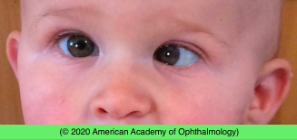
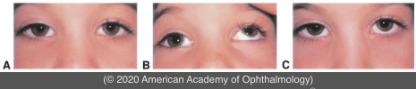

# Congenital Esotropia

## Images

## Hierarchy

- Case Description
  - 6-month-old boy has inward turning of his eye for the past 2 months
  - Image Description
- Differential Diagnosis
  - infantile (congenital) ET
    - present by 6 months of age
      - external photograph shows an infant with left esotropia and cross fixation of the right eye in adducted position
    - often have positive family history of strabismus
    - more common in prematurely born infants
    - neurologic and developmental problems
      - 30%
    - versions and ductions are often normal initially
    - deviation is comitant
    - .>30Δ
  - accomodative ET
  - sensory ET
  - CN 6 palsy
  - Duane retraction syndrome
- Additional Testing
  - MRI
    - indications
      - acute onset
      - headache
      - diplopia
      - abnormal head position
      - incomitant ET
        - r/o CN 6 palsy
      - acquired non-accomodative ET (comitant)
        - divergence insufficiency
          - distance ET>near ET
      - papilledema
- Assessment
  - esotropia, congenital
- Treatment
  - Medical
    - full hyperopic correction
      - if >+2.00 D
    - amblyopia treatment
      - patching
        - 2 hr/day while active
      - before or after surgery
  - Surgical
    - surgical correction
      - symmetric bilateral MR recession
      - unilateral MR recess + LR resect
        - < age 2 years
    - alignment within 8Δ–10Δ of orthotropia frequently results in the development of monofixation syndrom
- Patient Education
  - General
    - discuss risk of amblyopia
    - discuss role of patching for amblyopia
  - Prognosis
    - treatment outcome
      - good cosmetic result
        - in contrast to see-saw nystagmus in which the elevating eye intorts
          - in contrast to skew deviation in which the hypertropic eye intorts
      - stereopsis if ET corrected early
  - Prognosis & Complications
    - DVD
      - either eye slowly drifts upward and outward, with simultaneous extorsion
        - when occluded or during periods of visual inattention
    - IO muscle overaction
    - latent nystagmus
    - recurrent ET
    - consecutive XT
  - Follow-up
    - monitor for above complications
- Data acquisition
  - History
    - medical history
      - neurological or developmental problems
    - ocular history
      - onset/course of ET
        - review old photos
          - deviation
          - fixation preference (cross fixation)
          - abnormal head position
      - intermittent vs. constant
      - one eye or both eyes (alternating)
      - prior treatment
        - glasses
        - surgery
      - nystagmus
    - family hx of strabismus
  - Physical Exam
    - VA
      - preferential looking tests
        - Teller cards
      - cross fixation
    - abnormal head position
    - EOM & alignment
      - measure deviation
        - at near & distance
        - comitant vs incomitant
        - cover tests
          - cover-uncover test
            - differentiates tropia from phoria
          - alternate cover test
            - prism alternate cover test
              - plastic prisms should be held parallel to frontal plane
              - do not stack prisms
              - prisms can be divided between the 2 eyes
        - for measurement of deviation
        - light reflex tests
          - Hirschberg
            - 22Δ/ mm
            - 30Δ at pupil margin
            - 60Δ at mid-iris
            - 90Δ at limbus
          - Krimsky
            - uses prisms to center light reflex
      - limitation of abduction
        - doll’s head maneuver
        - observation after patching either of the patient’s eyes
      - oblique muscle overaction
        - A or V pattern
      - dissociated vertical deviation
      - latent nystagmus
    - anterior and posterior segment exam
      - cataract
      - rb
      - optic nerve pathology
      - papilledema
    - cycloplegic refraction
      - r/o significant hyperopia (>2.00 D)
        - sensory ET
- cannot differentiate tropia from phoria
