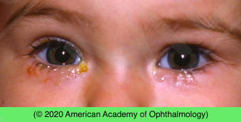

# Congenital Nasolacrimal Duct Obstruction

## Images

## Hierarchy

- Case Description
  - 6-month-old infant with chronic tearing and discharge of both eyes that started one month after birth
  - Image Description
- Additional Testing
  - dye disappearance test
    - check in (5)10 minutes
  - Jones I test
    - instill fluorescein into conjunctival fornices
    - recover it in inferior nasal meatus by passing a cotton- tipped applicator into nose
      - at 2 and 5 minutes
  - Jones II test
    - following an unsuccessful Jones I test
      - flush residual fluorescein from conjunctival sac with clear saline
      - irrigate lacrimal system with clear saline using a cannula inserted into the canalicular system
        - clear solution suggests that tears never entered lacrimal outflow system
        - fluorescein-stained irrigant indicates partial obstruction
- Differential Diagnosis
  - NLD obstruction
    - congenital
      - symptoms start within 1-2 months of birth
        - external photograph shows tearing of both eyes and periocular crusting of right eye without evidence of inflammation
    - acquired
  - canalicular/punctal atresia
  - dacryocystocele
    - bluish cystic mass
      - below medial canthal tendon
  - congential glaucoma
  - conjunctivitis
  - other
    - epiblepharon/entropion/ trichiasis
    - corneal abrasion
    - foreign body
- Assessment
  - congenital NLDO
- Treatment
  - Medical
    - NL sac digital massage
      - ≥4 x/day
      - inward & downward pressure
        - if mucopurulent discharge
    - topical antibiotic ointment/ drop
    - systemic antibiotic
      - if acute dacryocystitis
  - Surgical
    - NLD probing
      - in office
        - young infant
      - operating room
        - older infant
    - balloon dacryoplasty
      - if 2 probings fail
    - silicone intubation
    - DCR
      - last resort
- Data acquisition
  - History
    - age of onset & course
    - mucopurulent discharge
    - swelling or erythema in medial canthal area
    - trauma
    - chronic photophobia/ blepharospasm
      - congential glaucoma
  - Physical Exam
    - VA
    - IOP
    - corneal diameter
    - corneal edema/clouding
      - congenital glaucoma
    - Haab striae
    - palpate over lacrimal sac
      - warmth/swelling
      - reflux of mucopurulent discharge through punctum
        - dacryocystitis
    - punctal patency
    - lid margin crusting
    - mucopurulent discharge
    - increased tear lake
    - evert eyelid for foreign body
      - if corneal abrasion
      - if acute onset
    - full dilated exam
      - optic disc cupping
        - patients with congenital NLDO have higher prevalence of amblyopia risk factors
    - ocular motility/alignment
    - cycloplegic refraction
- Patient Education/ Counselling
  - discuss pathogenesis
  - discuss treatment options
  - Prognosis
    - good prognosis
      - spontaneous resolution in 90% with conservative treatment
      - single lacrimal probing resolves congenital NLDO in 90% of patients when performed before age 13 mo
  - Follow-up
    - routine
      - unless signs of infection
    - call if signs of infection
      - conjunctivitis
      - dacryocystitis
        - warmth
        - swelling
        - tenderness
        - purulent discharge
      - preseptal cellulitis
    - monitor for anisometropic/ strabismic amblyopia
