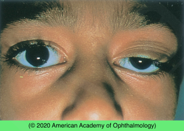
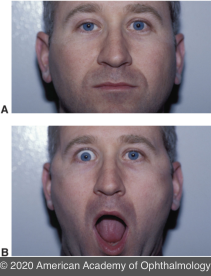

# Congenital Ptosis

## Images

## Hierarchy

- Case Description
  - young child with droopy eyelid since birth
  - Image Description
- Data acquisition
  - History
    - age of onset & course
      - review old photographs
    - trauma/surgery
    - variation with chewing or with eye movement
    - family history of congenital ptosis
      - blepharophimosis syndrome
      - r/o amblyopia
  - Physical Exam
    - VA
    - EOM
      - r/o CN 3 palsy
    - brow & head position
    - look for corneal exposure
      - lagophthalmos
    - check corneal sensation
    - Bell phenomenon
    - eyelid exam
      - lid position
        - measure vertical palpebral fissure
        - distance between corneal light reflex and upper lid margin
          - margin-reflex distance 1
      - levator function
        - manually fix eyebrow
        - decreased levator function in upgaze
      - indistinct/absent eyelid crease
      - remains elevated with downgaze
        - lid lag
    - examine pupils
      - miosis with anisocoria worse in dark
        - Horner syndrome
    - heterochromia
      - Congenital Horner syndrome
    - cycloplegic refraction
      - anisometropia with high cylinder
- Differential Diagnosis
  - simple congenital ptosis
    - unilateral or bilateral
      - external photograph shows left-sided ptosis of ≈ 5 mm (margin-reflex distance 1 of 0.5 mm)
    - present at birth and stable
    - decreased levator function
    - poorly formed (or absent) upper eyelid crease
    - involved eyelid may be higher in downgaze
      - eyelid lag
      - lagophthalmos
    - compensatory brow elevation or chin up position
  - Marcus Gunn jaw winking
    - most common form of congenital synkinetic neurogenic ptosis
    - unilateral
    - ptosis
      - none - severe
    - winking while chewing
      - eyelid elevates
        - movement of the mandible to the opposite side
        - jaw protrusion
        - wide opening of the mouth
          - when the teeth are clenched
  - traumatic ptosis
  - CN 3 palsy
  - Horner syndrome
    - unilateral
    - 2-3 mm
    - lower eyelid reverse ptosis
    - miosis
  - blepharophimosis syndrome
    - AD
    - ptosis
    - blepharophimosis
    - telecanthus
    - epicanthus inversus
  - pseudoptosis
    - dermatochalasis
    - enophthalmos
    - hypotropia
    - contralateral proptosis/lid retraction
- Assessment
  - Congenital ptosis
- Treatment
  - refractive correction
    - spectacles
  - amblyopia treatment
  - mild, no amblyopia, no abnormal head position
    - observation
  - severe/amblyopia/ abnormal head position
    - frontalis suspension
      - autologus fascia lata
      - artificial material
- Patient Education
  - Prognosis
    - good prognosis with timely treatment of ptosis & amblyopia
  - Prognosis & Complications
    - astigmatism
    - strabismus
    - amblyopia
    - corneal exposure after ptosis surgery
  - Follow-up
    - observation
      - q 3-12 months
