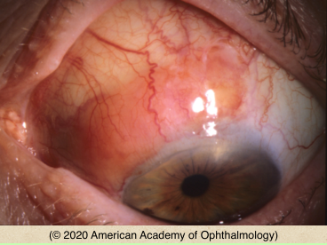
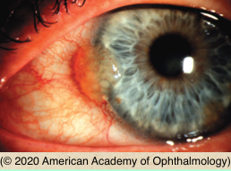

# Conjunctival Lymphoma

## Images

## Hierarchy

- Case Description
  - elderly man with painless slowly enlarging pink-red lesion on the surface of his left eye
  - Image Description
- Additional Testing
  - orbital imaging
  - biopsy
    - histologic examination
      - diffuse monomorphic sheet of lymphocytes in the stroma without well-defined follicles
    - immunohistochemistry
      - predominance of B lymphocytes that are kappa or lambda light chain restricted
        - require fresh tissue
    - flow cytometry
      - to show clonality
    - molecular genetic testing
- Assessment
  - conjunctival lymphoma
- Differential Diagnosis
  - conjunctival lymphoma
    - age > 50 yr
      - relatively well-defined salmon-pink subconjunctival mass involving the bulbar conjunctiva of the left eye
    - usually unilateral
      - 20% are bilateral
    - soft & mobile
    - ± orbital component
    - most are extranodal marginal zone B-cell lymphoma (MALT type)
  - conjunctival lymphoid hyperplasia
    - clinically similar to lymphoma
  - extrascleral extension of uveal lymphoma
    - subconjunctival salmon- colored mass fixed to the underlying sclera
  - conjunctival amyloidosis
    - salmon-colored nodular elevation that may be associated with hemorrhage
  - episcleritis/scleritis
- Treatment
  - biopsy
    - excisional if small
    - incisional if large
    - ± supplemental cryotherapy
  - EBRT
    - if complete excision not possible
  - intralesional interferon-α2b
  - systemic rituximab
  - chemotherapy
    - if systemic disease
      - underlying systemic lymphoma may be present or develop in ≤ 31%
  - refer to oncologist for systemic evaluation
- Patient Education
  - General
    - explain importance of long- term medical evaluation for lymphoma
  - Prognosis
    - good prognosis if localized
    - more guarded prognosis if systemic
      - higher risk if bilateral
  - Complications
    - systemic lymphoma may develop!
- Data acquisition
  - History
    - onset & course
    - symptoms
      - decreased vision
        - orbital involvement
      - double vision
      - pain
        - scleritis
      - redness
    - skin lesions elsewhere
    - systemic lymphoma
  - Physical Exam
    - VA
    - APD
    - EOM
      - orbital involvement
    - Hertel
    - optic disc swelling
    - attachment to underlying sclera
      - extrascleral extension of uveal lymphoma
    - AC rxn
    - lid lesions
    - iris, CB, or choroidal lesions
      - uveal lymphoma
    - systemic adenopathy
      - systemic lymphoma
