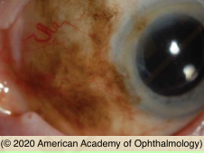

# Conjunctival Primary Acquried Melanosis (PAM)

## Images

## Hierarchy

- Case Description
  - 65-year-old Caucasian woman has noted pigmentation of her left eye that has slowly increased over the past 2 years
  - Image Description
- Additional Testing
  - ultrasound
    - if uveal melanoma supected
- Assessment
  - PAM
- Treatment
  - Surgical
    - ≤1-2 clock hours
      - observation
    - 2-4 clock hours
      - excisional biopsy
        - no-touch technique
        - wide margins
        - double freeze-thaw cryotherapy
        - ± alcohol epitheliectomy for corneal involvment
        - map conjunctival biopsies
        - sent for histology and immunohistochemistry
          - PAM without atypia
            - most important finding in predicting progression is the presence of cellular atypia
            - minimal risk of malignant transformation
          - PAM with mild atypia
          - PAM with moderate to severe atypia
            - significant risk of progression to melanoma
    - .>4 clock hours
      - incisional biopsy + cryotherapy
      - ± topical MMC
        - for diffuse disease not amenable to complete excision
- Differential Diagnosis
  - PAM
    - middle-aged
      - flat, diffuse, brown pigmentation of the bulbar conjunctiva with focal involvement of peripheral cornea
    - Caucasian
    - unilateral
    - flat
    - worse prognosis
      - larger size (≥3 clock-hours)
      - caruncular, forniceal, or palpebral location
      - thickening
      - feeder vessels
      - nodular component
      - progressive enlargement
  - complexion-related melanosis
    - darkly pigmented individual
    - bilateral
    - most apparent at limbus and less prominent as it extends into the fornix
  - nevus
    - ± cysts
  - ocular melanocytosis
    - pigment is at the level of episclera
  - extraocular extension of uveal melanoma
  - melanoma
    - elevated
- Patient Education
  - General
    - inform patient of importance of periodic follow-up
  - Course
    - can grow
    - can transform to melanoma
    - can recur after excision
  - Prognosis & Complications
    - good prognosis with complete excision/treatment
  - Follow-up
    - depends of degree of atypia
      - no atypia
        - 6-12 mo
      - moderate-severe atypia
        - 3-4 mo
- Data acquisition
  - History
    - onset & course
      - change in size & color
    - cutaneous melanoma
  - Physical Exam
    - slit lamp exam
      - size
      - location
        - check palpebral/tarsal conjunctiva, caruncle
      - mobility thickness
      - corneal extension
        - PAM is flat
          - ocular melanocytosis does not move with the conjunctiva
      - intralesional cyst
        - nevus
      - examine other eye
        - PAM is unilateral
          - complexion-related melanosis is bilateral
    - funduscopy
      - r/o uveal melanoma with extraocular extension
    - lymphadenopathy
