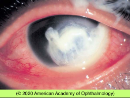
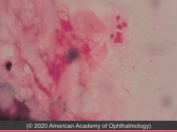

# Corneal Ulcer

## Images

## Hierarchy

- Case description
  - college student with history of contact lens wear complains of rapid onset of pain, redness, and decreased vision of his left eye over the past day
  - Image Description
    - large corneal ulcer with surrounding corneal edema and hypopyon
- Additional Testing
  - stain
    - gram stain
      - slender gram-negative rods (Gram stain, original magnification ×1000.)
    - giemsa stain
      - acanthamoeba
  - culture
    - corneal ulcer
    - contact lens & contact lens case
    - use calcium alginate swab
    - culture agar
      - blood agar
      - chocolate agar
      - thioglycolate agar
      - Sabourad agar
    - indications for culture
      - infiltrates that extend
        - to the middle of the cornea
        - into deep stroma
        - across a large area (>2 mm)
      - history or clinical features suggest fungal, amebic, mycobacterial, or drug-resistant organisms
      - cases unresponsive to initial empiric therapy
        - +- discontinuation of antibiotics for 12–24 hours
- Assessment
  - pseudomonas corneal ulcer
- Differential Diagnosis
  - bacterial
    - pseudomonas
    - infectious crystalline keratopathy
      - risk factors
        - corticosteroid use
        - contact lens wear
        - previous corneal surgery
          - penetrating keratoplasty
      - causative agents
        - fungal
          - α-hemolytic Streptococcus species (Streptococcus viridans)
  - fungal
    - septate filamentous Fungi
      - Fusarium
      - Aspergillus
    - nonseptate filamentous Fungi
      - Zygomycetes
        - Mucor
        - Rhizopus
        - Absidia
      - Pneumocystis jiroveci (previously Pneumocystis carinii)
        - not Gram stain, except Candida
    - yeast
      - Candida
    - smear
      - Gomori methenamine silver (GMS)
    - treatment
      - topical natamycin 5% suspension
        - for most filamentous fungi particularly Fusarium
      - topical voriconazole 1%
        - inferior to natamycin
      - topical amphotericin B (0.15%–0.30%)
        - for Aspergillus
          - for yeast keratitis
  - acanthamoeba
    - pain
    - perineural invasion
    - satellite lesions
    - ring-shaped infiltrate
      - nonnutrient agar with E coli or Enterobacter aerogenes overlay
    - topical administration
      - biguanides: chlorhexidine
        - efficacy against both cysts and trophozoites --> mainstay of pharmacologic treatment
      - diamidines: propamidine, hexamidine
      - aminoglycosides: neomycin, paromomycin
      - imidazoles/triazoles: voriconazole, miconazole, clotrimazole, ketoconazole, itraconazole
  - herpes virus
    - lid vesicles
    - corneal dendrite
  - atypical mycobacteria
    - vegetable injury
    - post-surgery
      - after refractive surgery
    - indolent course
    - keep culture plates x 8 weeks
  - topical anesthetic abuse
    - large ring opacity
- culture
  - characteristic trails
  - smears
    - Giemsa (also for Chlamydia)
    - periodic acid–Schiff (PAS)
    - calcofluor white
    - acridine orange
    - in vivo confocal microscopy shows the cyst forms
- Treatment
  - Medical
    - broad spectrum fortified topical antibiotics
      - vancomycin
      - ceftazidime
      - q1h
    - cycloplegia
    - steroids worsen keratitis, especially
      - fungus
      - atypical mycobacteria
      - pseudomonas
    - systemic antibiotics
      - oral fluoroquinolone
        - scleral extension
        - impending/frank perforation
      - neisseria gonorrhea
        - conjunctivitis
          - outpatient
          - IM ceftriaxone
            - 1 gr
            - single
        - keratitis
          - admit
          - IV ceftriaxone
            - 1 gr
            - q12-24 hr
              - X3 days
      - haemophilus
        - oral amoxicillin/clavulanate
    - types
      - low-risk
        - criteria
          - small, nonstaining peripheral infiltrate with no more than minimal anterior chamber reaction
        - non-CL wearer
          - fluoroquinolone or polymyxin B/trimethoprim
            - q1-2 hr while awake
        - CL wearer
          - fluoroquinolone +- polymyxin B/trimethoprim
            - q1 hr while awake
      - borderline vision threatening
        - loading dose
          - 1 drop q5 min x 5
        - fluoroquinolone ± polymyxin B/trimethoprim q1h around the clock
      - vision threatening
        - criteria
          - size >1.5-2 mm
          - involves visual axis
          - unresponsive to treatment
            - Gram (-)
        - Gram (+)
        - fortified cefazolin or vancomycin
          - alternating with
            - fortified tobramycin (gentamicin) or ceftazidime
        - loading dose
          - 1 drop q5 min x 5
  - Surgical
    - corneal transplant
      - indications
        - keratitis is unresponsive to antimicrobial therapy
        - descemetocele formation or perforation occurs
- Patient Education
  - Dos
    - discontinue CL wear
    - throw out all open CLs, cases, solutions
    - protective eyewear
  - Prognosis
    - guarded prognosis
  - Complications
    - corneal perforation
    - dense central scar
      - corneal transplant
  - Follow-up
    - daily until improvement
      - criteria for monitoring
        - pain
        - size of corneal epithelial defect
        - size & depth of infiltrate
        - AC rxn
- Data acquistion
  - History
    - CL wear
      - overnight CL wear
      - expired CL wear
      - continuous CL wear
      - CL wear in hot tub/sauna/ lake/ocean
      - care/cleaning
        - home-made saline solution
          - tap water
          - distilled water
        - expired solutions
        - particular brand of solution
    - prior episodes of eye redness
      - herpes
    - topical anesthetic use
    - recent trauma/surgery
  - Physical Exam
    - corneal epithelial defect
      - size
    - corneal infiltrate
      - size
      - depth
      - ring infiltrate
    - corneal perineuritis
      - acanthamoeba
    - endothelial plaque
    - AC reaction
      - hypopyon
