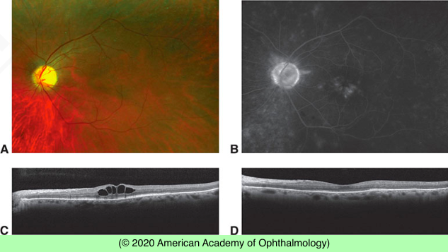

# Cystoid Macular Edema

## Images

## Hierarchy

- definition
  - intraretinal edema contained in honeycomb-like cystoid spaces
- pathogenesis
  - abnormal perifoveal retinal capillary permeability
- Rare causes of cystic macular change
  - nicotinic acid maculopathy
  - X-linked hereditary retinoschisis
  - Goldmann-Favre disease
  - retinitis pigmentosa
- imaging
  - fluorescein angiography
    - multiple small focal fluorescein leaks and late pooling of the dye in extracellular cystoid spaces
    - “flower-petal” (petaloid) pattern
  - OCT
    - diffuse retinal thickening with cystic areas of low reflectivity
      - more prominently in the inner nuclear and outer plexiform layers
    - subretinal fluid accumulation
- Incidence
  - cataract surgery
    - intracapsular lens extraction
      - 60%
    - Intraocular lens implantation at the time of extracapsular surgery does not appear to increase the incidence of CME
    - peak incidence 6–10 weeks postoperatively
    - spontaneous resolution in ≈ 95%
      - usually within 6 months
    - 2 types
      - clinical CME
        - severe cases
          - vitreous cells
          - optic nerve head swelling
          - permanent vision loss
      - angiographic CME
        - apparent only on fluorescein angiography
        - mild and asymptomatic
  - predisposing factors after cataract surgery
    - predisposing diseases
    - degree of postoperative inflammation
    - presence or absence of surgical complications
      - vitreous loss
      - iris prolapse
- histology
  - swelling in and between müllerian glia
- Treatment
  - Pharmacologic therapy
    - combination of topical corticosteroids and NSAIDs
      - for prophylaxis
      - for established edema
    - periocular steroid
      - for cases refractory to topical therapy
    - intraocular steroid
  - chronic CME
    - systemic acetazolamide
      - especially in cases associated with retinitis pigmentosa
  - for vitreous adhesions to the iris or corneoscleral wound
    - interruption of vitreous strands by vitrectomy or Nd:YAG laser
- etiology
  - diabetic retinopathy
  - central and branch retinal vein occlusion
  - uveitis
  - retinitis pigmentosa
  - ocular surgery
    - cataract extraction
      - Irvine-Gass Syndrome
    - retinal detachment surgery
    - vitrectomy
    - glaucoma procedures
    - photocoagulation
    - cryopexy
  - prostaglandin analogues
  - subretinal disease processes
    - choroidal neovascularization
    - choroidal hemangioma
    - subclinical retinal detachment
  - niacin
