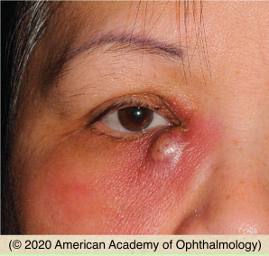

# Dacryocystitis

## Images

## Hierarchy

- Case Description
  - middle-aged woman with history of a red painful mass at the inner corner of her right eye
  - Image Description
- Additional Testing
  - gram stain/blood agar culture
    - if punctual discharge
  - CT scan/MRI
    - atypical location
    - severe
    - unresponsive to appropriate antibiotic treatment
    - orbital signs
      - proptosis
      - limitation of EOM
      - abnormal pupil reaction
      - increased IOP
  - nasal endoscopy
    - polyps, masses, inverted papilloma
    - septal deviation
- Differential Diagnosis
  - acute dacryocystitis
    - pain, redness, swelling, tearing, discharge, fever
      - erythematous swelling over the innermost aspect of lower eyelid (over lacrimal sac) with surrounding cutaneous erythema
    - mass below medial canthal tendon
    - punctal discharge with pressure over lacrimal sac
  - dacryocystocele
    - lacrimal sac not inflammed
    - present at birth/infancy
  - preseptal/facial cellulitis
    - no punctal discharge
  - acute ethmoid sinusitis
    - over nasal bone medial to inner canthus
  - lacrimal sac tumors
    - bleeding
  - encephalocele
  - frontal sinus mucocele/ mucopyocele
    - above the medial canthal tendon
- Assessment
  - acute dacryocystitis
    - secondary to nasolacrimal duct obstruction
  - admit severe cases for IV antibiotics
- Treatment
  - Medical
    - systemic antibiotics
      - children
        - amoxicillin-clavulanate
      - adults
        - cephalexin
        - amoxicillin/clavulanate
    - ± topical antibiotics
    - warm compress & gentle massage
    - pain medication
  - Surgical
    - incision & drainage of pointing abscess
    - DCR with silicone intubation
      - 7-10 days after starting antibiotics
        - only after the acute episode has resolved
- Patient Education
  - Course
    - recurrent infection if DCR not performed
  - Prognosis & Complications
    - good prognosis with appropriate treatment
  - Follow-up
    - daily until improvement
- Data acquisition
  - History
    - onset & course
    - symptoms
      - epiphora
      - tenderness/pain
      - fever
    - previous similar episodes
      - recurrent dacryocystitis
    - ear, nose, throat infection
      - sinusitis
    - prior nasal/facial trauma/surgery
    - treatment with oral antibiotics
  - Physical Exam
    - appearance
      - punctal discharge with sac pressure
        - submit for culture/sensitivity
      - color
      - location
        - below vs above medial canthal tendon
      - pointed abscess
      - fluctuance
    - orbital signs
      - BCVA
      - limitation of EOM
      - proptosis
        - orbital cellulitis
      - IOP
      - APD
