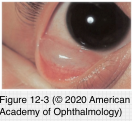
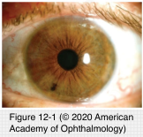
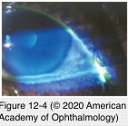
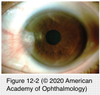

# Degenerative Changes of the Conjunctiva

## Images

## Hierarchy

- Introduction
  - degeneration
    - decomposition and deterioration of tissue elements and functions
    - etiology
      - aging
      - specific diseases
      - chronic environmental insults
    - unilateral or bilateral
      - if bilateral, may be asymmetric
- Age-Related (Involutional) Changes
  - conjunctiva loses transparency
  - conjunctiva becomes thinner
  - substantia propria (stroma) becomes less elastic
    - conjunctival laxity
  - vessels become more prominent
    - saccular telangiectasias, fusiform dilatory changes, or tortuosities
  - more pronounced in the area of the interpalpebral fissure
- Conjunctival Inclusion Cysts
  - types
    - congenital
    - acquired
  - bulbar conjunctiva or conjunctival fornix
  - central fluid-filled cavity in the substantia propria
    - from conjunctival epithelium
      - lined by nonkeratinized conjunctival epithelium
    - from ductal epithelium of the accessory lacrimal glands
      - lined by a double layer of epithelium
  - clear
  - corneal epithelial inclusion cyst
    - rare
  - risk factors
    - chronic inflammation
    - trauma
  - differential diagnosis
    - surgery
    - dilated lymphatic channels
  - treatment
    - most commonly asymptomatic
      - observe
    - re-form after simple drainage
    - complete excision
- Conjunctival Vascular Tortuosity and Hyperemia
  - See Table 12-2
- Pinguecula
  - bilateral
  - yellow-white elevated mass
    - enlarge gradually over long periods of time
  - nasal bulbar conjunctiva, adjacent to the limbus in the interpalpebral zone
  - etiology
    - aging, UV-light exposure, and other environmental traumas
  - +- cause recurrent inflammation and ocular irritation
  - pathology
    - elastotic degeneration of subepithelial collagen
  - treatment
    - Lubricant therapy
      - hyalinized connective tissue
    - excision is indicated only when
      - cosmetically unacceptable
      - chronically inflamed
    - topical corticosteroids
      - if inflamed
        - interfere with successful contact lens wear
- Conjunctivochalasis
  - poor adherence of the bulbar conjunctiva
    - +- overhangs the lower eyelid margin
    - chronic inflammation
  - risk factors
  - symptoms
    - usually asymptomatic
      - aging
    - aggravation of dry eye
    - exposure-related pain and irritation
      - secondary tearing due to occlusion of the lower punctum when the chalasis is prominent medially
      - increased tear inflammation
  - histopathology
    - loss of conjunctival epithelial cohesiveness
      - chronic nongranulomatous inflammation
    - elastosis
  - treatment
    - lubricants
      - collagenolysis
    - anti-inflammatory agents
    - antihistamines
    - nocturnal patching
    - surgical excision
    - conjunctival fixation to the sclera
    - amniotic membrane grafting
    - cauterization of the redundant folds
      - older age
- Pterygium
  - epidemiology
    - etiology
      - UV-light exposure
      - environmental traumas
    - more common in
      - near equator
      - men
        - age=20–30 years
      - outdoor work
  - clinical presentation
    - wing-shaped growth of conjunctiva and fibrovascular tissue on the superficial cornea
    - nasal side in the interpalpebral zone
    - nearly always preceded by pingueculae
    - corneal scarring
    - regular and irregular astigmatism
    - Stocker line
      - pigmented iron line
        - central anterior edge of the pterygium on the cornea
  - pseudopterygium
    - secondary to trauma or inflammatory corneal disease
  - treatment
    - artificial tears
    - topical corticosteroids
      - long-term use of topical corticosteroids is contraindicated
    - Excision is indicated if
      - pterygium approaches the visual axis
      - exhibits rapid growth
      - causes chronic irritation
      - cosmetically unacceptable
- Conjunctival Concretions
  - predisposing conditions
    - chronic conjunctivitis
  - small, yellow-white dots
  - palpebral conjunctiva
  - epithelial inclusion cysts filled with
    - epithelial and keratin debris
    - mucopolysaccharide and mucin
  - almost always asymptomatic
  - erosion of overlying conjunctiva
    - foreign-body sensation
  - if symptomatic remove under topical anesthesia
