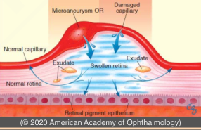
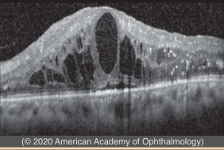
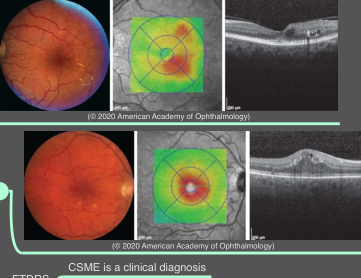

# Diabetic Macular Edema (I)

## Images

## Hierarchy

- Introduction
  - hyperglycemia-induced breakdown of blood–retina barrier
    - leads to fluid extravasation from retinal vessels into surrounding neural retina
  - ± hard exudates
    - precipitates of plasma lipoproteins
  - central subfield–involved DME that affects the fovea is a common cause of vision loss
  - more common in eyes with more advanced DR
    - can be present in any severity level of DR
  - examination with OCT or slit-lamp biomicroscopy are the most appropriate methods to diagnose DME
    - leakage on FA may occur in absence of macular edema
  - FA
    - showis local areas of retinal capillary leakage
- Cataract Surgery in Patients With Diabetes Mellitus
  - DR and DME may worsen in severity after cataract surgery
  - DRCR.net Protocol P
    - preexisting center-involving DME
    - only a small percentage had substantial visual acuity loss or definitive progression in central retinal thickening
  - Protocol Q
    - NPDR without concurrent center-involved DME
    - presence of non-central DME immediately prior to cataract surgery, or history of DME treatment, increase risk of developing central-involved DME 16 weeks after cataract extraction
  - recommenations
    - optimize systemic control prior to surgery
      - consider anti-VEGF injection preoperatively or steroid injection perioperatively for eyes with center-involved DME before cataract surgery
    - consider scatter photocoagulation before cataract surgery in patients with severe NPDR or PDR
      - if ocular media sufficiently clear
    - if ocular media not clear, prompt postoperative retinal evaluation and treatment are recommended
    - all patients with preexisting DR should be reevaluated after cataract surgery
  - cataract surgery technique
    - adequate capsulorrhexis
    - avoid silicone lenses
      - may fog with condensation during subsequent vitrectomies
- Classification of Diabetic Macular Edema
  - OCT-based classification
    - center-involved DME
      - central retinal subfield appears thickened on OCT
    - non–center-involved DME
  - clinically significant diabetic macular edema (CSME)
    - ETDRS
      - CSME is a clinical diagnosis
      - indication for focal laser photocoagulation
    - criteria
      - retinal thickening located at or within 500 μm of the center of the macula
      - hard exudates at or within 500 μm of the center if associated with thickening of adjacent retina
      - zone of thickening larger than 1 disc area, if located within 1 disc diameter of the center of the macula
  - Focal macular edema
    - areas of local fluorescein leakage from specific capillary lesions
      - no difference in treatment response based on pattern of macular edema (focal or diffuse)
  - Diffuse macular edema
    - extensive retinal capillary leakage
