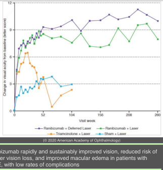

# Diabetic Macular Edema (II): Treatment

## Images

## Hierarchy

- Introduction
  - treatment is indicated for center-involved DME
  - factors to consider before treatment of non-center- involved DME (asymptomatic with normal visual acuity)
    - proximity of exudates or thickening to fovea
    - status and course of fellow eye
    - treatment risks
    - systemic conditions or medications (such as thiazolidinediones) that might exacerbate or cause DME
    - presence of high-risk PDR
    - any anticipated cataract surgery
      - initiate DME treatment before PRP and prior to cataract surgery to reduce the risk of worsening DME
- Macular laser photocoagulation
  - indications
    - DME from clearly focal leakage that can be easily targeted by laser
    - resistance to anti-VEGF therapy
    - poor candidate for anti-VEGF therapy
      - medically unstable
      - unable to adhere to near monthly treatment
  - ETDRS
    - macular focal- or grid-pattern laser photocoagulation of CSME versus observation
      - reduced the risk of moderate vision loss
      - increased the chance of vision improvement
      - associated with only minor visual field loss
  - adverse effects
    - paracentral scotomas
    - decreased vision
    - transient increased edema
    - inadvertent foveal burns
    - choroidal neovascularization
    - laser scar expansion
    - subretinal fibrosis
  - risk factors for poor visual outcome
    - macular ischemia (extensive perifoveal capillary nonperfusion)
    - hard exudates in the fovea
  - technique
    - guided by fluorescein angiography & OCT thickness map
    - laser parameters
      - spot sizes of 50–100 μm
      - burn durations ≤ 0.1 second
    - focal (direct) pattern
      - for focal leackage
      - directly treat all leaking microaneurysms between 500 μm - 3000 μm from center of macula
      - green or yellow wavelengths
    - grid pattern
      - for diffuse leakage or zones of capillary non-perfusion
      - areas of diffuse leakage ≥ 500 μm from center of macula and temporal margin of optic disc
      - light-intensity
      - 1 burn width separation between burns
      - green- or yellow-wavelength
    - repeated every ≥16 weeks until retinal thickening resolves or all of leaking microaneurysms adequately treated
    - micropulse, or sub–threshold intensity burns, may be as effective as standard macular laser treatment while reducing damage to RPE and outer retinal layers
  - in current clinical practice, treatment of eyes with DME can usually be delayed until progression of edema threatens or involves center of macula
  - treatment of peripheral nonperfusion as visualized on ultra-wide- field FA with scatter photocoagulation does not improve visual acuity or retinal thickening in eyes with DME
- Anti-VEGF drugs
  - drugs
    - pegaptanib
    - bevacizumab
    - ranibizumab
    - aflibercept
    - brolucizumab
  - adverse events
    - endophthalmitis
      - ≈ 1 in 1000
        - no demonstrated consistent differences in intraocular or systemic safety between anti-VEGF agents
    - systemic thromboembolic events
      - not shown to be more common after intraocular anti-VEGF treatment
  - DRCR.net Protocol I
    - intravitreal anti-VEGF superior to laser for center-involved DME
    - intravitreal ranibizumab with prompt or deferred (≥24 weeks) focal or grid-pattern laser more effective at both 1- and 2-year in increasing visual acuity than focal/grid laser alone or in combination with triamcinolone acetonide injections
    - in ranibizumab groups, vision gains accrued in first year of therapy were maintained through 5 total years of follow-up, despite number of injections progressively decreasing
    - adding focal/grid-pattern laser at initiation of intravitreal ranibizumab is no better, and is possibly worse, than deferring laser treatment for ≥24 weeks
  - RISE and RIDE
    - ranibizumab rapidly and sustainably improved vision, reduced risk of further vision loss, and improved macular edema in patients with DME, with low rates of complications
  - VIVID
  - VISTA
    - after 5 monthly injections, groups receiving aflibercept, both monthly and every 2 months, had substantial visual acuity gains compared with laser photocoagulation
  - DRCR.net Protocol T study
    - aflibercept superior to bevacizumab at 1 and 2 year(s)
    - aflibercept superior to ranibizumab at 1 year but statistically similar at 2 years
    - in eyes with mild visual impairment (20/32 to 20/40) visual results were equivalent at both 1 and 2 years for all 3 treatment groups
- Pars plana vitrectomy
  - indications
    - macular traction from
      - epiretinal membrane
        - more widely used outside US
          - creation of PVD or epiretinal membrane peeling can be effective in reducing retinal thickening
      - posterior hyaloid
    - first-line therapy without macular traction
  - outcome
    - generally improves retinal thickening
      - substantial vision gain or loss after vitrectomy
    - inconsistent effects on visual acuity
  - DRCR.net Protocol D
    - vitrectomy reduced retinal thickening in most eyes with DME and vitreomacular traction
    - median visual acuity remained unchanged over 6-month
      - 38% gained ≥ 10 letters
      - 22% lost ≥ 10 letters
- Intravitreal Steroid
  - intravitreal triamcinolone acetonide
    - DRCR.net Protocol B
      - at 2 years, focal/grid laser more effective, with fewer adverse effects, than 1-mg or 4-mg preservative-free intravitreal triamcinolone
    - DRCR.net Protocol I
      - at 2 years, intravitreal triamcinolone acetonide in combination with laser was inferior to ranibizumab with or without laser therapy, as well as to laser treatment alone
    - results from steroid-treated eyes that were pseudophakic at baseline were similar to those from anti-VEGF treated eyes and superior to laser-treated eyes
      - steroid may be a reasonable alternative to anti- VEGF in pseudophakic eyes with DME
  - sustained-release steroid implants (dexamethasone and fluocinolone acetonide)
    - improved rates of ≥ 3 lines visual acuity gain
    - DRCR.net Protocol U
      - eyes with persistent center-involved DME after ≥ 6 prior injections of anti-VEGF agents
      - combination therapy with continued anti-VEGF treatment and a dexamethasone implant
        - showed greater improvement in retinal thickening over 6-month study period
        - did not show superior vision gains when compared to continued anti- VEGF treatment alone
  - because of higher rates of cataract and glaucoma, corticosteroids are usually considered second-line agents for DME
  - useful alternative for eyes that are not candidates for or have been refractory to anti-VEGF therapy
