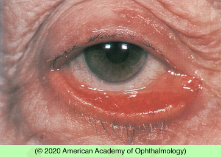

# Ectropion

## Images

## Hierarchy

- Case Description
  - elderly man complains of bilateral tearing and eye irritation
  - Image Description
    - right lower lid ectropion with no visible eyelid inflammation, scarring, or mass
- Differential Diagnosis
  - congenital ectropion
  - involutional ectropion
  - cicatricial ectropion
  - paralytic ectropion
  - mechanical ectropion
  - allergic (inflammatory) ectropion
    - eczema
    - dorzolamide, brimonidine
- Assessment
  - (involutional) ectropion
- Treatment
  - Medical
    - preservative-free artificial tears
    - ointment at bedtime
    - taping at bedtime
  - Surgical
    - involutional
      - horizontal lid tightening
      - lower eyelid retractor repair
    - paralytic
      - temporary/permanent tarsorrhaphy
      - gold weight implantation
      - lower lid tightening
        - delay x 3-6 months in patients with CN 7 palsy
    - cicatricial
      - scar excision + skin/conj graft
- Patient Education
  - General
    - discuss treatment options & risk/benefits of surgery
  - Follow-up
    - based on symptoms and integrity of conjunctiva/ cornea
      - close follow-up if corneal exposure
- Data acquisition
  - History
    - medical
      - stroke
      - Bell palsy
      - eczema
    - ocular
      - symptoms
        - tearing
        - eye irritation
          - 2o to exposure keratopathy
      - surgery/trauma/chemical burn/thermal burn
      - medications
        - brimonidine
        - dorzolamide
  - Physical Exam
    - external eye exam
      - CN exam
        - signs of CN 7 palsy
          - facial hemiparesis
          - orbicularis oculi function
            - lagophthalmos
      - lid laxity
        - snapback test
          - poor orbicularis tone
        - distraction test
          - ability to pull the eyelid >6 mm from the globe
        - lateral stretching of the eyelid
          - to assess whether lateral canthal resuspension would return the eyelid to its normal anatomical position
        - excessive lateral movement of the lower punctum with lateral eyelid traction
          - laxity of lower limb of medial canthal tendon
      - epiphora
      - punctal position
      - symblepharon
      - herniated orbital fat
      - lid inflammation/scarring
      - lid tumors
      - Bell’s reflex
      - corneal sensation
    - slit lamp exam
      - tear film
      - congestion/thickening/ keratinization of exposed conjunctiva
      - exposure keratopathy
        - SPK
        - abrasion
